# Arkade Asset V1 Specification (Working Draft)

## 1. Overview

### 1.1. Hybrid System Architecture

The Arkade Asset protocol is designed to operate in a hybrid environment, with assets moving seamlessly between off-chain Arkade transactions and on-chain Bitcoin transactions. This architecture imposes a critical requirement: a unified view of the asset state.

-   The **Arkade Signer** (off-chain) must be aware of on-chain events. To validate transactions that interact with on-chain assets (e.g., after a unilateral exit or collaborative-exit), the Signer must have access to the state of the Bitcoin blockchain. It effectively acts as a private indexer for the user.
-   An **On-chain Indexer** must be aware of Arkade-native transactions. To present a complete and accurate public ledger of assets, the indexer must be able to ingest and validate state transitions that occur within the Arkade system, by observing all relevant Arkade-native transactions.

This ensures that an asset's history is unbroken and its ownership is unambiguous, regardless of how it is transferred.

Arkade Asset V1 is a UTXO-native asset system for Bitcoin transactions inspired by Runes and Liquid Assets.

Within Arkade, it requires no offchain indexers to track asset state: simply parsing the transaction is enough to observe and validate asset transfers. This is possible because the Arkade Signer's cosigning guard validates before cosigning, along with its TEE assurances for verifiable honesty.

However, if used onchain, indexers/validators are required to analyse the chain (both utxos and vtxos) and disregard invalid asset transactions.

### Assets and Asset IDs

Arkade Assets are projected onto Bitcoin transactions by embedding a data packet, the **Arkade Asset V1 packet**.

Each Arkade Asset V1 packet, embedded in a Bitcoin output via OP_RETURN semantics, contains an ordered list of **Asset Groups** which define asset details along with indexes of transaction inputs and outputs that are carrying this asset and the amounts. The order is important for fresh asset mint operations.

Assets are identified by an Asset ID, which is always a pair: `AssetId: (genesis_txid, group_index)`

- `genesis_txid` = the transaction where the asset was first minted
- `group_index` = the index of the asset group inside that genesis transaction

There are two cases: 
- **Fresh mint**. If an Asset Group omits its Asset ID, it creates a new asset. It's Asset ID is `(this_txid, group_index)`, where `this_txid`is the current transaction hash. Since this is the genesis transaction for that asset, `this_txid = genesis_txid`.
- **Existing asset**. If the Asset Group specifies an Asset ID, it refers back to an already minted asset `(genesis_txid, group_index)`  

### Control Assets and Reissuance

When a fresh asset is being created, its asset group may specify a control asset. A fresh asset may be issued while its control asset is also being freshly minted in the same transaction.

Control assets allow additional, future reissuance of a token, and are themselves assets. If an asset group increases supply (Σout > Σin), the corresponding control asset MUST appear in the same transaction. This requirement applies to both fresh issuance and reissuance.

If an asset did not specify a control asset at genesis, it cannot be reissued and its total supply is forever capped at the amount created in its genesis transaction.

**Control Asset Rules:**

1. **No Self-Reference**: An asset MUST NOT reference itself as its own control asset. A `BY_GROUP` reference where `gidx` equals the current group index is INVALID.

2. **Single-Level Control**: Only the direct control asset is required for reissuance. Control is NOT transitive - if Asset A is controlled by Asset B, and Asset B is controlled by Asset C, reissuing Asset A requires only Asset B (not C).

3. **Supply Finalization**: Burning the control asset (explicitly or by not including it in outputs) permanently locks the controlled asset's supply. This is intentional behavior for finalizing an asset's supply. Existing tokens continue to circulate normally.

Arkade Asset V1 supports projecting multiple assets unto a single UTXO, and BTC amounts are orthogonal and not included in asset accounting.

Asset amounts are atomic units, and supply management is managed through UTXO spending conditions.

---

## 2. OP\_RETURN structure

Exactly **one OP\_RETURN output** must contain the Arkade Asset protocol packet, prefixed with magic bytes. The packet itself is a top-level TLV (Type-Length-Value) stream, allowing multiple data types to coexist within a single transaction.

```
scriptPubKey = OP_RETURN <Magic_Bytes> <TLV_Stream>
```

- **Magic_Bytes**: `0x41524b` ("ARK")
- **TLV_Stream**: A concatenation of one or more TLV records.
- **TLV Record**: `Type (1-byte) || Length (CompactSize) || Value (bytes)`

**Multiple OP_RETURN Handling:** If a transaction contains multiple OP_RETURN outputs with ARK magic bytes (`0x41524b`), or multiple Type `0x00` (Assets) records across TLV streams, only the **first Type `0x00` record found by output index order** is processed. Subsequent Asset records are ignored.

### Arkade Asset V1 Packet (Type 0x00)

The Arkade Asset data is identified by `Type = 0x00`. The `Value` of this record is the asset payload itself.

```
<Type: 0x00> <Length: L> <Value: Asset_Payload>
```

- **Asset_Payload**: The TLV packet containing asset group data (see below).

**Note (Implicit Burn Policy):** If a transaction spends any UTXOs known to carry Arkade Asset balances but contains no `OP_RETURN` with an Arkade Asset packet (Type `0x00`), those balances are considered irrecoverably burned. Indexers MUST remove such balances from their state.

---

## 3. Packet format (canonical TLV)

### Packet

```
Packet := {
  GroupCount    : varuint
  Groups[GroupCount]     : Group
}
```

### Group

```
Group := {
  AssetId?      : AssetId          # absent => fresh asset (AssetId* = (this_txid, group_index))
  ControlAsset? : AssetRef         # Genesis only: Defines the control asset for reissuance.
  Metadata?     : map<string, string> # Genesis only: Immutable metadata set at asset creation.
  InputCount    : varuint
  Inputs[InputCount]  : AssetInput
  OutputCount   : varuint
  Outputs[OutputCount] : AssetOutput
}
```

### 3.1. Genesis and Metadata Rules

- **Genesis (Fresh Assets)**: A fresh asset is created when `AssetId` is absent. The absence of `AssetId` itself indicates genesis — no separate marker is needed.
  - `ControlAsset` may be set to define the control asset for future reissuance (minting).
  - `Metadata` may be set to define immutable metadata for the asset.
  - If `ControlAsset` is omitted, no future token reissuance is possible.

- **Metadata is Immutable**: Metadata can only be set at genesis and cannot be changed after. This eliminates race conditions in the 2-step async execution model and simplifies validation.

- **Genesis-Only Fields**: The `ControlAsset` and `Metadata` fields are only valid at genesis (when `AssetId` is absent). They **must not** be present for existing assets.

### 3.2. Encoding Details

While the specification uses a logical TLV (Type-Length-Value) model, the canonical binary encoding employs specific optimizations for compactness.

**Group Optional Fields: Presence Byte**

Instead of using a type marker for each optional field within a `Group`, the implementation uses a single **presence byte**. This byte is a bitfield that precedes the group's data, where each bit signals the presence of an optional field:

-   `bit 0 (0x01)`: `AssetId` is present.
-   `bit 1 (0x02)`: `ControlAsset` is present (genesis only).
-   `bit 2 (0x04)`: `Metadata` is present (genesis only).
-   `bits 3-7`: Reserved for future protocol extensions. Parsers MUST ignore these bits if set.

The fields, if present, follow in that fixed order. This is more compact than a full TLV scheme for a small, fixed set of optional fields.

**Variant Types: Type Markers**

For data structures that represent one of several variants (a `oneof` structure), a **type marker byte** is used. This is consistent with the logical TLV model.

-   **`AssetRef`**: `0x01` for `BY_ID`, `0x02` for `BY_GROUP`.
-   **`AssetInput`**: `0x01` for `LOCAL`, `0x02` for `INTENT`.
-   **`AssetOutput`**: `0x01` for `LOCAL`, `0x02` for `INTENT`.

Type marker values are interpreted in the context of the structure being parsed; identical numeric values in different structures do not conflict.

### Types

```
AssetId   := { txid: bytes32, gidx: u16 } # the genesis tx id that first issued this asset & the index of the asset group in that packet

AssetRef  := oneof {
               0x01 BY_ID    { assetid: AssetId } # if existing asset
             | 0x02 BY_GROUP { gidx: u16 } # if fresh asset (does not exist yet therefore no AssetId)
             }
# BY_GROUP forward references are ALLOWED - gidx may reference a group that appears
# later in the packet. Validators must use two-pass processing to resolve references.

AssetInput := oneof {
               0x01 LOCAL  { i: u32, amt: u64 }                  # input from same transaction's prevouts
             | 0x02 INTENT { txid: bytes32, o: u32, amt: u64 }  # claim from intent output
             }

AssetOutput := oneof {
               0x01 LOCAL  { o: u32, amt: u64 }   # output within same transaction
             | 0x02 INTENT { o: u32, amt: u64 }   # parked for later claim by commitment tx
             }
```
This hybrid approach balances compactness for the `Group` structure with the flexibility of type markers for variant data types.

---

## 4. Asset identity rules

- **Fresh asset:** if `AssetId` omitted, AssetId\* = `(this_txid, group_index)`.
- **Existing asset:** if `AssetId` present, AssetId\* = that literal `(txid,gidx)`.
- **Control reference:**
  - BY\_ID → literal `(txid,gidx)`
  - BY\_GROUP{g} → `(this_txid, g)`

---

## 5. Intent System

The intent system enables users to signal participation in a batch for new VTXOs. Intents are Arkade-specific ownership proofs that signals vtxos (and their asset) for later claiming by a commitment transaction and its batches.

### Intent Outputs

An `AssetOutput::INTENT { o, amt }` parks assets at a specific output index of the intent transaction:

- `o`: The output index (vout) in the same transaction
- `amt`: The amount of assets being parked

Assets parked in INTENT outputs are locked until the intent is included in a batch or dropped.

### Intent Inputs

An `AssetInput::INTENT { txid, o, amt }` claims assets from a pending intent output:

- `txid`: The intent transaction ID
- `o`: The output index within that intent
- `amt`: The amount being claimed (must match exactly)

### Transaction Flow

```
Old VTXO → [Intent TX] → Intent Outputs → [Commitment TX] → New VTXOs / On-chain
           LOCAL inputs   INTENT outputs   INTENT inputs     LOCAL outputs
```

**Intent Transaction:**
- LOCAL inputs spend assets from existing VTXO
- INTENT outputs park assets at vouts in the same tx
- Bitcoin outputs (vouts) specify the destinations
- BIP322-signed message specifies which vouts are collaborative exits vs VTXOs
- Standard delta rules apply

**Commitment Transaction:**
- INTENT inputs claim from pending intents
- LOCAL outputs place assets at final destinations:
  - **Collaborative exits**: Aggregated in the commitment tx's asset packet
  - **VTXOs**: Each batch leaf holds its own asset packet for the VTXOs it creates

### Composability

A single intent can mix collaborative exits and VTXOs. The BIP322-signed configuration message embedded in the intent specifies the type of each output:

```
Intent TX:
  vout 0 → collaborative exit (on-chain)
  vout 1 → new VTXO
  vout 2 → new VTXO

Asset packet:
  INTENT { o: 0, amt: 50 }   # 50 tokens to on-chain
  INTENT { o: 1, amt: 30 }   # 30 tokens to VTXO
  INTENT { o: 2, amt: 20 }   # 20 tokens to VTXO
```

### Validation Rules

- **Zero Amount Validation**: All asset amounts MUST be greater than zero. An input or output with `amount = 0` is INVALID.
- **Input Amount Validation**: Validators MUST verify that declared input amounts match the actual asset balances of referenced UTXOs.
- **Output Index Validation**: Output indices MUST reference valid transaction outputs. Out-of-bound indices render the transaction INVALID.
- **Intent Input Validation**: When processing an INTENT input `{ txid, o, amt }`:
  1. Lookup pending intent by `txid`
  2. Verify output at index `o` exists and is unclaimed
  3. Verify `amt` matches the intent output's amount exactly
  4. Mark intent output as claimed

### Intent Lifecycle

- **Submitted**: VTXOs and assets are locked
- **Included in batch**: Assets transfer to new VTXOs or on-chain outputs
- **Dropped**: Assets unlocked, free to use again

User may revoke an intent, or operator may cancel it—in both cases assets are unlocked.

No confirmation delays—intents are fully Arkade-native.

### Intent State Tracking

The Signer maintains:
```
PendingIntent := {
  txid: bytes32,       # Intent transaction ID
  o: u32,              # Output index
  assetId: AssetId,    # The asset type
  amt: u64             # Amount parked
}
```

When an intent is submitted, the signer stores the intent details. When a commitment transaction claims intents, the signer validates each INTENT input against pending intents and marks them as claimed.

---

## 6. Examples

For detailed transaction examples, including diagrams, packet definitions, and code, please see [examples.md](./examples.md).

---

### Proof of Authenticity

Proving that an asset was genuinely issued by a specific entity (e.g., Tether issuing a stablecoin) can be accomplished by signing a message with the private key corresponding to a relevant UTXO. This is typically done using a standard like BIP322 (Signatures for P2TR). There are two primary methods:

**1. Proof of Genesis (Historical Proof)**

This method proves who the original creator of an asset was by linking them to the funding of the genesis transaction.

-   **What to Prove**: Ownership of a Bitcoin UTXO that was spent as an input in the asset's genesis transaction.
-   **How it Works**: The issuing entity (e.g., Tether) uses the private key for one of the genesis transaction's inputs to sign a message.
-   **Example Message**: `"We, Tether, certify that the Arkade Asset with genesis txid [genesis_txid] and group index [gidx] is the official USDT-Arkade."`

**2. Proof of Control (Dynamic Proof)**

This method proves who has administrative rights over an asset (e.g., the ability to reissue it). This is the most robust method for proving ongoing authenticity.

-   **What to Prove**: Ownership of the UTXO that holds the asset's control asset.
-   **How it Works**: The entity uses the private key for the UTXO holding the control asset to sign a message. An indexer is used to find which UTXO currently holds the control asset.
-   **Example Message**: `"As the current controller of USDT-Arkade, Tether authorizes this action at block height X."`

In summary, **Proof of Genesis** establishes historical origin, a one-time, static origin of an asset, **Proof of Control** provides an ongoing mechanism to demonstrate administrative authority - supporting actions such as reissuance or periodic attestations of authenticity - by linking the asset to a live, controlled UTXO on the Bitcoin blockchain. 

---

### Asset Metadata

Arkade Asset supports a flexible, onchain key-value model for metadata in the asset group. Well-known keys (e.g., `name`, `ticker`, `decimals`) can be defined in a separate standards document, but any key-value pair is valid.

Metadata is defined at genesis and is **immutable**—it cannot be changed after the asset is created. This design eliminates race conditions in the 2-step async execution model and ensures metadata can be verified without indexer state injection.

**Genesis Metadata**

When an asset is first created (i.e., the `AssetId` is omitted from the group), the optional `Metadata` map in the `Group` defines its permanent metadata. This is useful for defining core properties like names, images, or application-specific data.

**Metadata Hashing**

The `metadataHash` is the **Merkle root** of the asset's metadata, computed at genesis:

- **Leaf Generation**: The leaves of the Merkle tree are the `sha256` hashes of the canonically encoded key-value pairs. The pairs MUST be sorted by key before hashing to ensure a deterministic root.
- **Canonical Entry Format**: `leaf[i] = sha256(varuint(len(key[i])) || key[i] || varuint(len(value[i])) || value[i])`

**Metadata Verification**

Contracts verify metadata by recomputing the expected Merkle root from user-provided values. Since metadata is immutable, contracts can trust that the genesis metadata hash is the current and permanent hash.

Since Arkade Script does not include loop opcodes, contracts must know their metadata schema at compile time. For fixed schemas (e.g., 2-4 known keys), contracts can hardcode the leaf prefixes and tree structure, recomputing the root directly. See the ArkadeKitties example, which uses a fixed 2-leaf tree for `genome` and `generation` fields.

---

## 7. Indexer State and Reorganization Handling

To ensure data integrity and consistency with the underlying Bitcoin blockchain, the Arkade Asset (onchain) indexer is designed to handle blockchain reorganizations (reorgs) and transaction replacements (RBF).

### State Versioning

The indexer's state (including all asset definitions, UTXO balances, and processed transactions) is not stored in a single monolithic file. Instead, it is versioned by block height. After processing all transactions in a block, the indexer saves a complete snapshot of the new state into a file named `state_<height>.json`.

- **Genesis State**: The state before any blocks are processed is at `blockHeight: -1`.
- **Block n**: After processing, the state is saved to `state_n.json` and the internal `blockHeight` becomes `n`.
- **Block n+1**: The indexer loads `state_(n).json`, applies transactions from block n+1, and saves the result to `state_(n+1).json`.

### Block-Level Atomicity

Transactions are applied on a per-block basis. To process block n, the indexer first loads the state from the previous block (`state_(n-1).json`) and applies all transactions from block n to a temporary, in-memory copy of the state. Only if all transactions in block n are valid under the Arkade Asset rules and applied successfully is the new state committed to disk as `state_n.json`. If any transaction fails, the indexer MUST NOT advance its state or write `state_n.json` (i.e., block n is not applied by the indexer).

### Rollback on Reorganization

If a blockchain reorganization occurs, the external process monitoring the blockchain must instruct the indexer to roll back its state. For example, if block 101 is orphaned and replaced by a new block 101', the process is as follows:

1.  **Rollback**: The `rollbackLastBlock()` method is called. This deletes the state file for the most recent block (e.g., `state_101.json`).
2.  **Reload**: The indexer then loads the state from the previous block (`state_100.json`), making it the current active state.
3.  **Apply New Block**: The transactions from the new, valid block (101') can then be applied using the `applyBlock()` method, which will create a new `state_101.json`.

This mechanism ensures that the indexer's view of asset ownership remains synchronized with the canonical chain, providing a robust foundation for applications built on Arkade Assets.

### Unconfirmed Transactions

The indexer implementation described here operates on **confirmed blocks only**. It does not watch the mempool for unconfirmed transactions. This design choice has several implications:

-   **Scope**: The indexer's primary role is to maintain a canonical state of asset ownership based on the blockchain's history. It does not provide real-time notifications for pending transactions.
-   **Replace-by-Fee (RBF)**: The indexer handles RBF implicitly. Since it only processes confirmed blocks, it will only ever see the version of a transaction that is ultimately mined. If an initial transaction is replaced by another via RBF, the indexer will process the replacement, and the original transaction will be correctly ignored as it was never part of the canonical chain history.
-   **Provisional State**: Applications requiring a "pending" or "unconfirmed" view of asset transfers would need a separate component to monitor the mempool. Such a component would need to manage the complexity of transaction replacements and reordering, while the main indexer provides the final, authoritative state once transactions are confirmed.

---

## 8. Intent Transfers

Intent transfers enable assets to move between VTXOs across batches, and from VTXOs to on-chain outputs (collaborative exits).

### Balance Conservation

```
sum(LOCAL inputs) + sum(INTENT inputs) + delta = sum(LOCAL outputs) + sum(INTENT outputs)
```

Where `delta` follows standard rules (mints require control asset; burns are permissionless).

### Asset Identity Preservation

Assets transferred via intents maintain their original `(genesis_txid, group_index)` identity. This ensures:
- Asset transfers remain traceable to their genesis
- Control asset relationships are preserved
- Metadata history is maintained across intent transfers

---

## 9. Arkade Batch Swap Support

The intent system provides native support for Arkade's batch swap mechanism, enabling seamless asset continuity across VTXO transitions.

### The Batch Swap Challenge

In Arkade, users periodically perform batch swaps to:
- Transition preconfirmed VTXOs to confirmed state
- Reset VTXO expiry times
- Maintain unilateral exit guarantees

Without intents, assets in old VTXOs would be lost during batch swaps, requiring complex workarounds or operator liquidity fronting.

### Intent-Based Batch Swaps

With intent transfers, the batch swap process becomes:

1. **User Submits Intent**:
   - LOCAL inputs spend from old VTXO containing assets
   - INTENT outputs park assets for the new batch
   - BIP322-signed message specifies VTXO vs collaborative exit destinations

2. **Operator Builds Commitment Transaction**:
   - INTENT inputs claim from all pending intents
   - LOCAL outputs place assets at final destinations:
     - **Collaborative exits**: Aggregated in commitment tx's asset packet
     - **VTXOs**: Each batch leaf holds its own asset packet

### Example Flow

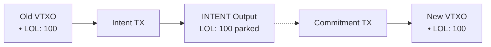

### Benefits

- **Asset Continuity**: Assets maintain their identity across batch swaps
- **No Liquidity Requirements**: Operator doesn't need to front assets
- **Composability**: Single intent can mix VTXOs and collaborative exits
- **Simplicity**: No script commitments or witnesses—direct txid+output references

### Collaborative Exit

Users can exit assets to on-chain outputs by specifying collaborative exit in their intent's BIP322 configuration. The commitment transaction's asset packet aggregates all collaborative exit claims and places those assets at on-chain outputs via LOCAL outputs.

This mechanism ensures that Arkade Assets work seamlessly within Arkade's batch swap architecture while maintaining the protocol's trust-minimized properties.

---

## 10. Arkade Defense Transactions and Asset Validation

Arkade uses special transaction types for operator security that are **exempt from Arkade Asset validation**. These transactions protect the operator's BTC liquidity and do not represent asset operations.

### Checkpoint Transactions

[Checkpoint transactions](https://docs.arkadeos.com/arkd/server-security/checkpoint-txs) are defense mechanisms that allow the Arkade operator to protect against griefing attacks on preconfirmed VTXOs.

**Asset Validation Rules:**
- Checkpoint transactions **do not require** an Arkade Asset packet
- A checkpoint transaction without an asset packet **does not burn assets**
- The indexer treats checkpoints as transitory BTC-layer state, not asset state changes

### Forfeit Transactions

[Forfeit transactions](https://docs.arkadeos.com/arkd/server-security/forfeit-txs) allow the operator to reclaim funds when detecting double-spend attempts on settled VTXOs.

**Asset Validation Rules:**
- Forfeit transactions **do not require** an Arkade Asset packet
- A forfeit transaction without an asset packet **does not burn assets**
- Forfeits are operator defense mechanisms, not user-initiated asset transfers

### Virtual Mempool Unrolls and Asset Continuity

When the Arkade virtual mempool partially unrolls (broadcasts transactions to Bitcoin in sequence), asset ownership follows the **tip of the virtual mempool**, not intermediate states.

**Example:** Consider a virtual mempool chain `A → B → C` where an asset is transferred from `A` to `C`:

```
Virtual Mempool State (preconfirmed):
  A (asset origin) → B → C (asset destination)
```

If the chain partially unrolls to `B` (transactions `A` and `B` are broadcast to Bitcoin, `C` remains preconfirmed):

```
After Partial Unroll to B:
  A, B (broadcast to Bitcoin)
  C (remains in virtual mempool, preconfirmed)
```

**Asset Resolution:**
- The asset is **still owned by `C`** in the virtual mempool
- The indexer treats the tip of the virtual mempool (`C`) as the current unspent asset location
- The partial unroll does not revert asset ownership to the on-chain state at `A` or `B`
- This ensures asset continuity even during defense scenarios where partial unrolls occur

### Rationale

These rules ensure that:
1. **Operator defense is not penalized**: Broadcasting checkpoints/forfeits doesn't accidentally burn user assets
2. **Asset state is deterministic**: The Bitcoin-confirmed state is the source of truth after unrolls
3. **No asset packet overhead**: Defense transactions remain lightweight and fast to broadcast

---
# Arkade Script Opcodes

This document outlines the introspection opcodes available in Arkade Script for interacting with Arkade Assets, along with the high-level API structure and example contracts.

For base opcodes (transaction introspection, arithmetic, cryptographic, etc.), see [arkd PR #577](https://github.com/arkade-os/arkd/pull/577).

---

## Arkade Asset Introspection Opcodes

These opcodes provide access to the Arkade Asset V1 packet embedded in the transaction.

All Asset IDs are represented as **two stack items**: `(txid32, gidx_u16)`.

### Packet & Groups

| Opcode | Stack Effect | Description |
|--------|--------------|-------------|
| `OP_INSPECTNUMASSETGROUPS` | → `K` | Number of groups in the Arkade Asset packet |
| `OP_INSPECTASSETGROUPASSETID` `k` | → `txid32 gidx_u16` | Resolved AssetId of group `k`. Fresh groups use `this_txid`. |
| `OP_INSPECTASSETGROUPCTRL` `k` | → `-1` \| `txid32 gidx_u16` | Control AssetId if present, else -1 |
| `OP_FINDASSETGROUPBYASSETID` `txid32 gidx_u16` | → `-1` \| `k` | Find group index, or -1 if absent |

### Per-Group Metadata

| Opcode | Stack Effect | Description |
|--------|--------------|-------------|
| `OP_INSPECTASSETGROUPMETADATAHASH` `k` | → `hash32` | Immutable metadata Merkle root (set at genesis) |

### Per-Group Inputs/Outputs

| Opcode | Stack Effect | Description |
|--------|--------------|-------------|
| `OP_INSPECTASSETGROUPNUM` `k source_u8` | → `count_u16` or `in_u16 out_u16` | Count of inputs/outputs. `source`: 0=inputs, 1=outputs, 2=both |
| `OP_INSPECTASSETGROUP` `k j source_u8` | → `type_u8 data... amount_u64` | j-th input/output of group `k`. `source`: 0=input, 1=output |
| `OP_INSPECTASSETGROUPSUM` `k source_u8` | → `sum_u64` or `in_u64 out_u64` | Sum of amounts. `source`: 0=inputs, 1=outputs, 2=both |

**`OP_INSPECTASSETGROUP` return values by type:**

| Type | `type_u8` | Additional Data |
|------|-----------|-----------------|
| LOCAL input | `0x01` | `input_index_u32 amount_u64` |
| INTENT input | `0x02` | `txid_32 output_index_u32 amount_u64` |
| LOCAL output | `0x01` | `output_index_u32 amount_u64` |
| INTENT output | `0x02` | `output_index_u32 amount_u64` |

### Cross-Output (Multi-Asset per UTXO)

| Opcode | Stack Effect | Description |
|--------|--------------|-------------|
| `OP_INSPECTOUTASSETCOUNT` `o` | → `n` | Number of asset entries assigned to output `o` |
| `OP_INSPECTOUTASSETAT` `o t` | → `txid32 gidx_u16 amount_u64` | t-th asset at output `o` |
| `OP_INSPECTOUTASSETLOOKUP` `o txid32 gidx_u16` | → `amount_u64` \| `-1` | Amount of asset at output `o`, or -1 if not found |

### Cross-Input (Packet-Declared)

| Opcode | Stack Effect | Description |
|--------|--------------|-------------|
| `OP_INSPECTINASSETCOUNT` `i` | → `n` | Number of assets declared for input `i` |
| `OP_INSPECTINASSETAT` `i t` | → `txid32 gidx_u16 amount_u64` | t-th asset declared for input `i` |
| `OP_INSPECTINASSETLOOKUP` `i txid32 gidx_u16` | → `amount_u64` \| `-1` | Declared amount for asset at input `i`, or -1 if not found |

### Intent-Specific

| Opcode | Stack Effect | Description |
|--------|--------------|-------------|
| `OP_INSPECTGROUPINTENTOUTCOUNT` `k` | → `n` | Number of INTENT outputs in group `k` |
| `OP_INSPECTGROUPINTENTOUT` `k j` | → `output_index_u32 amount_u64` | j-th INTENT output in group `k` |
| `OP_INSPECTGROUPINTENTINCOUNT` `k` | → `n` | Number of INTENT inputs in group `k` |
| `OP_INSPECTGROUPINTENTIN` `k j` | → `txid_32 output_index_u32 amount_u64` | j-th INTENT input in group `k` |

---

## High-Level API (Arkade Compile Sugar)

The following API provides syntactic sugar for Arkade Script contracts. Each property/method is documented with its translation to underlying opcodes.

### Asset Groups

```javascript
tx.assetGroups.length      // → OP_INSPECTNUMASSETGROUPS

tx.assetGroups.find(assetId)
                           // → OP_FINDASSETGROUPBYASSETID assetId.txid assetId.gidx
                           //   Returns: group index, or -1 if not found

tx.assetGroups[k].assetId  // → OP_INSPECTASSETGROUPASSETID k
                           //   Returns: { txid: bytes32, gidx: int }

tx.assetGroups[k].isFresh  // → OP_INSPECTASSETGROUPASSETID k
                           //   OP_DROP OP_TXID OP_EQUAL
                           //   True if assetId.txid == this_txid (new asset)

tx.assetGroups[k].control  // → OP_INSPECTASSETGROUPCTRL k
                           //   Returns: AssetId (txid32, gidx_u16), or -1 if no control

// Metadata hash (immutable, set at genesis)
tx.assetGroups[k].metadataHash
                           // → OP_INSPECTASSETGROUPMETADATAHASH k
                           //   Returns the immutable metadata Merkle root

// Counts
tx.assetGroups[k].numInputs
                           // → OP_INSPECTASSETGROUPNUM k 0

tx.assetGroups[k].numOutputs
                           // → OP_INSPECTASSETGROUPNUM k 1

// Sums
tx.assetGroups[k].sumInputs
                           // → OP_INSPECTASSETGROUPSUM k 0

tx.assetGroups[k].sumOutputs
                           // → OP_INSPECTASSETGROUPSUM k 1

// Computed: delta = sumOutputs - sumInputs
tx.assetGroups[k].delta    // → OP_INSPECTASSETGROUPSUM k 2 OP_SUB64
                           //   Positive = mint, Negative = burn, Zero = transfer

// Per-group inputs/outputs
tx.assetGroups[k].inputs[j]
                           // → OP_INSPECTASSETGROUP k j 0
                           //   Returns: AssetInput object

tx.assetGroups[k].outputs[j]
                           // → OP_INSPECTASSETGROUP k j 1
                           //   Returns: AssetOutput object
```

### Asset Inputs/Outputs

```javascript
// AssetInput (from OP_INSPECTASSETGROUP k j 0)
tx.assetGroups[k].inputs[j].type       // LOCAL (0x01) or INTENT (0x02)
tx.assetGroups[k].inputs[j].amount     // Asset amount (u64)

// LOCAL input additional fields:
tx.assetGroups[k].inputs[j].inputIndex // Transaction input index (u32)

// INTENT input additional fields:
tx.assetGroups[k].inputs[j].txid       // Intent transaction ID (bytes32)
tx.assetGroups[k].inputs[j].outputIndex // Output index in intent tx (u32)

// AssetOutput (from OP_INSPECTASSETGROUP k j 1)
tx.assetGroups[k].outputs[j].type       // LOCAL (0x01) or INTENT (0x02)
tx.assetGroups[k].outputs[j].amount     // Asset amount (u64)

// LOCAL output additional fields:
tx.assetGroups[k].outputs[j].outputIndex // Transaction output index (u32)
tx.assetGroups[k].outputs[j].scriptPubKey
                           // → OP_INSPECTASSETGROUP k j 1
                           //   (extract output index)
                           //   OP_INSPECTOUTPUTSCRIPTPUBKEY

// INTENT output additional fields:
tx.assetGroups[k].outputs[j].outputIndex // Output index in same tx (u32)
```

### Cross-Input Asset Lookups

```javascript
tx.inputs[i].assets.length
                           // → OP_INSPECTINASSETCOUNT i

tx.inputs[i].assets[t].assetId
tx.inputs[i].assets[t].amount
                           // → OP_INSPECTINASSETAT i t

tx.inputs[i].assets.lookup(assetId)
                           // → OP_INSPECTINASSETLOOKUP i assetId.txid assetId.gidx
                           //   Returns: amount (> 0) or -1 if not found
```

### Cross-Output Asset Lookups

```javascript
tx.outputs[o].assets.length
                           // → OP_INSPECTOUTASSETCOUNT o

tx.outputs[o].assets[t].assetId
tx.outputs[o].assets[t].amount
                           // → OP_INSPECTOUTASSETAT o t

tx.outputs[o].assets.lookup(assetId)
                           // → OP_INSPECTOUTASSETLOOKUP o assetId.txid assetId.gidx
                           //   Returns: amount (> 0) or -1 if not found
```

---

## Type Definitions

```javascript
// Asset ID - identifies an asset by its genesis transaction and group index
struct AssetId {
    txid: bytes32,
    gidx: int
}

// Asset reference for control assets
struct AssetRef {
    byId: bool,              // true for BY_ID, false for BY_GROUP
    assetId: AssetId,        // Used when byId = true
    groupIndex: int          // Used when byId = false (references group in same tx)
}

// Input types
enum AssetInputType { LOCAL = 0x01, INTENT = 0x02 }

struct AssetInputLocal {
    type: AssetInputType,    // LOCAL
    inputIndex: int,         // Transaction input index
    amount: bigint
}

struct AssetInputIntent {
    type: AssetInputType,    // INTENT
    txid: bytes32,           // Intent transaction ID
    outputIndex: int,        // Output index in intent tx
    amount: bigint
}

// Output types
enum AssetOutputType { LOCAL = 0x01, INTENT = 0x02 }

struct AssetOutputLocal {
    type: AssetOutputType,   // LOCAL
    outputIndex: int,        // Transaction output index
    amount: bigint
}

struct AssetOutputIntent {
    type: AssetOutputType,   // INTENT
    outputIndex: int,        // Output index in same tx (parked for claim)
    amount: bigint
}

```

---

## Common Patterns

### Checking Asset Presence

```javascript
// Check if an asset is present in transaction
let groupIndex = tx.assetGroups.find(assetId);
require(groupIndex != null, "Asset not found");

// Check if asset is at a specific output
let amount = tx.outputs[o].assets.lookup(assetId);
require(amount > 0, "Asset not at output");
```

### Checking if Asset is Fresh (New Issuance)

```javascript
// Check if group creates a new asset (txid matches this transaction)
let group = tx.assetGroups[k];
require(group.isFresh, "Must be fresh issuance");

// Equivalent low-level check:
// OP_INSPECTASSETGROUPASSETID k → txid gidx
// OP_DROP OP_TXID OP_EQUAL → bool
```

### Checking Delta (Mint/Burn/Transfer)

```javascript
let group = tx.assetGroups[k];

// Transfer (no supply change)
require(group.delta == 0, "Must be transfer");

// Mint (supply increase)
require(group.delta > 0, "Must be mint");

// Burn (supply decrease)
require(group.delta < 0, "Must be burn");
```

### Verifying Control Asset

```javascript
let group = tx.assetGroups.find(assetId);
require(group != null, "Asset not found");
require(group.control == expectedControlId, "Wrong control asset");
```
# Arkade Asset Transaction Examples

---

## A) Fresh Issuance with Pre-existing Control

This example demonstrates a fresh issuance of a new asset `A`, which is controlled by a pre-existing control asset `C`. The control asset `C` must be present in the same transaction for the issuance of `A` to be valid. The control asset must be present, but its input and output amounts do not need to match.

### Transaction Diagram

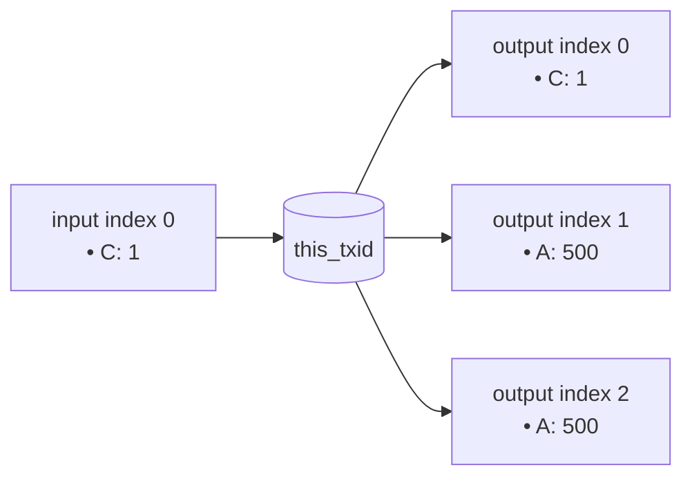

### Asset Packet Definition

- **Group[0] (Control Asset C):**
  - `AssetId`: `(txidC, gidxC)` (points to an existing asset)
  - `Inputs`: `(i:0, amt:1)`
  - `Outputs`: `(o:0, amt:1)`
  - *Result: Control asset is present.* 

- **Group[1] (New Asset A):**
  - `AssetId`: Omitted (fresh issuance, new ID is `(this_txid, 1)`)
  - `ControlAsset`: `BY_ID { assetid: {txidC, gidxC} }` (points to asset C)
  - `Outputs`: `(o:1, amt:500), (o:2, amt:500)`
  - *Result: Σout > Σin, fresh issuance is valid because control asset C is present in Group[0].*

### Code Example (TypeScript)

This is how you would construct the transaction packet using the `arkade-assets-codec` library.

```typescript
import { Packet } from './arkade-assets-codec';

// Example A: fresh issuance with a pre-existing control asset.
const controlTxidHex = '11'.repeat(32);
const controlGidx = 0;

const payload: Packet = {
  groups: [
    // Group[0] Control: A pre-existing control asset, spent and re-created.
    {
      assetId: { txidHex: controlTxidHex, gidx: controlGidx },
      inputs: [{ type: 'LOCAL', i: 0, amt: 1n }],
      outputs: [{ type: 'LOCAL', o: 0, amt: 1n }]
    },
    // Group[1] Token: A fresh issuance, controlled by group 0.
    // AssetId is omitted, which indicates this is a genesis (fresh asset).
    {
      controlAsset: { gidx: 0 }, // References Group[0]
      metadata: { name: 'Token A' },  // Immutable metadata set at genesis
      inputs: [],
      outputs: [
        { type: 'LOCAL', o: 1, amt: 500n },
        { type: 'LOCAL', o: 2, amt: 500n }
      ]
    },
  ]
};

// This payload would then be encoded and put into an OP_RETURN.
```

---

## B) Simple Transfer

This example shows a standard transfer of a single asset (`LOL`) from multiple inputs to multiple outputs. The key requirement for a valid transfer is that the total amount of the asset in the inputs equals the total amount in the outputs (i.e., Σinputs = Σoutputs).

### Transaction Diagram

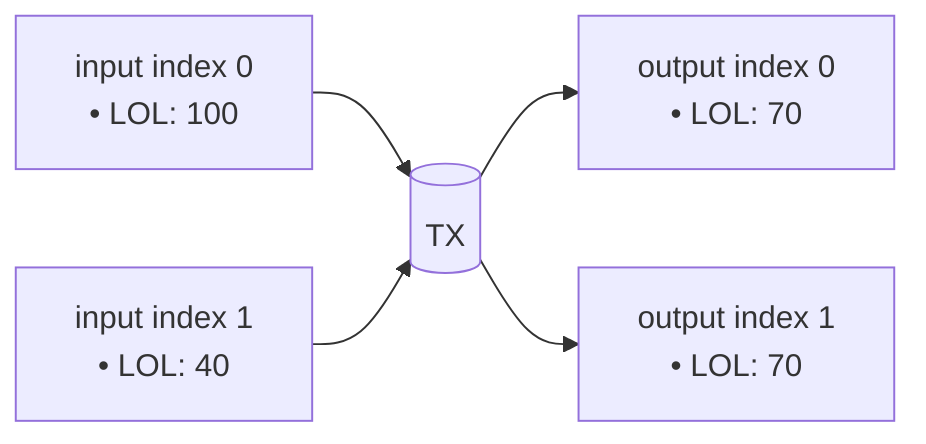

### Asset Packet Definition

- **Group[0] (Asset LOL):**
  - `AssetId`: `(txidL, gidxL)`
  - `Inputs`: `(i:0, amt:100), (i:1, amt:40)`
  - `Outputs`: `(o:0, amt:70), (o:1, amt:70)`
  - *Result: Σin (140) = Σout (140). This is a valid transfer.*

### Code Example (TypeScript)

```typescript
import { Packet } from './arkade-assets-codec';

const lolAssetId = { txidHex: '70'.repeat(32), gidx: 0 };

const payload: Packet = {
  groups: [
    {
      assetId: lolAssetId,
      inputs: [
        { type: 'LOCAL', i: 0, amt: 100n },
        { type: 'LOCAL', i: 1, amt: 40n },
      ],
      outputs: [
        { type: 'LOCAL', o: 0, amt: 70n },
        { type: 'LOCAL', o: 1, amt: 70n },
      ],
    },
  ]
};
```

---

## C) Asset Burn

This example demonstrates how to burn assets. A burn occurs when the sum of an asset's inputs is greater than the sum of its outputs (Σinputs > Σoutputs). In this case, two inputs containing the `XYZ` asset are spent, but no outputs are created for that asset group, resulting in the total amount being burned.

### Transaction Diagram

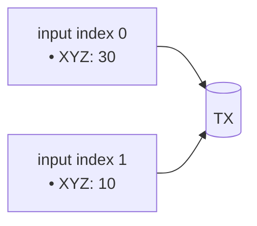

### Asset Packet Definition

- **Group[0] (Asset XYZ):**
  - `AssetId`: `(txidX, gidxX)`
  - `Inputs`: `(i:0, amt:30), (i:1, amt:10)`
  - `Outputs`: `[]`
  - *Result: Σin (40) > Σout (0). This is a valid burn.*

### Code Example (TypeScript)

```typescript
import { Packet } from './arkade-assets-codec';

const xyzAssetId = { txidHex: '88'.repeat(32), gidx: 0 }; // Placeholder

const payload: Packet = {
  groups: [
    {
      assetId: xyzAssetId,
      inputs: [
        { type: 'LOCAL', i: 0, amt: 30n },
        { type: 'LOCAL', i: 1, amt: 10n },
      ],
      outputs: [], // No outputs for this group, so all inputs are burned
    },
  ]
};
```

---

## D) Reissuance with Control

This example shows how to reissue more units of an existing asset (`A`). Reissuance is a transaction where the output amount of an asset is greater than its input amount (Σoutputs > Σinputs). This is only allowed if the asset was created with a control asset, and that control asset (`C`) is present in the reissuance transaction.

### Transaction Diagram

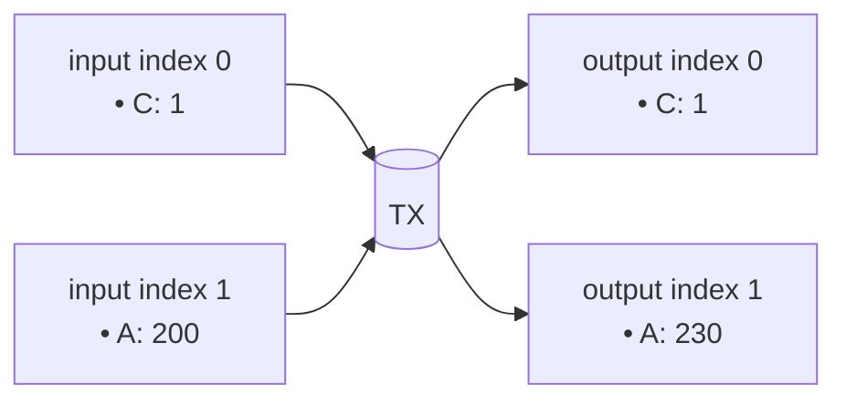

### Asset Packet Definition

- **Group[0] (Control Asset C):**
  - `AssetId`: `(txidC, gidxC)`
  - `Inputs`: `(i:0, amt:1)`
  - `Outputs`: `(o:0, amt:1)`
  - *Result: Control asset is present.*

- **Group[1] (Reissued Asset A):**
  - `AssetId`: `(txidA, gidxA)`
  - `Inputs`: `(i:1, amt:200)`
  - `Outputs`: `(o:1, amt:230)`
  - *Result: Σout (230) > Σin (200). This reissuance is valid because its control asset `C` is present in Group[0].*

### Code Example (TypeScript)

```typescript
import { Packet } from './arkade-assets-codec';

const controlAssetId = { txidHex: 'cc'.repeat(32), gidx: 0 };
const reissuedAssetId = { txidHex: 'aa'.repeat(32), gidx: 1 };

const payload: Packet = {
  groups: [
    {
      assetId: controlAssetId,
      inputs: [{ type: 'LOCAL', i: 0, amt: 1n }],
      outputs: [{ type: 'LOCAL', o: 0, amt: 1n }],
    },
    {
      assetId: reissuedAssetId,
      inputs: [{ type: 'LOCAL', i: 1, amt: 200n }],
      outputs: [{ type: 'LOCAL', o: 1, amt: 230n }],
    },
  ]
};
```

---

## E) Multi-Asset-Per-UTXO Transfer

An input UTXO is not limited to holding only one type of asset. This example demonstrates a transaction where a single input (`input index 0`) contains quantities of two different assets, `X` and `Y`. Both asset groups reference the same input index to spend their respective amounts.

### Transaction Diagram

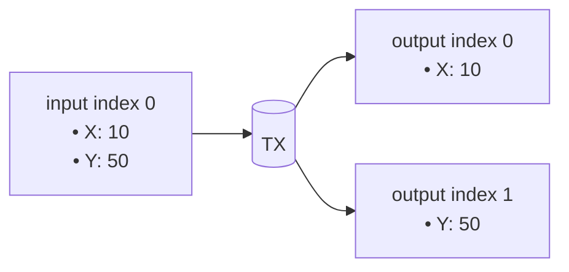

### Asset Packet Definition

- **Group[0] (Asset X):**
  - `AssetId`: `(txidX, gidxX)`
  - `Inputs`: `(i:0, amt:10)`
  - `Outputs`: `(o:0, amt:10)`
  - *Result: Valid transfer (delta=0).*

- **Group[1] (Asset Y):**
  - `AssetId`: `(txidY, gidxY)`
  - `Inputs`: `(i:0, amt:50)`
  - `Outputs`: `(o:1, amt:50)`
  - *Result: Valid transfer (delta=0).*

### Code Example (TypeScript)

```typescript
import { Packet } from './arkade-assets-codec';

const assetX = { txidHex: '55'.repeat(32), gidx: 0 };
const assetY = { txidHex: '66'.repeat(32), gidx: 1 };

const payload: Packet = {
  groups: [
    {
      assetId: assetX,
      inputs: [{ type: 'LOCAL', i: 0, amt: 10n }],
      outputs: [{ type: 'LOCAL', o: 0, amt: 10n }],
    },
    {
      assetId: assetY,
      inputs: [{ type: 'LOCAL', i: 0, amt: 50n }],
      outputs: [{ type: 'LOCAL', o: 1, amt: 50n }],
    },
  ]
};
```

---

## F) Multi-Asset-Per-Transaction Transfer

A single transaction can contain operations for multiple, independent assets. This example shows two separate asset transfers (`P` and `Q`) happening within the same transaction. Each asset has its own group in the packet.

### Transaction Diagram

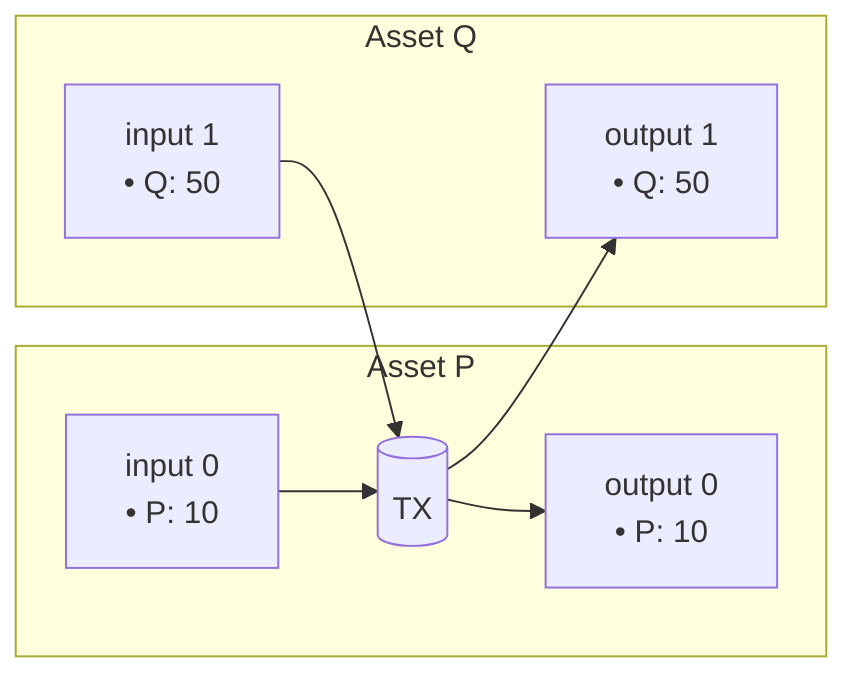

### Asset Packet Definition

- **Group[0] (Asset P):**
  - `AssetId`: `(txidP, gidxP)`
  - `Inputs`: `(i:0, amt:10)`
  - `Outputs`: `(o:0, amt:10)`
  - *Result: Valid transfer (delta=0).*

- **Group[1] (Asset Q):**
  - `AssetId`: `(txidQ, gidxQ)`
  - `Inputs`: `(i:1, amt:50)`
  - `Outputs`: `(o:1, amt:50)`
  - *Result: Valid transfer (delta=0).*

### Code Example (TypeScript)

```typescript
import { Packet } from './arkade-assets-codec';

const assetP = { txidHex: 'ab'.repeat(32), gidx: 0 };
const assetQ = { txidHex: 'cd'.repeat(32), gidx: 0 };

const payload: Packet = {
  groups: [
    {
      assetId: assetP,
      inputs: [{ type: 'LOCAL', i: 0, amt: 10n }],
      outputs: [{ type: 'LOCAL', o: 0, amt: 10n }],
    },
    {
      assetId: assetQ,
      inputs: [{ type: 'LOCAL', i: 1, amt: 50n }],
      outputs: [{ type: 'LOCAL', o: 1, amt: 50n }],
    },
  ]
};
```

---

## G) Intent (Park & Claim)

The intent system allows assets to be moved across Arkade batches. It's a two-stage process: park and claim.

1.  **Intent Transaction:** User parks assets in `INTENT` outputs, signaling participation in a batch swap.
2.  **Commitment Transaction:** Operator claims parked assets via `INTENT` inputs and places them at new VTXOs via `LOCAL` outputs.

### Transaction Diagrams

**Intent Transaction**
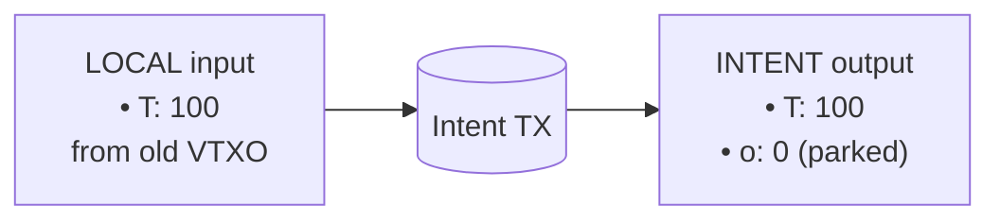

**Commitment Transaction**
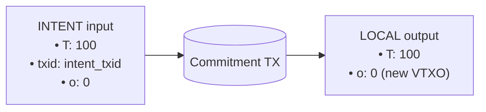

### Asset Packet Definitions

**Intent Packet**
- `AssetId`: `(txidT, gidxT)`
- `Inputs`: `(type:LOCAL, i:0, amt:100)`
- `Outputs`: `(type:INTENT, o:0, amt:100)`

**Commitment Packet**
- `AssetId`: `(txidT, gidxT)`
- `Inputs`: `(type:INTENT, txid:intent_txid, o:0, amt:100)`
- `Outputs`: `(type:LOCAL, o:0, amt:100)`

### Code Example (TypeScript)

```typescript
import { Packet } from './arkade-assets-codec';

const assetId = { txidHex: 'dd'.repeat(32), gidx: 0 };
const intentTxid = Buffer.alloc(32); // Will be the hash of the intent transaction

// Intent Transaction Payload (user submits to join batch)
const intentPayload: Packet = {
  groups: [
    {
      assetId: assetId,
      inputs: [{ type: 'LOCAL', i: 0, amt: 100n }],
      outputs: [{ type: 'INTENT', o: 0, amt: 100n }],
    },
  ]
};

// Commitment Transaction Payload (operator builds batch)
const commitmentPayload: Packet = {
  groups: [
    {
      assetId: assetId,
      inputs: [{
        type: 'INTENT',
        txid: intentTxid,  // Hash of the intent transaction
        o: 0,              // Output index in intent tx
        amt: 100n
      }],
      outputs: [{ type: 'LOCAL', o: 0, amt: 100n }],
    },
  ]
};
```

### Composable Intents (Batch Swap + Collaborative Exit)

A single intent can mix VTXOs and collaborative exits:

```typescript
// Intent with mixed destinations (specified via BIP322 config message)
const mixedIntentPayload: Packet = {
  groups: [
    {
      assetId: assetId,
      inputs: [{ type: 'LOCAL', i: 0, amt: 100n }],
      outputs: [
        { type: 'INTENT', o: 0, amt: 30n },  // → new VTXO
        { type: 'INTENT', o: 1, amt: 70n },  // → collaborative exit (on-chain)
      ],
    },
  ]
};
```

---

# Arkade Script Contract Examples

## 1) Gated Asset Swap

This example demonstrates an Arkade Script contract that facilitates a trustless 1-for-1 swap of Asset `A` for Asset `B`. The contract is placed on the output holding Asset `A`. To spend this output, the transaction must also provide 1 unit of Asset `B` and send it to the contract's address, ensuring a fair exchange.

### Contract Logic

The script performs the following checks:
1.  **Verify Incoming Asset B:** It checks that the transaction contains an input of Asset `B` with an amount of 1.
2.  **Verify Outgoing Asset A:** It ensures that the output containing Asset `A` is being spent.
3.  **Verify Destination of Asset B:** It confirms that Asset `B` is being sent to the same address that held Asset `A`.

### Arkade Script Opcodes

```
// Define Asset IDs
OP_PUSHBYTES_32 <asset_B_txid>
OP_PUSHBYTES_1 <asset_B_gidx>
OP_ASSETID

// Check that 1 unit of Asset B is an input
OP_PUSHINT_1
OP_GETASSET_IN
OP_EQUAL
OP_VERIFY

// Check that Asset B is sent to the current contract's output script
OP_PUSHINT_1
OP_GETASSET_OUT
OP_EQUAL
OP_VERIFY
```

### Transaction Diagram

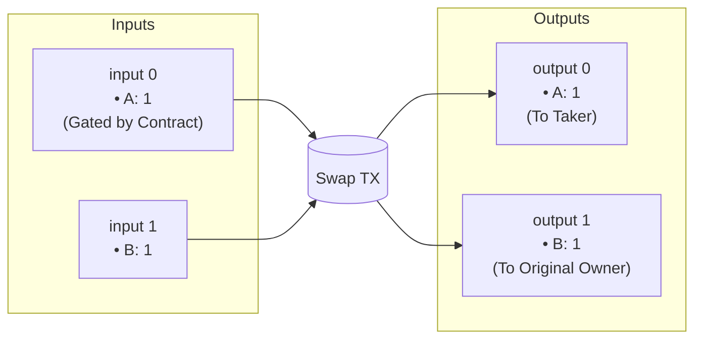

---

## 2) Multi-Sig Asset Vault

This contract demonstrates a 2-of-2 multi-signature vault for an asset. To spend the asset held by this contract, two valid signatures must be provided corresponding to the two public keys defined in the script.

### Contract Logic

1.  **Define Public Keys:** The script starts by pushing two public keys onto the stack.
2.  **Check Signatures:** It then uses `OP_CHECKSIG` twice to validate the provided signatures against the public keys. `OP_SWAP` is used to reorder the stack for the second signature check.
3.  **Verify:** Both checks must pass for the transaction to be valid.

### Arkade Script Opcodes

```
// PubKey1 Sig1
OP_PUSHBYTES_33 <pubkey1>
OP_CHECKSIG
OP_VERIFY

// PubKey2 Sig2
OP_PUSHBYTES_33 <pubkey2>
OP_CHECKSIG
OP_VERIFY
```

### Transaction Diagram

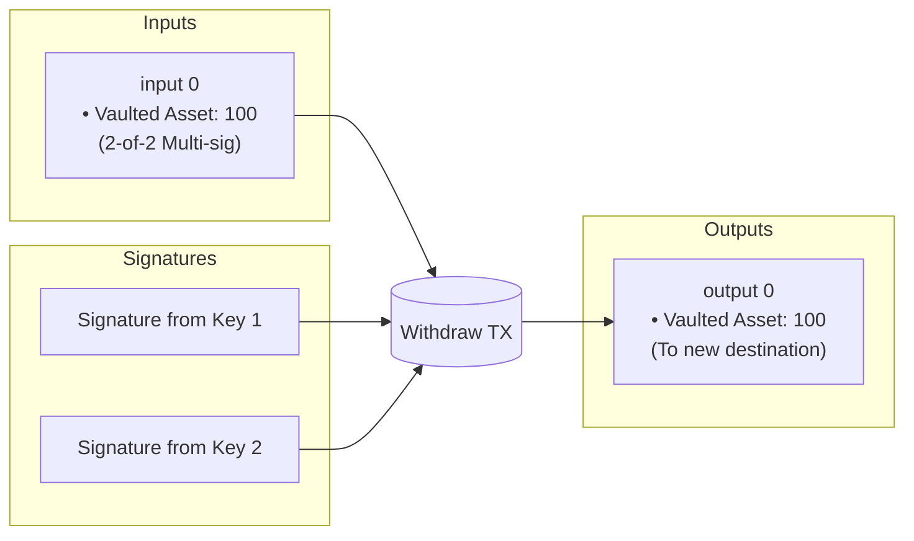

---

## 3) Synthetic Asset Covenant

This advanced contract creates a synthetic asset (`SynthUSD`) that is pegged to another asset (`BaseAsset`). The contract ensures that new `SynthUSD` can only be issued if a corresponding amount of `BaseAsset` is locked in the same transaction. Conversely, `SynthUSD` can be burned to unlock the `BaseAsset`.

### Contract Logic

The script uses introspection opcodes to check the asset balances for both the synthetic and base assets across inputs and outputs.

1.  **Get Input and Output Sums:** It calculates the sum of inputs and outputs for both `SynthUSD` and `BaseAsset`.
2.  **Enforce Peg:** It verifies that `(Σout_Synth - Σin_Synth) + (Σout_Base - Σin_Base) == 0`. This means that for every unit of `SynthUSD` created, one unit of `BaseAsset` must be deposited, and for every unit of `SynthUSD` burned, one unit of `BaseAsset` is returned.

### Arkade Script Opcodes

```
// Assume synth_gidx and base_gidx are on the stack

// Calculate delta for SynthUSD: (sumOutputs - sumInputs)
<synth_gidx> <1> OP_INSPECTASSETGROUPSUM
<synth_gidx> <0> OP_INSPECTASSETGROUPSUM
OP_SUB

// Calculate delta for BaseAsset: (sumOutputs - sumInputs)
<base_gidx> <1> OP_INSPECTASSETGROUPSUM
<base_gidx> <0> OP_INSPECTASSETGROUPSUM
OP_SUB

// Verify peg: delta(SynthUSD) + delta(BaseAsset) == 0
OP_ADD
OP_0
OP_EQUALVERIFY
```

### Transaction Diagram (Issuance)

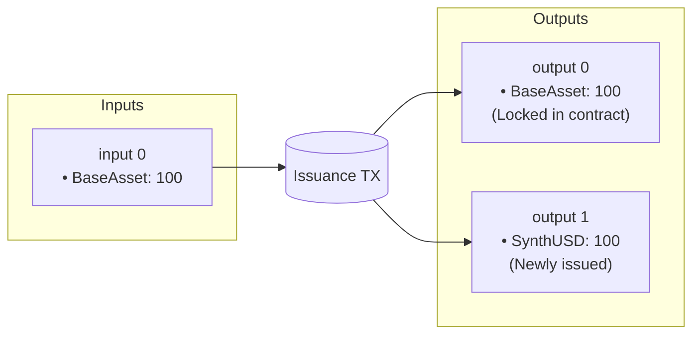
# ArkadeKitties: A Trustless Collectible Game on Ark

This document outlines the design for ArkadeKitties, a decentralized game for collecting and breeding unique digital cats, built entirely on the Ark protocol using Arkade Assets and Arkade Script.

## 1. Core Concept

ArkadeKitties are unique, collectible digital assets. Each Kitty is a non-fungible Arkade Asset with an amount of 1 and has a distinct set of traits determined by its genetic code (genome), which is stored immutably on-chain as asset metadata. Players can buy, sell, and breed their Kitties to create new, rare offspring.

The entire system is trustless. Ownership is enforced by the Ark protocol, and all game logic, including breeding, is executed by on-chain Arkade Script contracts, eliminating the need for a central server.

## 2. Kitty Asset Representation

Each ArkadeKitty is a unique Arkade Asset with an amount of 1. The asset is non-fungible and can be owned and transferred like any other asset on the network.

- **Species Control via Delta Enforcement**: All Kitties share the same control asset (the "Species Control" asset). The Species Control group must be present in any breeding transaction with `delta == 0` (no minting or burning of the control asset itself). This ensures the control asset is retained and can authorize future breeding operations.
- **Species Control Asset**: A single control asset defines the species. Every Kitty's group MUST set `control` to this exact `assetId`. Transactions that mint or reissue Kitties MUST include the Species Control group with `delta == 0`. Minting the control and the controlled asset in the same transaction is allowed by spec and supported by the tools.
- **Genesis Asset (optional lore)**: A special "Genesis Kitty" can still exist as the first Kitty minted under the Species Control. Its `assetId` may be referenced off-chain for lore/UX, but authorization is strictly enforced by the Species Control.

- **Provenance Verification**: To prevent counterfeit assets, the `BreedKitties` contract enforces that any parent Kitty (and any child) sets its `control` reference to the Species Control `assetId`. Any asset with a different or missing control reference cannot be used for breeding and cannot be minted by the contract.

> Naming and API conventions:
> - This document uses the example sugar API: `tx.assetGroups.find(...)`, `group.metadataHash`, `group.numInputs`, `group.delta`.
> - Type names are kept consistent in the contract: `assetId`, `pubkey`, `Sig`.
> - A group's `assetId` identifies the group; the lineage pointer is a separate control asset reference, accessed via minimal opcode helpers.

## 3. Metadata: The Kitty Genome ("Cattributes")

The appearance and traits of each Kitty are determined by its metadata, which contains its genetic code. This metadata is structured as a key-value map and is committed to the chain via a Merkle root in the `metadataHash` field.

**Example Metadata (on-chain committed keys only):**

```json
{
  "generation": "0",
  "genome": "733833e4519f1811c5f81b12ab391cb3"
}
```

Note: Visual traits like color, pattern, and cooldown are deterministically derived from the genome (see "Example Genome Breakdown") and are not committed as separate metadata keys on-chain.

## 4. Breeding Mechanism

Breeding is the core game mechanic. A player can select two Kitties they own (the "Sire" and "Dame") and combine them in a transaction that calls the breeding contract. The contract validates the parents and creates a new Kitty with a mixed genome.

### Breeding Contract Example

The `BreedKitties` contract is the heart of the game. It ensures that new Kitties are only created from valid parents and that their genomes are mixed deterministically. The user provides the parents' `genome` and `generation`; the contract recomputes the two-leaf Merkle root and verifies it matches the on-chain `metadataHash`. Crucially, the contract spends and retains the Species Control asset in every successful breeding transaction, so mints are only possible through the contract.

```typescript
pragma arkade ^1.0.0;

// Merkle verification helper for 2-leaf Kitty metadata ("generation" < "genome")
function verifyKittyMetadata(genLeaf: bytes32, genomeLeaf: bytes32, root: bytes32) internal returns (bool) {
    // Keys are sorted lexicographically: generation precedes genome
    return sha256(genLeaf + genomeLeaf) == root;
}

// Canonical metadata Merkle root for ArkadeKitties (two entries: generation, genome)
// Encoding follows arkassets.md leaves:
//   leaf = sha256(varuint(len(key)) || key || varuint(len(value)) || value)
// Keys sorted: "generation" < "genome". We encode generation as 8-byte big-endian (BE).
function computeKittyMetadataRoot(genome: bytes32, generationBE8: bytes8) internal returns (bytes32) {
    // Precomputed key+length prefixes to avoid dynamic packing:
    // generation leaf prefix: 0x0a || "generation" || 0x08
    const GEN_LEAF_PREFIX: bytes = 0x0a67656e65726174696f6e08;
    // genome leaf prefix: 0x06 || "genome" || 0x20
    const GENOME_LEAF_PREFIX: bytes = 0x0667656e6f6d6520;

    let genLeaf = sha256(GEN_LEAF_PREFIX + generationBE8);
    let genomeLeaf = sha256(GENOME_LEAF_PREFIX + genome);

    // 2-leaf Merkle root
    return sha256(genLeaf + genomeLeaf);
}

// A simple, deterministic function to mix two genomes (opcode-friendly)
// Use hashing instead of bytewise XOR to avoid byte arithmetic on-chain.
function mixGenomes(genomeA: bytes32, genomeB: bytes32, entropy: bytes32) internal returns (bytes32) {
    // There is a small chance of a "mutation" (1 in 256).
    // This is triggered by the last byte of entropy being zero.
    if (entropy[31] == 0) {
        // On mutation, the new genome is a pseudorandom hash of all inputs.
        return sha256(genomeA + genomeB + entropy);
    }

    // Perform a trait-by-trait crossover. Each multi-byte trait is inherited as a single unit.
    // The 32-byte genome is structured as follows:
    // - Bytes 0-2:   Body Color (24-bit RGB)
    // - Bytes 3-5:   Pattern Color (24-bit RGB)
    // - Bytes 6-8:   Eye Color (24-bit RGB)
    // - Bytes 9-10:  Body Pattern
    // - Bytes 11-12: Eye Shape
    // - Bytes 13-14: Mouth & Nose Shape
    // - Byte 15:     Cooldown Index
    // - Bytes 16-18: Reserved Trait 1 (e.g., for animations)
    // - Bytes 19-21: Reserved Trait 2 (e.g., for voice)
    // - Bytes 22-23: Reserved Trait 3
    // - Bytes 24-25: Reserved Trait 4
    // - Bytes 26-27: Reserved Trait 5
    // - Bytes 28-29: Reserved Trait 6
    // - Bytes 30-31: Reserved Trait 7

    // To implement this without loops, we build a 32-byte mask by unrolling the logic for each trait.
    // The decision for each trait block is based on the first byte of entropy for that block.
    bytes32 mask = 0x;
    mask += (entropy[0] < 128) ? 0xFFFFFF : 0x000000;     // Body Color
    mask += (entropy[3] < 128) ? 0xFFFFFF : 0x000000;     // Pattern Color
    mask += (entropy[6] < 128) ? 0xFFFFFF : 0x000000;     // Eye Color
    mask += (entropy[9] < 128) ? 0xFFFF : 0x0000;         // Body Pattern
    mask += (entropy[11] < 128) ? 0xFFFF : 0x0000;        // Eye Shape
    mask += (entropy[13] < 128) ? 0xFFFF : 0x0000;        // Mouth & Nose
    mask += (entropy[15] < 128) ? 0xFF : 0x00;            // Cooldown
    mask += (entropy[16] < 128) ? 0xFFFFFF : 0x000000;     // Reserved 1
    mask += (entropy[19] < 128) ? 0xFFFFFF : 0x000000;     // Reserved 2
    mask += (entropy[22] < 128) ? 0xFFFF : 0x0000;        // Reserved 3
    mask += (entropy[24] < 128) ? 0xFFFF : 0x0000;        // Reserved 4
    mask += (entropy[26] < 128) ? 0xFFFF : 0x0000;        // Reserved 5
    mask += (entropy[28] < 128) ? 0xFFFF : 0x0000;        // Reserved 6
    mask += (entropy[30] < 128) ? 0xFFFF : 0x0000;        // Reserved 7

    // The final genome is composed in a single bitwise operation.
    return (genomeA & mask) | (genomeB & ~mask);
}

function computeChildGeneration(sireGenerationBE8: bytes8, dameGenerationBE8: bytes8) internal returns (bytes8) {
    let sireGen = sireGenerationBE8.toInt64();
    let dameGen = dameGenerationBE8.toInt64();
    let parentMaxGen = (sireGen >= dameGen ? sireGen : dameGen);
    let childGen = parentMaxGen + 1;
    return childGen.toBytesBE(8);
}


// --- ENTROPY-AWARE BREEDING CONTRACTS (COMMIT-REVEAL) ---


// Contract 1: Commits to a breeding pair and a secret salt.
// This creates a temporary UTXO locked with the BreedRevealContract script.
contract BreedCommit(
    assetId speciesControlId,
    script feeScript, // A generic script for the fee output
    int fee, // The required fee to prevent spam
    pubkey oracle // The public key of the oracle to be used for the reveal
    int timeout // The timeout for the reveal to occur

) {
    function commit(            
        // Sire & Dame details
        sireId: assetId, sireGenome: bytes32, sireGenerationBE8: bytes8, script sireOwner,
        dameId: assetId, dameGenome: bytes32, dameGenerationBE8: bytes8, script dameOwner,
        // A secret salt from the user, hashed
        saltHash: bytes32,
        // The output index for the reveal UTXO
        revealOutputIndex: int,
        // The output index for the fee UTXO
        feeOutputIndex: int,
        // the script for the new Kitty owner
        newKittyOwner: script,
    ) {


        // 1. Verify a fee is paid to the designated fee script
        require(tx.outputs[feeOutputIndex].scriptPubKey == feeScript, "Fee output script mismatch");
        require(tx.outputs[feeOutputIndex].value >= fee, "Fee not paid");
        require(tx.outputs[revealOutputIndex].assets.lookup(speciesControlId) == 1, "Species Control not locked in reveal output");
        require(tx.outputs[revealOutputIndex].assets.lookup(sireId) == 1, "Sire not locked in reveal output");
        require(tx.outputs[revealOutputIndex].assets.lookup(dameId) == 1, "Dame not locked in reveal output");
        // 2. Verify parent assets are present and valid
        let sireGroup = tx.assetGroups.find(sireId);
        let dameGroup = tx.assetGroups.find(dameId);
        require(sireGroup != null && dameGroup != null, "Sire and Dame assets must be spent");
        require(sireGroup.control == speciesControlId, "Sire not Species-Controlled");
        require(dameGroup.control == speciesControlId, "Dame not Species-Controlled");
        require(sireGroup.metadataHash == computeKittyMetadataRoot(sireGenome, sireGenerationBE8), "Sire metadata hash mismatch");
        require(dameGroup.metadataHash == computeKittyMetadataRoot(dameGenome, dameGenerationBE8), "Dame metadata hash mismatch");

        // 2. Verify Species Control asset is present and retained
        let speciesGroup = tx.assetGroups.find(speciesControlId);
        require(speciesGroup != null && speciesGroup.delta == 0, "Species Control must be present and retained");

        // 3. Construct the reveal script and enforce its creation
        // The off-chain client is responsible for constructing the exact reveal script by
        // parameterizing the BreedReveal contract template with the details of this commit.
        // The commit contract then verifies that the output at the specified index is locked
        // with this exact script, which it reconstructs here for verification.

        Script revealScript = new BreedReveal(
            speciesControlId,
            oracle,
            sireId, dameId,
            sireGenome, sireGenerationBE8,
            dameGenome, dameGenerationBE8,
            saltHash,
            sireOwner, dameOwner,
            newKittyOwner,
            tx.time + timeout,
        );

        require(tx.outputs[revealOutputIndex].scriptPubKey == revealScript, "Reveal output script mismatch");

    }
}


// Contract 2: Spends the commit UTXO, verifies oracle randomness, and creates the new Kitty.
contract BreedReveal(
    // Note: All parameters are now baked into the contract's script at creation time.
    assetId speciesControlId,
    pubkey oracle,
    assetId sireId, assetId dameId,
    bytes32 sireGenome, bytes8 sireGenerationBE8,
    bytes32 dameGenome, bytes8 dameGenerationBE8,
    bytes32 saltHash,
    script sireOwner, script dameOwner,
    script newKittyOwner,
    int expirationTime,
) {
    function reveal(
        // User reveals their secret salt
        salt: bytes32,
        // Oracle provides randomness and a signature
        oracleRand: bytes32,
        oracleSig: signature,
        // The assetId of the new Kitty being created
        newKittyId: assetId,
        kittyOutputIndex: int,
        sireOutputIndex: int,
        dameOutputIndex: int,
        speciesControlOutputIndex: int,
    ) {
        // 1. Verify the user's salt
        require(sha256(salt) == saltHash, "Invalid salt");

        // 2. Verify the oracle's signature over the randomness, bound to this specific commit
        // The message includes the outpoint of the commit UTXO to prevent signature replay.
        let commitOutpoint = tx.input.current.outpoint;
        require(checkDataSig(oracleSig, sha256(commitOutpoint + oracleRand), oracle), "Invalid oracle signature");

        // 3. Verify Species Control is present and retained (delta == 0)
        let speciesGroup = tx.assetGroups.find(speciesControlId);
        require(speciesGroup != null && speciesGroup.delta == 0, "Species Control must be present and retained");
        require(tx.outputs[speciesControlOutputIndex].assets.lookup(speciesControlId) == 1, "Species Control not in output");

        // 4. Find the new Kitty's asset group
        let newKittyGroup = tx.assetGroups.find(newKittyId);
        require(newKittyGroup != null, "New Kitty asset group not found");
        require(newKittyGroup.isFresh && newKittyGroup.delta == 1, "Child must be a fresh NFT");
        require(newKittyGroup.control == speciesControlId, "Child not Species-Controlled");
        let newKittyOutput = tx.outputs[kittyOutputIndex];
        require(newKittyOutput.assets.lookup(newKittyId) == 1, "New Kitty not locked in output");
        require(newKittyOutput.scriptPubKey == newKittyOwner, "New Kitty must be sent to a P2PKH address");

        // 5. Generate the unpredictable genome and expected metadata hash
        let entropy = sha256(salt + oracleRand);
        let newGenome = mixGenomes(sireGenome, dameGenome, entropy);
        let expectedMetadataHash = computeKittyMetadataRoot(newGenome, computeChildGeneration(sireGenerationBE8, dameGenerationBE8));

        // 6. Enforce all Kitty creation rules (verify genesis metadata hash)
        require(newKittyGroup.metadataHash == expectedMetadataHash, "Child metadata hash mismatch");

    }

    // If the reveal doesn't happen, allow parents to be reclaimed.
    function refund(dameOutputIndex: int, sireOutputIndex: int, speciesControlOutputIndex: int) {
        // 1. Check that the timeout has passed
        require(tx.locktime >= expirationTime, "Timeout not yet reached");

        // 2. Verify parents are returned to their owners
        require(tx.outputs[sireOutputIndex].assets.lookup(sireId) == 1, "Sire not refunded");
        require(tx.outputs[sireOutputIndex].scriptPubKey == sireOwner, "Sire not refunded to owner");
        require(tx.outputs[dameOutputIndex].assets.lookup(dameId) == 1, "Dame not refunded");
        require(tx.outputs[dameOutputIndex].scriptPubKey == dameOwner, "Dame not refunded to owner");

        // 3. Verify Species Control is retained (delta == 0)
        let speciesGroup = tx.assetGroups.find(speciesControlId);
        require(speciesGroup != null && speciesGroup.delta == 0, "Species Control must be retained");
        require(tx.outputs[speciesControlOutputIndex].assets.lookup(speciesControlId) == 1, "Species Control not in output");
    }

}

## 5. On-Chain vs. Off-Chain Logic

A key design principle in Arkade Script is the separation of concerns between on-chain contracts and off-chain clients (e.g., a user's wallet or a web interface).

- **On-Chain (The Contract)**: The `BreedCommit` and `BreedReveal` contracts act as a **trustless arbiter**. Their only job is to enforce the rules of the game. They verify parent Kitties, check oracle signatures, and validate the properties of the new child Kitty.

- **Off-Chain (The Client)**: The user's client is responsible for **transaction construction**. This now happens in two stages:
  1.  **Commit Transaction**: The client constructs a transaction that calls `commit`. It provides parent details and a `saltHash`, and creates an output locked with the `BreedReveal` script.
  2.  **Reveal Transaction**: After the oracle publishes randomness for the commit, the client constructs a second transaction. It spends the commit UTXO, calls `reveal`, and includes the new child Kitty output with the correct (and now known) metadata.

If the client constructs a transaction that violates the on-chain rules (e.g., calculates the wrong genome), the contract will reject it, and the transaction will fail.

## 6. Genome and Cattribute Mapping

The visual appearance of a Kitty is derived directly from its `genome`. The 32-byte genome is treated as a series of gene segments, where each segment maps to a specific trait. This mapping is deterministic and public, allowing any client to render a Kitty just by reading its on-chain genome.

**Example Genome Breakdown:**

The 32-byte genome is a blueprint for a Kitty's appearance and attributes. Below is the definitive mapping from genome bytes to traits.

| Byte(s) | Trait                | Interpretation                                      |
|---------|----------------------|-----------------------------------------------------|
| `0-2`   | **Body Color**       | A 24-bit RGB value for the main fur.                |
| `3-5`   | **Pattern Color**    | A 24-bit RGB value for spots, stripes, etc.         |
| `6-8`   | **Eye Color**        | A 24-bit RGB value for the iris.                    |
| `9-10`  | **Body Pattern**     | A 16-bit value mapping to a pattern style and variations. |
| `11-12` | **Eye Shape**        | A 16-bit value mapping to an eye shape.             |
| `13-14` | **Mouth & Nose Shape** | A 16-bit value mapping to a mouth and nose style.   |
| `15`    | **Cooldown Index**   | An 8-bit value mapping to breeding speed.           |
| `16-18` | **Reserved Trait 1** | Reserved for future use (e.g., animations).         |
| `19-21` | **Reserved Trait 2** | Reserved for future use (e.g., voice).              |
| `22-23` | **Reserved Trait 3** | Reserved for future use.                            |
| `24-25` | **Reserved Trait 4** | Reserved for future use.                            |
| `26-27` | **Reserved Trait 5** | Reserved for future use.                            |
| `28-29` | **Reserved Trait 6** | Reserved for future use.                            |
| `30-31` | **Reserved Trait 7** | Reserved for future use.                            |

## 7. Entropy and Breeding Predictability

The deterministic nature of the initial `mixGenomes` function means that a breeder could predict the outcome of a breeding event before initiating it. This allows for "grinding"—running simulations off-chain to find favorable outcomes and only committing those transactions.

To ensure fair and unpredictable breeding, we introduce entropy using a **commit-reveal scheme** combined with an external **oracle**.

1.  **Commit**: A user commits to breeding a specific pair by creating a transaction that includes a hash of a secret value (`saltHash`). This locks in their choice.
2.  **Oracle Randomness**: A trusted oracle provides a random value (`oracleRand`) and signs it, binding it to the user's specific commit transaction. To prevent oracle bias (where the oracle could try many random values and pick a favorable one), the oracle **must** operate as a **Verifiable Random Function (VRF)**. A VRF ensures that for a given input (the commit transaction ID), there is only one possible valid random output, removing the oracle's ability to influence the outcome.
3.  **Reveal**: The user reveals their secret `salt` and combines it with the `oracleRand`. This combined, unpredictable value is used as entropy to generate the new Kitty's genome.

This two-step process ensures that neither the user nor the oracle can unilaterally control the outcome, making the breeding process genuinely random.
