# Arkade Asset V1 Specification (Working Draft)

## 1. Overview

Arkade Asset V1 is UTXO-native asset system for Bitcoin transactions inspired by Runes and Liquid Assets.

Within Arkade, it requires no indexers: simply parsing the transaction is enough to observe and validate asset interactions. This is due to Arkade Signer's cosigning guard which validates before cosigning, along with its TEE assurances for verifibale honesty.

However, if used onchain, indexers/validators are required to follow the chain (both utxos and vtxos) and disregard invalid asset interaction transactions.

Assets are identified by 2 pieces of data, its genesis transaction hash, and group index. `(genesis_txid, group_index)`

Assets are projected onto Bitcoin transactions by embedding a well-defined data packet, the Arkade Asset V1 packet, in a Bitcoin output via OP_RETURN semantics.

This data packet contains a set of (ordered) Asset Groups, which define asset details along with indexes of transaction inputs and outputs that are caarying this asset and the amounts. The order is important for fresh asset mint operations.

If an Asset group omits its Asset Id, it mints a **fresh asset** whose Asset Id in subsequent transactions is `(this_txid, group_index)`.

If Asset Id is provided, the group operates on that existing asset.

When a fresh asset is being created, it may refer to another asset as its control asset. Issuance is valid if that control asset is present in the same transaction. A fresh asset may be issued while its control asset is also being freshly minted in the same transaction.

Control assets allow additional, future reissuance of a token, and are themselves assets. When a positive delta (Σout > Σin) is detected in an asset group that specifies a control asset, that control asset MUST appear in the same transaction. This requirement applies to both fresh issuance and reissuance. If an asset did not specify a control asset at genesis, it cannot be reissued.

Arkade Asset V1 supports projecting multiple assets unto a single UTXO, and BTC amounts are orthogonal and not included in asset accounting.

Asset amounts are atomic units, and supply management is managed through UTXO spending conditions.


---

## 2. OP\_RETURN structure

Exactly **one OP\_RETURN output** must contain the protocol packet, prefixed with magic bytes. The packet itself is a top-level TLV (Type-Length-Value) stream, allowing multiple data types to coexist within a single transaction.

```
scriptPubKey = OP_RETURN <Magic_Bytes> <TLV_Stream>
```

- **Magic_Bytes**: `0x41524b` ("ARK")
- **TLV_Stream**: A concatenation of one or more TLV records.
- **TLV Record**: `Type (1-byte) || Length (CompactSize) || Value (bytes)`

### Arkade Asset V1 Packet (Type 0x00)

The ArkAsset data is identified by `Type = 0x00`. The `Value` of this record is the asset payload itself.

```
<Type: 0x00> <Length: L> <Value: Asset_Payload>
```

- **Asset_Payload**: The TLV packet containing asset group data (see below).

**Note (Implicit Burn Policy):** If a transaction spends any UTXOs known to carry ArkAsset balances but contains no `OP_RETURN` with an ArkAsset packet (Type `0x00`), those balances are considered irrecoverably burned. Indexers MUST remove such balances from their state.

---

## 3. Packet format (canonical TLV)

### Packet

```
Packet := {
  GroupCount    : varuint
  Groups[GroupCount]     : Group
}
```

### Group

```
Group := {
  AssetId?      : AssetId          # absent => fresh asset (AssetId* = (this_txid, group_index))
  Issuance?     : Issuance         # Genesis only: Defines issuance policy and initial metadata.
  Metadata?     : map<string, string> # Update only: The new metadata for an existing asset.
  InputCount    : varuint
  Inputs[InputCount]  : AssetInput
  OutputCount   : varuint
  Outputs[OutputCount] : AssetOutput
}

Issuance := {
  ControlAsset? : AssetRef
  Metadata?     : map<string, string>
  Immutable?    : bool             # If true, metadata cannot be changed after genesis.
}
```

### 3.1. Issuance and Metadata Rules

- **Genesis (Fresh Assets)**: The `Issuance` property is **only allowed** when creating a fresh asset (i.e., when `AssetId` is absent). It defines the initial control policy and metadata.
  - If `Issuance.Immutable` is set to `true`, the asset's metadata can never be changed.
  - The `Metadata` property **must not** be present at genesis.

- **Metadata Updates (Existing Assets)**: To update the metadata of an existing, non-immutable asset, the transaction must:
  1. Include the asset's `ControlAsset` as an input to authorize the change.
  2. Include the new `Metadata` property in the asset group, containing the full new metadata map.

- **Mutual Exclusivity**: The `Issuance` and `Metadata` properties are mutually exclusive. An asset group **must not** contain both.

- **Covenant Enforcement**: The validity of a metadata transition (e.g., ensuring only certain keys are changed) is enforced by covenant scripts, which can inspect the input and output metadata hashes.

### 3.2. Encoding Details

While the specification uses a logical TLV (Type-Length-Value) model, the canonical binary encoding employs specific optimizations for compactness.

**Group Optional Fields: Presence Byte**

Instead of using a type marker for each optional field within a `Group` (`AssetId`, `Issuance`), the implementation uses a single **presence byte**. This byte is a bitfield that precedes the group's data, where each bit signals the presence of an optional field:

-   `bit 0 (0x01)`: `AssetId` is present.
-   `bit 1 (0x02)`: `Issuance` is present (genesis only).
-   `bit 2 (0x04)`: `Metadata` is present (update only).

The fields, if present, follow in that fixed order. This is more compact than a full TLV scheme for a small, fixed set of optional fields.

**Variant Types: Type Markers**

For data structures that represent one of several variants (a `oneof` structure), a **type marker byte** is used. This is consistent with the logical TLV model.

-   **`AssetRef`**: `0x01` for `BY_ID`, `0x02` for `BY_GROUP`.
-   **`AssetInput`**: `0x01` for `LOCAL`, `0x02` for `TELEPORT`.
-   **`AssetOutput`**: `0x01` for `LOCAL`, `0x02` for `TELEPORT`.

This hybrid approach balances compactness for the `Group` structure with the flexibility of type markers for variant data types.

### Types

```
AssetId   := { txid: bytes32, gidx: u16 } # the genesis tx id that first issued this asset & the index of the asset group in that packet

AssetRef  := oneof {
               0x01 BY_ID    { assetid: AssetId } # if existing asset
             | 0x02 BY_GROUP { gidx: u16 } # if fresh asset (does not exist yet therefore no Assetid)
             }

AssetInput := oneof {
               0x01 LOCAL    { i: u16, amt: u64 }                    # input from same transaction's prevouts
             | 0x02 TELEPORT { commitment: bytes32, amt: u64 }       # input from external teleport via commitment
             }

AssetOutput := oneof {
               0x01 LOCAL    { o: u16, amt: u64 }                    # output within same transaction
             | 0x02 TELEPORT { commitment: bytes32, amt: u64 }       # output to external transaction via commitment
             }

TeleportCommitment := sha256(payment_script || nonce)
```

---

## 4. Asset identity rules

- **Fresh asset:** if `AssetId` omitted, AssetId\* = `(this_txid, group_index)`.
- **Existing asset:** if `AssetId` present, AssetId\* = that literal `(txid,gidx)`.
- **Control reference:**
  - BY\_ID → literal `(txid,gidx)`
  - BY\_GROUP{g} → `(this_txid, g)`

---

## 5. Teleport System

### Commitment-Based Teleports

To solve the circular dependency problem, teleports use a **commitment hash** instead of direct txid references:

1. **Creating a Teleport Output**:
   - Sender generates: `commitment = sha256(payment_script || nonce)`
   - Creates `AssetOutput::TELEPORT { commitment, amt }`
   - The `payment_script` is the receiver's scriptPubKey that gets committed to (for later claiming)

2. **Claiming a Teleport Input**:
   - Receiver creates a transaction with an output containing the `payment_script`
   - References the teleport via `AssetInput::TELEPORT { commitment, amt }`
   - Must provide proof in witness: `{ payment_script, nonce }`
   - **The teleported assets MUST be assigned to a LOCAL output that has the committed `payment_script`**
   - Indexer validates: 
     - `sha256(payment_script || nonce) == commitment`
     - Transaction contains at least one output with the exact `payment_script`
     - Looks up the commitment in pending teleports to find source_txid
     - **Verifies the assets flow to an output with the committed `payment_script`**

3. **Validation Rules**:
   - Indexer tracks pending teleports by commitment hash.
   - **Lifecycle & Claiming Rules**:
     - **Arkade-Native Teleport**: If a teleport is created by an *arkade* transaction, it is instantly claimable by **any** other transaction (arkade or on-chain). No confirmation delay is required.
     - **On-Chain Teleport**: If a teleport is created by an *on-chain* transaction, it can be claimed by **any** other transaction (arkade or on-chain) after a minimum number of block confirmations (e.g., 6 blocks). This delay protects against reorg attacks.
   - In summary, an indexer must enforce the following:
     - **Arkade Source**: Instantly claimable by any destination.
     - **On-Chain Source**: Claimable by any destination only after `N` confirmations.
   - When a teleport input is claimed, the indexer also verifies:
     - The source transaction exists and has the corresponding teleport output.
     - The claiming transaction has an output with the matching `payment_script`.
     - **Assets from the teleport input MUST flow to a LOCAL output with the committed `payment_script`**.
   - Unclaimed teleports remain pending until claimed.

   - **Competing Claims**: In scenarios where multiple transactions attempt to claim the same teleport, the first valid claim to be processed wins. This implies:
     - An arkade transaction will always win against a competing on-chain transaction, as it is processed first.
     - If two on-chain transactions compete, the one in the earlier block wins.

### Teleport State Tracking

The indexer maintains:
```
PendingTeleport := {
  commitment: bytes32,
  source_txid: bytes32,
  source_height: u64,      // Block height where the teleport was created. Optional for arkade-native teleports.
  assetid: AssetId,
  amount: u64
}
```

When a teleport output is created, the indexer stores the source_txid, group index, and its output index. When claiming, the indexer uses the commitment to look up these values.

---

## 6. Examples

For detailed transaction examples, including diagrams, packet definitions, and code, please see [examples.md](./examples.md).

---

### Proof of Authenticity

Proving that an asset was genuinely issued by a specific entity (e.g., Tether issuing a stablecoin) can be accomplished by signing a message with the private key corresponding to a relevant UTXO. This is typically done using a standard like BIP322 (Signatures for P2TR). There are two primary methods:

**1. Proof of Genesis (Historical Proof)**

This method proves who the original creator of an asset was by linking them to the funding of the genesis transaction.

-   **What to Prove**: Ownership of a Bitcoin UTXO that was spent as an input in the asset's genesis transaction.
-   **How it Works**: The issuing entity (e.g., Tether) uses the private key for one of the genesis transaction's inputs to sign a message.
-   **Example Message**: `"We, Tether, certify that the ArkAsset with genesis txid [genesis_txid] and group index [gidx] is the official USDT-Ark."`
-   **Use Case**: A one-time, static proof to establish the authentic origin of an asset.

**2. Proof of Control (Dynamic Proof)**

This method proves who currently has administrative rights over an asset (e.g., the ability to reissue it). This is the most robust method for proving ongoing authenticity.

-   **What to Prove**: Ownership of the UTXO that currently holds the asset's **control asset**.
-   **How it Works**: The entity uses the private key for the UTXO holding the control asset to sign a message. An indexer is used to find which UTXO currently holds the control asset.
-   **Example Message**: `"As the current controller of USDT-Ark, Tether authorizes this action at block height X."`
-   **Use Case**: Proving ongoing administrative control for actions like reissuance or for periodic attestations of authenticity.

In summary, while Proof of Genesis establishes historical origin, **Proof of Control** provides a dynamic and continuous way to verify an asset's authenticity by linking it to a live, controlled UTXO on the Bitcoin blockchain.

---

### Asset Metadata

ArkAsset supports a flexible, on-chain key-value model for metadata in the asset group. Well-known keys (e.g., `name`, `ticker`, `decimals`) can be defined in a separate standards document, but any key-value pair is valid.

Metadata is managed directly within the `Group` packet structure:

**1. Genesis Metadata**

When an asset is first created (i.e., the `AssetId` is omitted from the group), the optional `Metadata` map in the `Group` defines its initial, base metadata. This is useful for defining core, permanent properties.

**2. Metadata Updates**

To update the metadata for an existing asset, a `Group` for that asset must be included in a transaction. This group may or may not have inputs and outputs.

- **Rule**: If the `Metadata` field is present in a group for an *existing* asset, it is treated as an update. The transaction is only valid if one of its inputs spends the UTXO that currently holds the **Control Asset** for the asset being updated.
- **Behavior**: An indexer will replace the asset's existing metadata with the new key-value pairs. This allows any entity with spending rights of the control asset to change or add metadata fields over time.
- **Idempotency**: If the provided metadata is identical to the existing metadata, the transaction is still valid (assuming authorization), but no state change occurs. This allows clients to submit metadata without needing to check if it has changed.

> **Note:** To authorize a metadata update, the transaction must spend the UTXO containing the control asset. To avoid burning the control asset, the transaction packet must also include a group that transfers the control asset to a new output. If the control asset is not reissued, it is destroyed, and no further updates will be possible.

**3. Metadata Introspection**

To enable trustless, on-chain validation of asset properties without incurring high overhead, an indexer MUST make a hash of an asset's current metadata available to the script execution environment.

- **Rule**: When building the transaction context for script execution, for each `Group` in the packet, the indexer must compute and expose a `metadataHash` for the corresponding asset. This hash is a read-only snapshot of the state *before* the current transaction is applied.
- **Behavior**: A smart contract can then verify a specific piece of metadata by requiring the user to provide the full metadata as a function argument. The contract hashes the provided data and compares it against the `metadataHash` from the introspection API.

- **Hashing Mechanism**: The `metadataHash` is the **Merkle root** of the asset's metadata. This provides a secure and efficient way to verify individual key-value pairs without processing the full metadata set on-chain.
  - **Leaf Generation**: The leaves of the Merkle tree are the `sha256` hashes of the canonically encoded key-value pairs. The pairs MUST be sorted by key before hashing to ensure a deterministic root.
  - **Canonical Entry Format**: `leaf[i] = sha256(varuint(len(key[i])) || key[i] || varuint(len(value[i])) || value[i])`
  - **Verification**: This model allows a user to prove a specific metadata property by providing the key, value, and a Merkle path to the contract. The contract can then verify the proof against the on-chain root hash.

---

## 7. Indexer State and Reorganization Handling

To ensure data integrity and consistency with the underlying Bitcoin blockchain, the ArkAsset (onchain) indexer is designed to handle blockchain reorganizations (reorgs) and transaction replacements (RBF).

### State Versioning

The indexer's state (including all asset definitions, UTXO balances, and processed transactions) is not stored in a single monolithic file. Instead, it is versioned by block height. After processing all transactions in a block, the indexer saves a complete snapshot of the new state into a file named `state_<height>.json`.

- **Genesis State**: The state before any blocks are processed is at `blockHeight: -1`.
- **Block 100**: After processing, the state is saved to `state_100.json` and the internal `blockHeight` becomes `100`.
- **Block 101**: The indexer loads `state_100.json`, applies transactions from block 101, and saves the result to `state_101.json`.

### Block-Level Atomicity

Transactions are applied on a per-block basis. The indexer first loads the state from the previous block (`N-1`) and applies all transactions from the new block (`N`) to a temporary, in-memory copy of the state. Only if all transactions in the block are valid and applied successfully is the new state committed to disk as `state_N.json`. If any transaction fails, the entire block is rejected, and no changes are saved.

### Rollback on Reorganization

If a blockchain reorganization occurs, the external process monitoring the blockchain must instruct the indexer to roll back its state. For example, if block 101 is orphaned and replaced by a new block 101', the process is as follows:

1.  **Rollback**: The `rollbackLastBlock()` method is called. This deletes the state file for the most recent block (e.g., `state_101.json`).
2.  **Reload**: The indexer then loads the state from the previous block (`state_100.json`), making it the current active state.
3.  **Apply New Block**: The transactions from the new, valid block (101') can then be applied using the `applyBlock()` method, which will create a new `state_101.json`.

This mechanism ensures that the indexer's view of asset ownership remains synchronized with the canonical chain, providing a robust foundation for applications built on ArkAsset.

### Unconfirmed Transactions

The indexer implementation described here operates on **confirmed blocks only**. It does not watch the mempool for unconfirmed transactions. This design choice has several implications:

-   **Scope**: The indexer's primary role is to maintain a canonical state of asset ownership based on the blockchain's history. It does not provide real-time notifications for pending transactions.
-   **Replace-by-Fee (RBF)**: The indexer handles RBF implicitly. Since it only processes confirmed blocks, it will only ever see the version of a transaction that is ultimately mined. If an initial transaction is replaced by another via RBF, the indexer will process the replacement, and the original transaction will be correctly ignored as it was never part of the canonical chain history.
-   **Provisional State**: Applications requiring a "pending" or "unconfirmed" view of asset transfers would need a separate component to monitor the mempool. Such a component would need to manage the complexity of transaction replacements and reordering, while the main indexer provides the final, authoritative state once transactions are confirmed.

---

## 8. Teleport Transfers

Teleport transfers enable assets to be projected to outputs in external transactions, solving asset continuity challenges in cross-transaction scenarios like batch swaps.

### Mechanism

A teleport transfer is specified using the `TELEPORT` variant of `AssetOutput`:

```
AssetOutput := oneof {
  0x01 LOCAL    { o: u16, amt: u64 }                    # output within same transaction
  0x02 TELEPORT { txid: bytes32, vout: u32, amt: u64 } # output to external transaction via commitment
}
```

When processing a transaction with teleport outputs:

1. **Source Transaction**: Assets are deducted from inputs and "sent" to the external target
2. **Target Transaction**: Must exist and be confirmed for the teleport to be valid
3. **Asset Materialization**: Assets appear at the target outpoint once both transactions confirm

### Validation Rules

- **Balance Conservation**: `sum(LOCAL inputs) + sum(TELEPORT inputs) = sum(LOCAL outputs) + sum(TELEPORT outputs)`
- **Teleport Acknowledgment**: Target transaction MUST include `TELEPORT` input matching source's `TELEPORT` output
- **Exact Matching**: Teleport input/output pairs must have identical `txid`, `vout`, `amt`, and `AssetId`
- **Atomicity**: Both source and target transactions must be confirmed for teleport validity
- **No Double-Spend**: Assets cannot be both transferred locally and teleported in the same group

### Asset Identity Preservation

Teleported assets maintain their original `(genesis_txid, group_index)` identity. This ensures:
- Asset definitions remain traceable to their genesis
- Control asset relationships are preserved
- Metadata history is maintained across teleports

### Indexer Behavior

The indexer handles teleports through a two-phase validation process:

1. **Source Validation**: When source transaction confirms, verify `TELEPORT` outputs are well-formed
2. **Target Validation**: When target transaction confirms, verify it includes matching `TELEPORT` inputs
3. **Asset Transfer**: Only credit assets to target UTXO after both transactions confirm and match
4. **Burn Policy**: If target transaction confirms but doesn't include matching `TELEPORT` input, assets are permanently burned

---

## 9. Arkade Batch Swap Support

Teleport transfers provide native support for Arkade's batch swap mechanism, enabling seamless asset continuity across VTXO transitions.

### The Batch Swap Challenge

In Arkade, users periodically perform batch swaps to:
- Transition preconfirmed VTXOs to confirmed state
- Extend VTXO expiry times
- Maintain settlement guarantees

Without teleports, assets in old VTXOs would be lost during batch swaps, requiring complex workarounds or operator liquidity fronting.

### Teleport-Enabled Batch Swaps

With teleport transfers, the batch swap process becomes:

1. **User's Forfeit Transaction**:
   - Spends old VTXO containing assets
   - Uses `TELEPORT` outputs to send assets to new batch commitment transaction
   - No assets are burned or lost

2. **Operator's Commitment Transaction**:
   - Creates new VTXOs for users
   - Receives teleported assets at specified outputs
   - Assets materialize in the new batch structure

### Example Flow

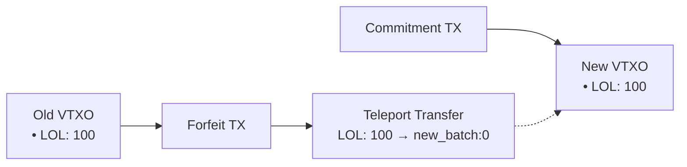

### Benefits

- **Asset Continuity**: Assets maintain their identity across batch swaps
- **No Liquidity Requirements**: Operator doesn't need to front assets
- **Atomic Operations**: Both forfeit and commitment transactions must confirm
- **TEE Validation**: Arkade's TEE cosigner validates teleport destinations before signing

### Implementation Notes

In the Arkade context:
- The TEE cosigner validates that teleport targets point to valid new VTXOs
- Batch swap intents include teleport specifications
- Asset balances are preserved across the VTXO transition
- No additional operator infrastructure is required

This mechanism ensures that Arkade Assets work seamlessly within Arkade's batch swap architecture while maintaining the protocol's trust-minimized properties.

---

```


<div style="page-break-after: always;"><\/div>


# Arkade Script Opcodes

This document outlines the introspection opcodes available in Arkade Script for interacting with Arkade Assets, along with the high-level API structure and example contracts.

## Introspection Opcodes

All Asset Ids are handled as **two stack items**: `(txid32, gidx_u16)`.

### Basics

- `OP_TXHASH` → *[out]* `txid32`\
  *Pushes the txid of the current transaction.*

### Groups

- `OP_INSPECTNUMASSETGROUPS` → *[out]* `K`\
  *Number of groups in the Arkade AssetV1 packet.*
- `OP_INSPECTASSETGROUPASSETID k` → *[out]* `assetid_txid32  assetid_gidx_u16`\
  *Resolved AssetId of group **k**. Fresh groups use **this_txid**.*
- `OP_INSPECTASSETGROUPCTRL k` → *[out]* `ctrl_txid32  ctrl_gidx_u16 | OP_0`\
  *Control AssetId if present, else OP_0.*
- `OP_FINDASSETGROUPBYASSETID assetid_txid32 assetid_gidx_u16` → *[out]* `k | OP_0`\
  *Find group index for a given AssetId, or OP_0 if absent.*

### Per-group I/O
- `OP_INSPECTASSETGROUPMETADATAHASH k source_u8` → *[out]* `metadata_hash_bytes32`\
  *Pushes the metadata hash (Merkle root) of group **k**. `source_u8` determines the source: `0` for the existing metadata (from inputs), `1` for the new metadata (from outputs), and `2` to push both (existing then new).*
- `OP_INSPECTASSETGROUPNUM k source_u8` → *[out]* `count_u16` or `count_in_u16 count_out_u16`\
  *Pushes the number of inputs/outputs for group **k**. `source_u8`: `0` for inputs, `1` for outputs, `2` for both (in, then out).*
- `OP_INSPECTASSETGROUP k j source_u8` → *[out]* `type_u8  data...  amount_u64`\
  *Retrieve the j-th input/output of group **k**. `source_u8`: `0` for input, `1` for output.*
- `OP_INSPECTASSETGROUPSUM k source_u8` → *[out]* `sum_u64` or `sum_in_u64 sum_out_u64`\
  *Pushes the sum of input/output amounts for group **k**. `source_u8`: `0` for inputs, `1` for outputs, `2` for both (in, then out).*
### Cross-output (multi-asset per UTXO)

- `OP_INSPECTOUTASSETCOUNT o` → *[out]* `n`\
  *Number of asset entries assigned to output o.*
- `OP_INSPECTOUTASSETAT o t` → *[out]* `assetid_txid32  assetid_gidx_u16  amount_u64`\
  *t-th asset and amount assigned to output o.*
- `OP_INSPECTOUTASSETLOOKUP o assetid_txid32 assetid_gidx_u16` → *[out]* `amount_u64 | OP_0`\
  *Declared amount for given asset at output o, or OP_0 if none.*

### Cross-input (packet-declared)

- `OP_INSPECTINASSETCOUNT i` → *[out]* `n`\
  *Number of assets declared for input i.*
- `OP_INSPECTINASSETAT i t` → *[out]* `assetid_txid32  assetid_gidx_u16  amount_u64`\
  *t-th asset and amount declared for input i.*
- `OP_INSPECTINASSETLOOKUP i assetid_txid32 assetid_gidx_u16` → *[out]* `amount_u64 | OP_0`\
  *Declared amount for given asset at input i, or OP_0 if none.*

### Teleport-specific

- `OP_INSPECTGROUPTELEPORTOUTCOUNT k` → *[out]* `n`\
  *Number of TELEPORT outputs in group k.*
- `OP_INSPECTGROUPTELEPORTOUT k j` → *[out]* `txid_32  vout_u32  amount_u64`\
  *j-th TELEPORT output in group k (target txid, vout, amount).*
- `OP_INSPECTGROUPTELEPORTINCOUNT k` → *[out]* `n`\
  *Number of TELEPORT inputs in group k.*
- `OP_INSPECTGROUPTELEPORTIN k j` → *[out]* `txid_32  vout_u32  amount_u64`\
  *j-th TELEPORT input in group k (source txid, vout, amount).*

---

## Asset Introspection API

Arkade Assets extend Arkade Script with asset-specific introspection, following a pattern similar to other smart contract languages:

```javascript
// Transaction basics
tx.txid;                               // maps to OP_TXHASH

// Asset Group Introspection
tx.assetGroups.length;                    // Number of asset groups -> maps to OP_INSPECTNUMASSETGROUPS
tx.assetGroups.find(AssetId);     // Find a group by asset ID -> maps to OP_FINDASSETGROUPBYASSETID

// AssetGroup Object
tx.assetGroups[i].assetId;            // Asset ID for this group -> maps to OP_INSPECTASSETGROUPASSETID
int tx.assetGroups[i].numInputs;              // -> OP_INSPECTASSETGROUPNUM with source 0
int tx.assetGroups[i].numOutputs;             // -> OP_INSPECTASSETGROUPNUM with source 1
bigint tx.assetGroups[i].sumInputs;           // -> OP_INSPECTASSETGROUPSUM with source 0
bigint tx.assetGroups[i].sumOutputs;          // -> OP_INSPECTASSETGROUPSUM with source 1
tx.assetGroups[i].inputs[j];    // -> OP_INSPECTASSETGROUP k j 0
tx.assetGroups[i].outputs[j]; // -> OP_INSPECTASSETGROUP k j 1

// AssetInput Object
tx.assetGroups[i].inputs[j].type; // LOCAL or TELEPORT
tx.assetGroups[i].inputs[j].amount;       // Asset amount
// TELEPORT only:
tx.assetGroups[i].inputs[j].commitment; // Teleport commitment

// AssetOutput Object
tx.assetGroups[i].outputs[j].type; // LOCAL or TELEPORT
tx.assetGroups[i].outputs[j].amount;        // Asset amount
// TELEPORT only:
tx.assetGroups[i].outputs[j].commitment;  // Teleport commitment
// LOCAL only:
tx.assetGroups[i].outputs[j].scriptPubKey; // Output script (via out_index from OP_INSPECTASSETGROUPOUT + OP_INSPECTOUTPUTSCRIPTPUBKEY)

// Enum Types
enum AssetInputType { LOCAL, TELEPORT }
enum AssetOutputType { LOCAL, TELEPORT }

// Cross-input lookups (packet-declared)
tx.inputs[i].assets.length;               // maps to OP_INSPECTINASSETCOUNT
tx.inputs[i].assets[j].assetId;          // maps to OP_INSPECTINASSETAT (asset id part)
tx.inputs[i].assets[j].amount;           // maps to OP_INSPECTINASSETAT (amount part)
tx.inputs[i].assets.lookup(AssetId);     // maps to OP_INSPECTINASSETLOOKUP (amount | 0)

// AssetGroup lineage pointer (control asset reference)
tx.assetGroups[i].control;                 // maps to OP_INSPECTASSETGROUPCTRL

// Output introspection (multi-asset per UTXO)
tx.outputs.length;                           // number of transaction outputs
tx.outputs[i].scriptPubKey;                  // maps to OP_INSPECTOUTPUTSCRIPTPUBKEY
tx.outputs[i].assets.length;                 // maps to OP_INSPECTOUTASSETCOUNT
tx.outputs[i].assets[j].assetId;          // maps to OP_INSPECTOUTASSETAT (asset id part)
tx.outputs[i].assets[j].amount;           // maps to OP_INSPECTOUTASSETAT (amount part)
tx.outputs[i].assets.lookup(AssetId);     // maps to OP_INSPECTOUTASSETLOOKUP (amount | 0)
```

### Asset Types and Structures

```javascript
// Asset ID type
struct AssetId {
    txid: bytes32,
    gidx: int
}

// Asset reference for control assets
struct AssetRef {
    byId: bool,              // true for BY_ID, false for BY_GROUP
    assetId: AssetId,        // Used when byId = true
    groupIndex: int         // Used when byId = false
}

// Teleport-specific introspection records
struct TeleportOut {
    txid: bytes32,
    vout: int,
    amount: bigint
}
struct TeleportIn {
    txid: bytes32,
    vout: int,
    amount: bigint
}
```

---

## Example Contracts

For detailed contract examples, including diagrams, packet definitions, and code, please see [examples.md](./examples.md).


<div style="page-break-after: always;"><\/div>


# Arkade Asset Transaction Examples

---

## A) Fresh Issuance with Pre-existing Control

This example demonstrates a fresh issuance of a new asset `A`, which is controlled by a pre-existing control asset `C`. The control asset `C` must be present in the same transaction for the issuance of `A` to be valid. The control asset must be present, but its input and output amounts do not need to match.

### Transaction Diagram

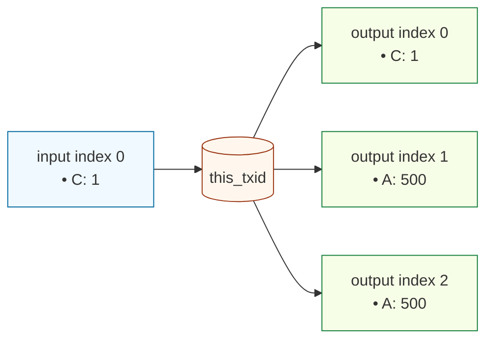

### Asset Packet Definition

- **Group[0] (Control Asset C):**
  - `AssetId`: `(txidC, gidxC)` (points to an existing asset)
  - `Inputs`: `(i:0, amt:1)`
  - `Outputs`: `(o:0, amt:1)`
  - *Result: Control asset is present.* 

- **Group[1] (New Asset A):**
  - `AssetId`: Omitted (fresh issuance, new ID is `(this_txid, 1)`)
  - `Issuance.ControlAsset`: `BY_ID { assetid: {txidC, gidxC} }` (points to asset C)
  - `Outputs`: `(o:1, amt:500), (o:2, amt:500)`
  - *Result: Σout > Σin, fresh issuance is valid because control asset C is present in Group[0].*

### Code Example (TypeScript)

This is how you would construct the transaction packet using the `arkade-assets-codec` library.

```typescript
import { Packet } from './arkade-assets-codec';

// Example A: fresh issuance with a pre-existing control asset.
const controlTxidHex = '11'.repeat(32);
const controlGidx = 0;

const payload: Packet = {
  groups: [
    // Group[0] Control: A pre-existing control asset, spent and re-created.
    {
      assetId: { txidHex: controlTxidHex, gidx: controlGidx },
      inputs: [{ type: 'LOCAL', i: 0, amt: 1n }],
      outputs: [{ type: 'LOCAL', o: 0, amt: 1n }]
    },
    // Group[1] Token: A fresh issuance, controlled by group 0.
    {
      issuance: {
        controlAsset: { gidx: 0 }, // References Group[0] implicitly
        metadata: { name: 'Token A' },
        immutable: false,
      },
      inputs: [],
      outputs: [
        { type: 'LOCAL', o: 1, amt: 500n },
        { type: 'LOCAL', o: 2, amt: 500n }
      ]
    },
  ]
};

// This payload would then be encoded and put into an OP_RETURN.
```

---

## B) Simple Transfer

This example shows a standard transfer of a single asset (`LOL`) from multiple inputs to multiple outputs. The key requirement for a valid transfer is that the total amount of the asset in the inputs equals the total amount in the outputs (i.e., Σinputs = Σoutputs).

### Transaction Diagram

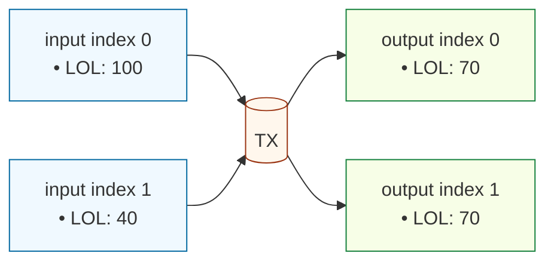

### Asset Packet Definition

- **Group[0] (Asset LOL):**
  - `AssetId`: `(txidL, gidxL)`
  - `Inputs`: `(i:0, amt:100), (i:1, amt:40)`
  - `Outputs`: `(o:0, amt:70), (o:1, amt:70)`
  - *Result: Σin (140) = Σout (140). This is a valid transfer.*

### Code Example (TypeScript)

```typescript
import { Packet } from './arkade-assets-codec';

const lolAssetId = { txidHex: '70'.repeat(32), gidx: 0 };

const payload: Packet = {
  groups: [
    {
      assetId: lolAssetId,
      inputs: [
        { type: 'LOCAL', i: 0, amt: 100n },
        { type: 'LOCAL', i: 1, amt: 40n },
      ],
      outputs: [
        { type: 'LOCAL', o: 0, amt: 70n },
        { type: 'LOCAL', o: 1, amt: 70n },
      ],
    },
  ]
};
```

---

## C) Asset Burn

This example demonstrates how to burn assets. A burn occurs when the sum of an asset's inputs is greater than the sum of its outputs (Σinputs > Σoutputs). In this case, two inputs containing the `XYZ` asset are spent, but no outputs are created for that asset group, resulting in the total amount being burned.

### Transaction Diagram

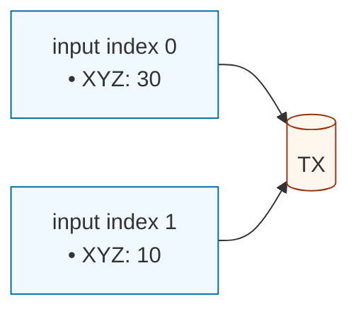

### Asset Packet Definition

- **Group[0] (Asset XYZ):**
  - `AssetId`: `(txidX, gidxX)`
  - `Inputs`: `(i:0, amt:30), (i:1, amt:10)`
  - `Outputs`: `[]`
  - *Result: Σin (40) > Σout (0). This is a valid burn.*

### Code Example (TypeScript)

```typescript
import { Packet } from './arkade-assets-codec';

const xyzAssetId = { txidHex: '88'.repeat(32), gidx: 0 }; // Placeholder

const payload: Packet = {
  groups: [
    {
      assetId: xyzAssetId,
      inputs: [
        { type: 'LOCAL', i: 0, amt: 30n },
        { type: 'LOCAL', i: 1, amt: 10n },
      ],
      outputs: [], // No outputs for this group, so all inputs are burned
    },
  ]
};
```

---

## D) Reissuance with Control

This example shows how to reissue more units of an existing asset (`A`). Reissuance is a transaction where the output amount of an asset is greater than its input amount (Σoutputs > Σinputs). This is only allowed if the asset was created with a control asset, and that control asset (`C`) is present in the reissuance transaction.

### Transaction Diagram

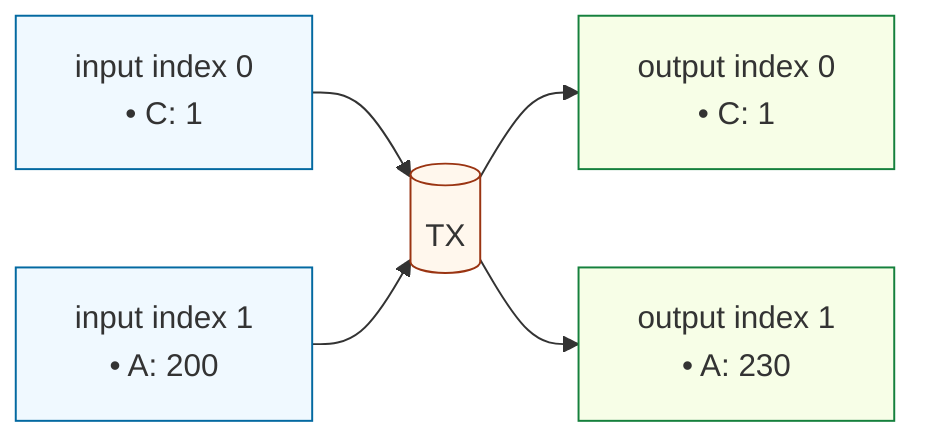

### Asset Packet Definition

- **Group[0] (Control Asset C):**
  - `AssetId`: `(txidC, gidxC)`
  - `Inputs`: `(i:0, amt:1)`
  - `Outputs`: `(o:0, amt:1)`
  - *Result: Control asset is present.*

- **Group[1] (Reissued Asset A):**
  - `AssetId`: `(txidA, gidxA)`
  - `Inputs`: `(i:1, amt:200)`
  - `Outputs`: `(o:1, amt:230)`
  - *Result: Σout (230) > Σin (200). This reissuance is valid because its control asset `C` is present in Group[0].*

### Code Example (TypeScript)

```typescript
import { Packet } from './arkade-assets-codec';

const controlAssetId = { txidHex: 'cc'.repeat(32), gidx: 0 };
const reissuedAssetId = { txidHex: 'aa'.repeat(32), gidx: 1 };

const payload: Packet = {
  groups: [
    {
      assetId: controlAssetId,
      inputs: [{ type: 'LOCAL', i: 0, amt: 1n }],
      outputs: [{ type: 'LOCAL', o: 0, amt: 1n }],
    },
    {
      assetId: reissuedAssetId,
      inputs: [{ type: 'LOCAL', i: 1, amt: 200n }],
      outputs: [{ type: 'LOCAL', o: 1, amt: 230n }],
    },
  ]
};
```

---

## E) Multi-Asset-Per-UTXO Transfer

An input UTXO is not limited to holding only one type of asset. This example demonstrates a transaction where a single input (`input index 0`) contains quantities of two different assets, `X` and `Y`. Both asset groups reference the same input index to spend their respective amounts.

### Transaction Diagram

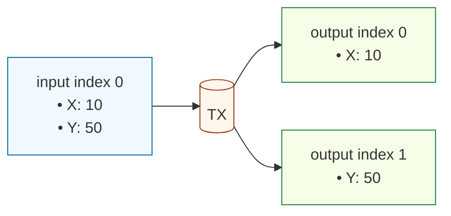

### Asset Packet Definition

- **Group[0] (Asset X):**
  - `AssetId`: `(txidX, gidxX)`
  - `Inputs`: `(i:0, amt:10)`
  - `Outputs`: `(o:0, amt:10)`
  - *Result: Valid transfer (delta=0).*

- **Group[1] (Asset Y):**
  - `AssetId`: `(txidY, gidxY)`
  - `Inputs`: `(i:0, amt:50)`
  - `Outputs`: `(o:1, amt:50)`
  - *Result: Valid transfer (delta=0).*

### Code Example (TypeScript)

```typescript
import { Packet } from './arkade-assets-codec';

const assetX = { txidHex: '55'.repeat(32), gidx: 0 };
const assetY = { txidHex: '66'.repeat(32), gidx: 1 };

const payload: Packet = {
  groups: [
    {
      assetId: assetX,
      inputs: [{ type: 'LOCAL', i: 0, amt: 10n }],
      outputs: [{ type: 'LOCAL', o: 0, amt: 10n }],
    },
    {
      assetId: assetY,
      inputs: [{ type: 'LOCAL', i: 0, amt: 50n }],
      outputs: [{ type: 'LOCAL', o: 1, amt: 50n }],
    },
  ]
};
```

---

## F) Multi-Asset-Per-Transaction Transfer

A single transaction can contain operations for multiple, independent assets. This example shows two separate asset transfers (`P` and `Q`) happening within the same transaction. Each asset has its own group in the packet.

### Transaction Diagram

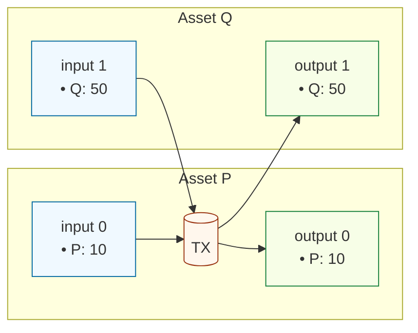

### Asset Packet Definition

- **Group[0] (Asset P):**
  - `AssetId`: `(txidP, gidxP)`
  - `Inputs`: `(i:0, amt:10)`
  - `Outputs`: `(o:0, amt:10)`
  - *Result: Valid transfer (delta=0).*

- **Group[1] (Asset Q):**
  - `AssetId`: `(txidQ, gidxQ)`
  - `Inputs`: `(i:1, amt:50)`
  - `Outputs`: `(o:1, amt:50)`
  - *Result: Valid transfer (delta=0).*

### Code Example (TypeScript)

```typescript
import { Packet } from './arkade-assets-codec';

const assetP = { txidHex: 'ab'.repeat(32), gidx: 0 };
const assetQ = { txidHex: 'cd'.repeat(32), gidx: 0 };

const payload: Packet = {
  groups: [
    {
      assetId: assetP,
      inputs: [{ type: 'LOCAL', i: 0, amt: 10n }],
      outputs: [{ type: 'LOCAL', o: 0, amt: 10n }],
    },
    {
      assetId: assetQ,
      inputs: [{ type: 'LOCAL', i: 1, amt: 50n }],
      outputs: [{ type: 'LOCAL', o: 1, amt: 50n }],
    },
  ]
};
```

---

## G) Metadata Update

To update the metadata of an asset, the transaction must spend and re-create both the asset being updated and its corresponding control asset. The new metadata is included in the asset's group, and the indexer will verify that the control asset was present to authorize the change.

### Transaction Diagram

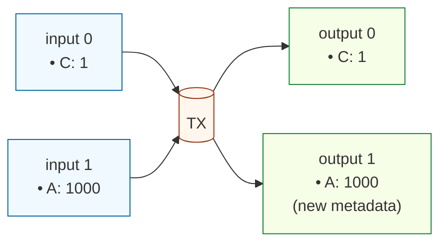

### Asset Packet Definition

- **Group[0] (Control Asset C):**
  - `AssetId`: `(txidC, gidxC)`
  - `Inputs`: `(i:0, amt:1)`
  - `Outputs`: `(o:0, amt:1)`
  - *Result: Control asset is present.*

- **Group[1] (Updated Asset A):**
  - `AssetId`: `(txidA, gidxA)`
  - `Metadata`: `{...}` (contains the new metadata)
  - `Inputs`: `(i:1, amt:1000)`
  - `Outputs`: `(o:1, amt:1000)`
  - *Result: Valid metadata update because control asset `C` is present.*

### Code Example (TypeScript)

```typescript
import { Packet } from './arkade-assets-codec';

const controlAssetId = { txidHex: 'cc'.repeat(32), gidx: 0 };
const assetToUpdateId = { txidHex: 'aa'.repeat(32), gidx: 1 };

const payload: Packet = {
  groups: [
    // Group 0: The control asset, spent and retained.
    {
      assetId: controlAssetId,
      inputs: [{ type: 'LOCAL', i: 0, amt: 1n }],
      outputs: [{ type: 'LOCAL', o: 0, amt: 1n }],
    },
    // Group 1: The asset having its metadata updated.
    {
      assetId: assetToUpdateId,
      metadata: { name: 'New Token Name' }, // New metadata here
      inputs: [{ type: 'LOCAL', i: 1, amt: 1000n }],
      outputs: [{ type: 'LOCAL', o: 1, amt: 1000n }],
    },
  ]
};
```

---

## H) Teleport (Commit-Reveal)

The teleport system allows assets to be moved between transactions without a direct UTXO dependency. It's a two-stage process: commit and reveal.

1.  **Commit Transaction:** An asset is spent into a `TELEPORT` output, which contains a commitment hash (e.g., `sha256(secret)`).
2.  **Reveal Transaction:** A second, unrelated transaction can claim the teleported asset by providing the secret pre-image in a `TELEPORT` input. The hash of the pre-image must match the commitment hash.

### Transaction Diagrams

**Commit Transaction**
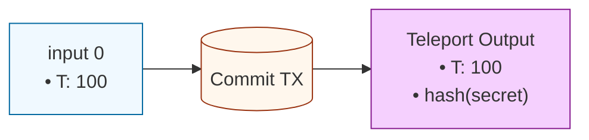

**Reveal Transaction**
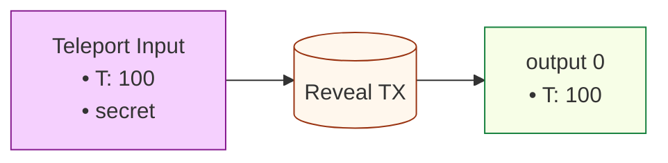

### Asset Packet Definitions

**Commit Packet**
- `AssetId`: `(txidT, gidxT)`
- `Inputs`: `(i:0, amt:100)`
- `Outputs`: `(type:TELEPORT, amt:100, hash:sha256(secret))`

**Reveal Packet**
- `AssetId`: `(txidT, gidxT)`
- `Inputs`: `(type:TELEPORT, amt:100, preimg:secret)`
- `Outputs`: `(o:0, amt:100)`

### Code Example (TypeScript)

```typescript
import { Packet } from './arkade-assets-codec';
import { createHash } from 'crypto';

const teleportAssetId = { txidHex: 'dd'.repeat(32), gidx: 0 };
const secret = Buffer.from('this is a secret pre-image');
const commitHash = createHash('sha256').update(secret).digest();

// Commit Transaction Payload
const commitPayload: Packet = {
  groups: [
    {
      assetId: teleportAssetId,
      inputs: [{ type: 'LOCAL', i: 0, amt: 100n }],
      outputs: [{ type: 'TELEPORT', hash: commitHash, amt: 100n }],
    },
  ]
};

// Reveal Transaction Payload
const revealPayload: Packet = {
  groups: [
    {
      assetId: teleportAssetId,
      inputs: [{ type: 'TELEPORT', preimg: secret, amt: 100n }],
      outputs: [{ type: 'LOCAL', o: 0, amt: 100n }],
    },
  ]
};
```

---

# Arkade Script Contract Examples

## 1) Gated Asset Swap

This example demonstrates an Arkade Script contract that facilitates a trustless 1-for-1 swap of Asset `A` for Asset `B`. The contract is placed on the output holding Asset `A`. To spend this output, the transaction must also provide 1 unit of Asset `B` and send it to the contract's address, ensuring a fair exchange.

### Contract Logic

The script performs the following checks:
1.  **Verify Incoming Asset B:** It checks that the transaction contains an input of Asset `B` with an amount of 1.
2.  **Verify Outgoing Asset A:** It ensures that the output containing Asset `A` is being spent.
3.  **Verify Destination of Asset B:** It confirms that Asset `B` is being sent to the same address that held Asset `A`.

### Arkade Script Opcodes

```
// Define Asset IDs
OP_PUSHBYTES_32 <asset_B_txid>
OP_PUSHBYTES_1 <asset_B_gidx>
OP_ASSETID

// Check that 1 unit of Asset B is an input
OP_PUSHINT_1
OP_GETASSET_IN
OP_EQUAL
OP_VERIFY

// Check that Asset B is sent to the current contract's output script
OP_PUSHINT_1
OP_GETASSET_OUT
OP_EQUAL
OP_VERIFY
```

### Transaction Diagram

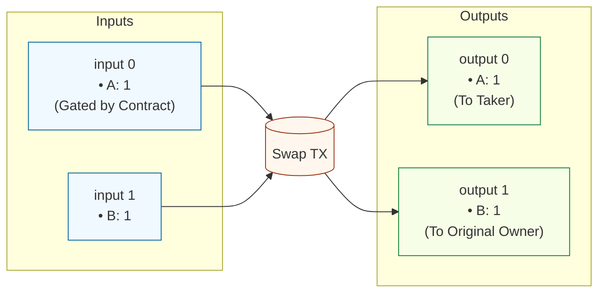

---

## 2) Multi-Sig Asset Vault

This contract demonstrates a 2-of-2 multi-signature vault for an asset. To spend the asset held by this contract, two valid signatures must be provided corresponding to the two public keys defined in the script.

### Contract Logic

1.  **Define Public Keys:** The script starts by pushing two public keys onto the stack.
2.  **Check Signatures:** It then uses `OP_CHECKSIG` twice to validate the provided signatures against the public keys. `OP_SWAP` is used to reorder the stack for the second signature check.
3.  **Verify:** Both checks must pass for the transaction to be valid.

### Arkade Script Opcodes

```
// PubKey1 Sig1
OP_PUSHBYTES_33 <pubkey1>
OP_CHECKSIG
OP_VERIFY

// PubKey2 Sig2
OP_PUSHBYTES_33 <pubkey2>
OP_CHECKSIG
OP_VERIFY
```

### Transaction Diagram

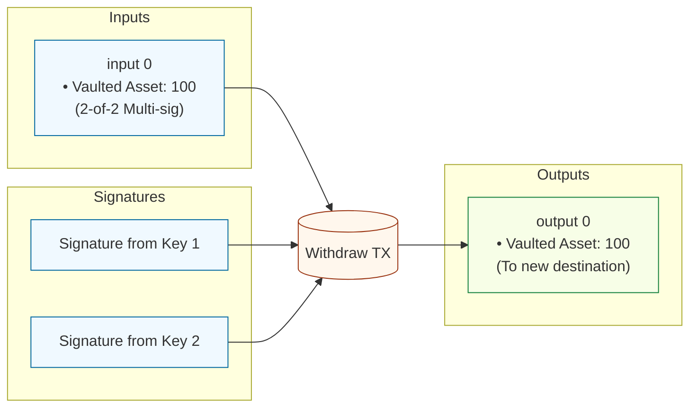

---

## 3) Synthetic Asset Covenant

This advanced contract creates a synthetic asset (`SynthUSD`) that is pegged to another asset (`BaseAsset`). The contract ensures that new `SynthUSD` can only be issued if a corresponding amount of `BaseAsset` is locked in the same transaction. Conversely, `SynthUSD` can be burned to unlock the `BaseAsset`.

### Contract Logic

The script uses introspection opcodes to check the asset balances for both the synthetic and base assets across inputs and outputs.

1.  **Get Input and Output Sums:** It calculates the sum of inputs and outputs for both `SynthUSD` and `BaseAsset`.
2.  **Enforce Peg:** It verifies that `(Σout_Synth - Σin_Synth) + (Σout_Base - Σin_Base) == 0`. This means that for every unit of `SynthUSD` created, one unit of `BaseAsset` must be deposited, and for every unit of `SynthUSD` burned, one unit of `BaseAsset` is returned.

### Arkade Script Opcodes

```
// Assume synth_gidx and base_gidx are on the stack

// Calculate delta for SynthUSD: (sumOutputs - sumInputs)
<synth_gidx> <1> OP_INSPECTASSETGROUPSUM
<synth_gidx> <0> OP_INSPECTASSETGROUPSUM
OP_SUB

// Calculate delta for BaseAsset: (sumOutputs - sumInputs)
<base_gidx> <1> OP_INSPECTASSETGROUPSUM
<base_gidx> <0> OP_INSPECTASSETGROUPSUM
OP_SUB

// Verify peg: delta(SynthUSD) + delta(BaseAsset) == 0
OP_ADD
OP_0
OP_EQUALVERIFY
```

### Transaction Diagram (Issuance)

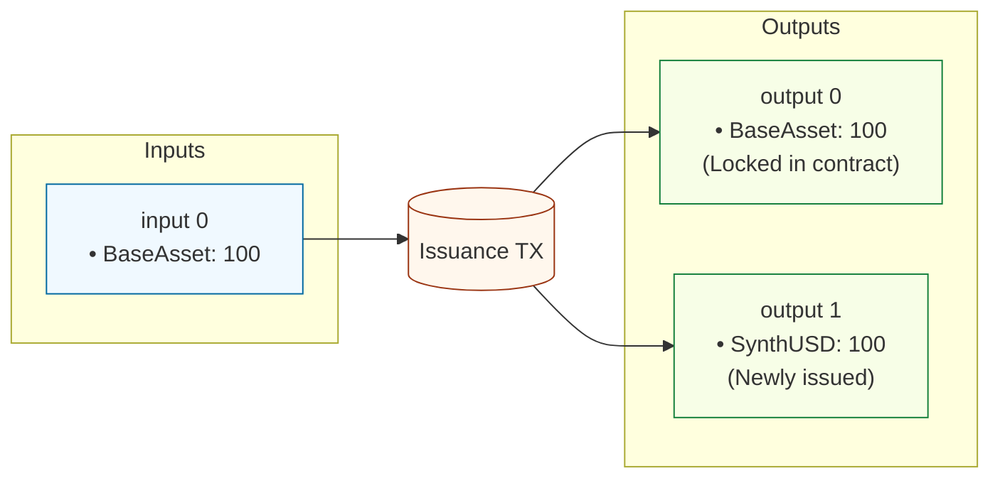


<div style="page-break-after: always;"><\/div>


# ArkadeKitties: A Trustless Collectible Game on Ark

This document outlines the design for ArkadeKitties, a decentralized game for collecting and breeding unique digital cats, built entirely on the Ark protocol using Arkade Assets and Arkade Script.

## 1. Core Concept

ArkadeKitties are unique, collectible digital assets. Each Kitty is a non-fungible Arkade Asset with an amount of 1 and has a distinct set of traits determined by its genetic code (genome), which is stored immutably on-chain as asset metadata. Players can buy, sell, and breed their Kitties to create new, rare offspring.

The entire system is trustless. Ownership is enforced by the Ark protocol, and all game logic, including breeding, is executed by on-chain Arkade Script contracts, eliminating the need for a central server.

## 2. Kitty Asset Representation

Each ArkadeKitty is a unique Arkade Asset with an amount of 1. The asset is non-fungible and can be owned and transferred like any other asset on the network.

- **Species Control via Presence-Only Enforcement**: All Kitties share the same control asset (the "Species Control" asset). Under the current spec and tools, control is presence-only: the Species Control group must be present somewhere in the transaction, but Δ=0 retention or re-locking is not required. Output introspection is still used to verify the child Kitty's properties (metadata, NFT amount, etc.).
- **Species Control Asset**: A single control asset defines the species. Every Kitty's group MUST set `control` to this exact `assetId`. Transactions that mint or reissue Kitties MUST include the Species Control group (presence-only). Minting the control and the controlled asset in the same transaction is allowed by spec and supported by the tools.
- **Genesis Asset (optional lore)**: A special "Genesis Kitty" can still exist as the first Kitty minted under the Species Control. Its `assetId` may be referenced off-chain for lore/UX, but authorization is strictly enforced by the Species Control.

- **Provenance Verification**: To prevent counterfeit assets, the `BreedKitties` contract enforces that any parent Kitty (and any child) sets its `control` reference to the Species Control `assetId`. Any asset with a different or missing control reference cannot be used for breeding and cannot be minted by the contract.

> Naming and API conventions:
> - This document uses the example sugar API: `tx.assetGroups.find(...)`, `group.metadataHash`, `group.numInputs`, `group.delta`.
> - Type names are kept consistent in the contract: `assetId`, `pubkey`, `Sig`.
> - A group's `assetId` identifies the group; the lineage pointer is a separate control asset reference, accessed via minimal opcode helpers.

## 3. Metadata: The Kitty Genome ("Cattributes")

The appearance and traits of each Kitty are determined by its metadata, which contains its genetic code. This metadata is structured as a key-value map and is committed to the chain via a Merkle root in the `metadataHash` field.

**Example Metadata (on-chain committed keys only):**

```json
{
  "generation": "0",
  "genome": "733833e4519f1811c5f81b12ab391cb3"
}
```

Note: Visual traits like color, pattern, and cooldown are deterministically derived from the genome (see "Example Genome Breakdown") and are not committed as separate metadata keys on-chain.

## 4. Breeding Mechanism

Breeding is the core game mechanic. A player can select two Kitties they own (the "Sire" and "Dame") and combine them in a transaction that calls the breeding contract. The contract validates the parents and creates a new Kitty with a mixed genome.

### Breeding Contract Example

The `BreedKitties` contract is the heart of the game. It ensures that new Kitties are only created from valid parents and that their genomes are mixed deterministically. The user provides the parents' `genome` and `generation`; the contract recomputes the two-leaf Merkle root and verifies it matches the on-chain `metadataHash`. Crucially, the contract spends and retains the Species Control asset in every successful breeding transaction, so mints are only possible through the contract.

```typescript
pragma arkade ^1.0.0;

// Merkle verification helper for 2-leaf Kitty metadata ("generation" < "genome")
function verifyKittyMetadata(genLeaf: bytes32, genomeLeaf: bytes32, root: bytes32) internal returns (bool) {
    // Keys are sorted lexicographically: generation precedes genome
    return sha256(genLeaf + genomeLeaf) == root;
}

// Canonical metadata Merkle root for ArkadeKitties (two entries: generation, genome)
// Encoding follows arkassets.md leaves:
//   leaf = sha256(varuint(len(key)) || key || varuint(len(value)) || value)
// Keys sorted: "generation" < "genome". We encode generation as 8-byte big-endian (BE).
function computeKittyMetadataRoot(genome: bytes32, generationBE8: bytes8) internal returns (bytes32) {
    // Precomputed key+length prefixes to avoid dynamic packing:
    // generation leaf prefix: 0x0a || "generation" || 0x08
    const GEN_LEAF_PREFIX: bytes = 0x0a67656e65726174696f6e08;
    // genome leaf prefix: 0x06 || "genome" || 0x20
    const GENOME_LEAF_PREFIX: bytes = 0x0667656e6f6d6520;

    let genLeaf = sha256(GEN_LEAF_PREFIX + generationBE8);
    let genomeLeaf = sha256(GENOME_LEAF_PREFIX + genome);

    // 2-leaf Merkle root
    return sha256(genLeaf + genomeLeaf);
}

// A simple, deterministic function to mix two genomes (opcode-friendly)
// Use hashing instead of bytewise XOR to avoid byte arithmetic on-chain.
function mixGenomes(genomeA: bytes32, genomeB: bytes32, entropy: bytes32) internal returns (bytes32) {
    // There is a small chance of a "mutation" (1 in 256).
    // This is triggered by the last byte of entropy being zero.
    if (entropy[31] == 0) {
        // On mutation, the new genome is a pseudorandom hash of all inputs.
        return sha256(genomeA + genomeB + entropy);
    }

    // Perform a trait-by-trait crossover. Each multi-byte trait is inherited as a single unit.
    // The 32-byte genome is structured as follows:
    // - Bytes 0-2:   Body Color (24-bit RGB)
    // - Bytes 3-5:   Pattern Color (24-bit RGB)
    // - Bytes 6-8:   Eye Color (24-bit RGB)
    // - Bytes 9-10:  Body Pattern
    // - Bytes 11-12: Eye Shape
    // - Bytes 13-14: Mouth & Nose Shape
    // - Byte 15:     Cooldown Index
    // - Bytes 16-18: Reserved Trait 1 (e.g., for animations)
    // - Bytes 19-21: Reserved Trait 2 (e.g., for voice)
    // - Bytes 22-23: Reserved Trait 3
    // - Bytes 24-25: Reserved Trait 4
    // - Bytes 26-27: Reserved Trait 5
    // - Bytes 28-29: Reserved Trait 6
    // - Bytes 30-31: Reserved Trait 7

    // To implement this without loops, we build a 32-byte mask by unrolling the logic for each trait.
    // The decision for each trait block is based on the first byte of entropy for that block.
    bytes32 mask = 0x;
    mask += (entropy[0] < 128) ? 0xFFFFFF : 0x000000;     // Body Color
    mask += (entropy[3] < 128) ? 0xFFFFFF : 0x000000;     // Pattern Color
    mask += (entropy[6] < 128) ? 0xFFFFFF : 0x000000;     // Eye Color
    mask += (entropy[9] < 128) ? 0xFFFF : 0x0000;         // Body Pattern
    mask += (entropy[11] < 128) ? 0xFFFF : 0x0000;        // Eye Shape
    mask += (entropy[13] < 128) ? 0xFFFF : 0x0000;        // Mouth & Nose
    mask += (entropy[15] < 128) ? 0xFF : 0x00;            // Cooldown
    mask += (entropy[16] < 128) ? 0xFFFFFF : 0x000000;     // Reserved 1
    mask += (entropy[19] < 128) ? 0xFFFFFF : 0x000000;     // Reserved 2
    mask += (entropy[22] < 128) ? 0xFFFF : 0x0000;        // Reserved 3
    mask += (entropy[24] < 128) ? 0xFFFF : 0x0000;        // Reserved 4
    mask += (entropy[26] < 128) ? 0xFFFF : 0x0000;        // Reserved 5
    mask += (entropy[28] < 128) ? 0xFFFF : 0x0000;        // Reserved 6
    mask += (entropy[30] < 128) ? 0xFFFF : 0x0000;        // Reserved 7

    // The final genome is composed in a single bitwise operation.
    return (genomeA & mask) | (genomeB & ~mask);
}

function computeChildGeneration(sireGenerationBE8: bytes8, dameGenerationBE8: bytes8) internal returns (bytes8) {
    let sireGen = sireGenerationBE8.toInt64();
    let dameGen = dameGenerationBE8.toInt64();
    let parentMaxGen = (sireGen >= dameGen ? sireGen : dameGen);
    let childGen = parentMaxGen + 1;
    return childGen.toBytesBE(8);
}


// --- ENTROPY-AWARE BREEDING CONTRACTS (COMMIT-REVEAL) ---


// Contract 1: Commits to a breeding pair and a secret salt.
// This creates a temporary UTXO locked with the BreedRevealContract script.
contract BreedCommit(
    assetId speciesControlId,
    script feeScript, // A generic script for the fee output
    int fee, // The required fee to prevent spam
    pubkey oracle // The public key of the oracle to be used for the reveal
    int timeout // The timeout for the reveal to occur

) {
    function commit(            
        // Sire & Dame details
        sireId: assetId, sireGenome: bytes32, sireGenerationBE8: bytes8, script sireOwner,
        dameId: assetId, dameGenome: bytes32, dameGenerationBE8: bytes8, script dameOwner,
        // A secret salt from the user, hashed
        saltHash: bytes32,
        // The output index for the reveal UTXO
        revealOutputIndex: int,
        // The output index for the fee UTXO
        feeOutputIndex: int,
        // the script for the new Kitty owner
        newKittyOwner: script,
    ) {


        // 1. Verify a fee is paid to the designated fee script
        require(tx.outputs[feeOutputIndex].scriptPubKey == feeScript, "Fee output script mismatch");
        require(tx.outputs[feeOutputIndex].value >= fee, "Fee not paid");
        require(tx.outputs[revealOutputIndex].assets.lookup(speciesControlId) == 1, "Species Control not locked in reveal output");
        require(tx.outputs[revealOutputIndex].assets.lookup(sireId) == 1, "Sire not locked in reveal output");
        require(tx.outputs[revealOutputIndex].assets.lookup(dameId) == 1, "Dame not locked in reveal output");
        // 2. Verify parent assets are present and valid
        let sireGroup = tx.assetGroups.find(sireId);
        let dameGroup = tx.assetGroups.find(dameId);
        require(sireGroup != null && dameGroup != null, "Sire and Dame assets must be spent");
        require(sireGroup.control == speciesControlId, "Sire not Species-Controlled");
        require(dameGroup.control == speciesControlId, "Dame not Species-Controlled");
        require(sireGroup.metadataHash == computeKittyMetadataRoot(sireGenome, sireGenerationBE8), "Sire metadata hash mismatch");
        require(dameGroup.metadataHash == computeKittyMetadataRoot(dameGenome, dameGenerationBE8), "Dame metadata hash mismatch");

        // 2. Verify Species Control asset is present and retained
        let speciesGroup = tx.assetGroups.find(speciesControlId);
        require(speciesGroup != null && speciesGroup.delta == 0, "Species Control must be present and retained");

        // 3. Construct the reveal script and enforce its creation
        // The off-chain client is responsible for constructing the exact reveal script by
        // parameterizing the BreedReveal contract template with the details of this commit.
        // The commit contract then verifies that the output at the specified index is locked
        // with this exact script, which it reconstructs here for verification.

        Script revealScript = new BreedReveal(
            speciesControlId,
            oracle,
            sireId, dameId,
            sireGenome, sireGenerationBE8,
            dameGenome, dameGenerationBE8,
            saltHash,
            sireOwner, dameOwner,
            newKittyOwner,
            tx.time + timeout,
        );

        require(tx.outputs[revealOutputIndex].scriptPubKey == revealScript, "Reveal output script mismatch");

    }
}


// Contract 2: Spends the commit UTXO, verifies oracle randomness, and creates the new Kitty.
contract BreedReveal(
    // Note: All parameters are now baked into the contract's script at creation time.
    assetId speciesControlId,
    pubkey oracle,
    assetId sireId, assetId dameId,
    bytes32 sireGenome, bytes8 sireGenerationBE8,
    bytes32 dameGenome, bytes8 dameGenerationBE8,
    bytes32 saltHash,
    script sireOwner, script dameOwner,
    script newKittyOwner,
    int expirationTime,
) {
    function reveal(
        // User reveals their secret salt
        salt: bytes32,
        // Oracle provides randomness and a signature
        oracleRand: bytes32,
        oracleSig: signature,
        // The assetId of the new Kitty being created
        newKittyId: assetId,
        kittyOutputIndex: int,
        sireOutputIndex: int,
        dameOutputIndex: int,
    ) {
        // 1. Verify the user's salt
        require(sha256(salt) == saltHash, "Invalid salt");

        // 2. Verify the oracle's signature over the randomness, bound to this specific commit
        // The message includes the outpoint of the commit UTXO to prevent signature replay.
        let commitOutpoint = tx.input.current.outpoint;
        require(checkDataSig(oracleSig, sha256(commitOutpoint + oracleRand), oracle), "Invalid oracle signature");

        // 3. Find the new Kitty's asset group
        let newKittyGroup = tx.assetGroups.find(newKittyId);
        require(newKittyGroup != null, "New Kitty asset group not found");
        require(newKittyGroup.isFresh && newKittyGroup.delta == 1, "Child must be a fresh NFT");
        require(newKittyGroup.control == speciesControlId, "Child not Species-Controlled");
        let newKittyOutput = tx.outputs[kittyOutputIndex];
        require(newKittyOutput.assets.lookup(newKittyId) == 1, "New Kitty not locked in output");
        require(newKittyOutput.scriptPubKey == newKittyOwner, "New Kitty must be sent to a P2PKH address");

        // 4. Generate the unpredictable genome and expected metadata hash
        let entropy = sha256(salt + oracleRand);
        let newGenome = mixGenomes(sireGenome, dameGenome, entropy);
        let expectedMetadataHash = computeKittyMetadataRoot(newGenome, computeChildGeneration(sireGenerationBE8, dameGenerationBE8));

        // 5. Enforce all Kitty creation rules
        require(newKittyGroup.metadataHash == expectedMetadataHash, "Child metadata hash mismatch");

    }

    // If the reveal doesn't happen, allow parents to be reclaimed.
    function refund(dameOutputIndex: int, sireOutputIndex: int) {
        // 1. Check that the timeout has passed
        require(tx.time >= expirationTime, "Timeout not yet reached");

        require(tx.outputs[sireOutputIndex].assets.lookup(sireId) == 1, "Sire not refunded to owner");
        require(tx.outputs[dameOutputIndex].assets.lookup(dameId) == 1, "Dame not refunded to owner");
    }

}

## 5. On-Chain vs. Off-Chain Logic

A key design principle in Arkade Script is the separation of concerns between on-chain contracts and off-chain clients (e.g., a user's wallet or a web interface).

- **On-Chain (The Contract)**: The `BreedCommit` and `BreedReveal` contracts act as a **trustless arbiter**. Their only job is to enforce the rules of the game. They verify parent Kitties, check oracle signatures, and validate the properties of the new child Kitty.

- **Off-Chain (The Client)**: The user's client is responsible for **transaction construction**. This now happens in two stages:
  1.  **Commit Transaction**: The client constructs a transaction that calls `commit`. It provides parent details and a `saltHash`, and creates an output locked with the `BreedReveal` script.
  2.  **Reveal Transaction**: After the oracle publishes randomness for the commit, the client constructs a second transaction. It spends the commit UTXO, calls `reveal`, and includes the new child Kitty output with the correct (and now known) metadata.

If the client constructs a transaction that violates the on-chain rules (e.g., calculates the wrong genome), the contract will reject it, and the transaction will fail.

## 6. Genome and Cattribute Mapping

The visual appearance of a Kitty is derived directly from its `genome`. The 32-byte genome is treated as a series of gene segments, where each segment maps to a specific trait. This mapping is deterministic and public, allowing any client to render a Kitty just by reading its on-chain genome.

**Example Genome Breakdown:**

The 32-byte genome is a blueprint for a Kitty's appearance and attributes. Below is the definitive mapping from genome bytes to traits.

| Byte(s) | Trait                | Interpretation                                      |
|---------|----------------------|-----------------------------------------------------|
| `0-2`   | **Body Color**       | A 24-bit RGB value for the main fur.                |
| `3-5`   | **Pattern Color**    | A 24-bit RGB value for spots, stripes, etc.         |
| `6-8`   | **Eye Color**        | A 24-bit RGB value for the iris.                    |
| `9-10`  | **Body Pattern**     | A 16-bit value mapping to a pattern style and variations. |
| `11-12` | **Eye Shape**        | A 16-bit value mapping to an eye shape.             |
| `13-14` | **Mouth & Nose Shape** | A 16-bit value mapping to a mouth and nose style.   |
| `15`    | **Cooldown Index**   | An 8-bit value mapping to breeding speed.           |
| `16-18` | **Reserved Trait 1** | Reserved for future use (e.g., animations).         |
| `19-21` | **Reserved Trait 2** | Reserved for future use (e.g., voice).              |
| `22-23` | **Reserved Trait 3** | Reserved for future use.                            |
| `24-25` | **Reserved Trait 4** | Reserved for future use.                            |
| `26-27` | **Reserved Trait 5** | Reserved for future use.                            |
| `28-29` | **Reserved Trait 6** | Reserved for future use.                            |
| `30-31` | **Reserved Trait 7** | Reserved for future use.                            |

## 7. Entropy and Breeding Predictability

The deterministic nature of the initial `mixGenomes` function means that a breeder could predict the outcome of a breeding event before initiating it. This allows for "grinding"—running simulations off-chain to find favorable outcomes and only committing those transactions.

To ensure fair and unpredictable breeding, we introduce entropy using a **commit-reveal scheme** combined with an external **oracle**.

1.  **Commit**: A user commits to breeding a specific pair by creating a transaction that includes a hash of a secret value (`saltHash`). This locks in their choice.
2.  **Oracle Randomness**: A trusted oracle provides a random value (`oracleRand`) and signs it, binding it to the user's specific commit transaction. To prevent oracle bias (where the oracle could try many random values and pick a favorable one), the oracle **must** operate as a **Verifiable Random Function (VRF)**. A VRF ensures that for a given input (the commit transaction ID), there is only one possible valid random output, removing the oracle's ability to influence the outcome.
3.  **Reveal**: The user reveals their secret `salt` and combines it with the `oracleRand`. This combined, unpredictable value is used as entropy to generate the new Kitty's genome.

This two-step process ensures that neither the user nor the oracle can unilaterally control the outcome, making the breeding process genuinely random and exciting.


<div style="page-break-after: always;"><\/div>


