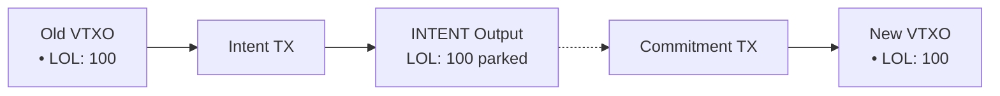

# Arkade Asset V1 Specification (Working Draft)

## 1. Overview

### 1.1. Hybrid System Architecture

The Arkade Asset protocol is designed to operate in a hybrid environment, with assets moving seamlessly between off-chain Arkade transactions and on-chain Bitcoin transactions. This architecture imposes a critical requirement: a unified view of the asset state.

-   The **Arkade Signer** must be aware of on-chain events. To validate transactions that interact with on-chain assets (e.g., after a unilateral exit or collaborative-exit), the Signer must have access to the state of the Bitcoin blockchain. It effectively acts as a private indexer for the user.
-  The **Arkade Indexer** must be aware of Arkade-native transactions. To present a complete and accurate public ledger of assets, the indexer must be able to ingest and validate state transitions that occur within the Arkade system, by observing all relevant Arkade-native transactions.

This ensures that an asset's history is unbroken and its ownership is unambiguous, regardless of how it is transferred. Arkade Asset V1 is a UTXO-native asset system for Bitcoin transactions inspired by Runes and Liquid Assets.


### Assets and Asset IDs

Arkade Assets are projected onto Bitcoin transactions by embedding a data packet, the **Arkade Asset V1 packet**.

Each Arkade Asset V1 packet, embedded in a Bitcoin output via OP_RETURN semantics, contains an ordered list of **Asset Groups** which define asset details along with indexes of transaction inputs and outputs that are carrying this asset and the amounts. The order is important for fresh asset mint operations.

Assets are identified by an Asset ID, which is always a pair: `AssetId: (genesis_txid, group_index)`

- `genesis_txid` = the transaction where the asset was first minted
- `group_index` = the index of the asset group inside that genesis transaction

There are two cases: 
- **Fresh mint**. If an Asset Group omits its Asset ID, it creates a new asset. Its Asset ID is `(this_txid, group_index)`, where `this_txid` is the current transaction hash. Since this is the genesis transaction for that asset, `this_txid = genesis_txid`.
- **Existing asset**. If the Asset Group specifies an Asset ID, it refers back to an already minted asset `(genesis_txid, group_index)`  

### Control Assets and Reissuance

When a fresh asset is being created, its asset group may specify a control asset. A fresh asset may be issued while its control asset is also being freshly minted in the same transaction.

Control assets allow additional, future reissuance of a token, and are themselves assets. If an asset group increases supply (Σout > Σin), the corresponding control asset MUST appear in the same transaction. This requirement applies to both fresh issuance and reissuance.

If an asset did not specify a control asset at genesis, it cannot be reissued and its total supply is forever capped at the amount created in its genesis transaction.

**Control Asset Rules:**

1. **No Self-Reference**: An asset MUST NOT reference itself as its own control asset.

2. **Single-Level Control**: Only the direct control asset is required for reissuance. Control is NOT transitive - if Asset A is controlled by Asset B, and Asset B is controlled by Asset C, reissuing Asset A requires only Asset B (not C).

3. **Supply Finalization**: Burning the control asset (explicitly or by not including it in outputs) permanently locks the controlled asset's supply and prevents future metadata updates. This is intentional behavior for finalizing an asset's supply. Existing tokens continue to circulate normally.

Arkade Asset V1 supports projecting multiple assets onto a single UTXO, and BTC amounts are orthogonal and not included in asset accounting.

Asset amounts are atomic units, and supply management is managed through UTXO spending conditions.

---

## 2. OP\_RETURN structure

Exactly **one OP\_RETURN output** must contain the Arkade Asset protocol packet, prefixed with magic bytes. The packet itself is a top-level TLV (Type-Length-Value) stream, allowing multiple data types to coexist within a single transaction.

```
scriptPubKey = OP_RETURN <Magic_Bytes> <TLV_Stream>
```

- **Magic_Bytes**: `0x41524b` ("ARK")
- **TLV_Stream**: A concatenation of one or more TLV records.
- **TLV Record**: `Type (1-byte) || Length (CompactSize) || Value (bytes)`

**Multiple OP_RETURN Handling:** If a transaction contains multiple OP_RETURN outputs with ARK magic bytes (`0x41524b`), or multiple Type `0x00` (Assets) records across TLV streams, only the **first Type `0x00` record found by output index order** is processed. Subsequent Asset records are ignored.

### Arkade Asset V1 Packet (Type 0x00)

The Arkade Asset data is identified by `Type = 0x00`. The `Value` of this record is the asset payload itself.

```
<Type: 0x00> <Length: L> <Value: Asset_Payload>
```

- **Asset_Payload**: The TLV packet containing asset group data (see below).

**Note (Implicit Burn Policy):** If a transaction spends any UTXOs known to carry Arkade Asset balances but contains no `OP_RETURN` with an Arkade Asset packet (Type `0x00`), those balances are considered irrecoverably burned. Indexers MUST remove such balances from their state.

---

## 3. Packet format (canonical TLV)

### Packet

```
Packet := {
  GroupCount    : varuint
  Groups[GroupCount]     : Group
}
```

### Group

```
Group := {
  AssetId?      : AssetId          # absent => fresh asset (AssetId* = (this_txid, group_index))
  ControlAsset? : AssetRef         # Genesis only: Defines the control asset for reissuance/metadata updates.
  Metadata?     : map<string, string> # Initial metadata at genesis, or new metadata for updates.
  InputCount    : varuint
  Inputs[InputCount]  : AssetInput
  OutputCount   : varuint
  Outputs[OutputCount] : AssetOutput
}
```

### 3.1. Encoding Details

While the specification uses a logical TLV (Type-Length-Value) model, the canonical binary encoding employs specific optimizations for compactness.

**Group Optional Fields: Presence Byte**

Instead of using a type marker for each optional field within a `Group`, the implementation uses a single **presence byte**. This byte is a bitfield that precedes the group's data, where each bit signals the presence of an optional field:

-   `bit 0 (0x01)`: `AssetId` is present.
-   `bit 1 (0x02)`: `ControlAsset` is present (genesis only).
-   `bit 2 (0x04)`: `Metadata` is present.
-   `bits 3-7`: Reserved for future protocol extensions. Parsers MUST ignore these bits if set.

The fields, if present, follow in that fixed order. This is more compact than a full TLV scheme for a small, fixed set of optional fields.

**Variant Types: Type Markers**

For data structures that represent one of several variants (a `oneof` structure), a **type marker byte** is used. This is consistent with the logical TLV model.

-   **`AssetRef`**: `0x01` for `BY_ID`, `0x02` for `BY_GROUP`.
-   **`AssetInput`**: `0x01` for `LOCAL`, `0x02` for `INTENT`.

Type marker values are interpreted in the context of the structure being parsed; identical numeric values in different structures do not conflict.

### Types

```
AssetId   := { txid: bytes32, gidx: u16 } # the genesis tx id that first issued this asset & the index of the asset group in that packet

AssetRef  := oneof {
               0x01 BY_ID    { assetid: AssetId } # if existing asset
             | 0x02 BY_GROUP { gidx: u16 } # if fresh asset (does not exist yet therefore no AssetId)
             }
# BY_GROUP forward references are ALLOWED - gidx may reference a group that appears later in the packet.

AssetInput := oneof {
               0x01 LOCAL  { i: u32, amt: u64 }                  # input from same transaction's prevouts
             | 0x02 INTENT { txid: bytes32, o: u32, amt: u64 }  # output from intent transaction
             }

AssetOutput := { o: u32, amt: u64 }   # output within same transaction
```

> **Note:** The intent system enables users to signal participation in a batch for new VTXOs. Intents are Arkade-specific ownership proofs that signals vtxos (and their asset) for later claiming by a commitment transaction and its batches.


---

## 4. Intent Asset Flow

```
Old Asset VTXO → [Intent TX] → [Commitment TX] → New Asset VTXOs
```

**Intent Transaction:**
- LOCAL inputs spend assets from existing VTXO
- outputs identify assets at vouts in the same tx
- BIP322-signed message specifies which vouts are collaborative exits vs VTXOs
- Standard delta rules apply

**Commitment Transaction:**
- INTENT inputs claim from pending intents
- outputs place assets at final destinations:
  - **Collaborative exits**: Aggregated in the commitment tx's asset packet
  - **VTXOs**: Each batch leaf holds its own asset packet for the VTXOs it creates

**Composability:**

A single intent can mix collaborative exits and VTXOs. The BIP322-signed configuration message embedded in the intent specifies the type of each output:

```
Intent TX:
  vout 0 → collaborative exit (on-chain)
  vout 1 → new VTXO
  vout 2 → new VTXO

Asset packet:
  { o: 0, amt: 50 }   # 50 tokens to on-chain
  { o: 1, amt: 30 }   # 30 tokens to VTXO
  { o: 2, amt: 20 }   # 20 tokens to VTXO
```


**Intent Lifecycle**

- Submitted: VTXOs and assets are locked
- Included in batch: Assets transfer to new VTXOs or on-chain outputs
- Dropped: Assets unlocked, free to use again


## 5. Asset Group Validation Rules

- **AssetID Validation**: If `AssetId` is present, it must reference a valid genesis asset transaction and group index.

- **Metadata Validation**: If `Metadata` is present, `AssetId` must be absent.

- **Control Asset Validation**: The `ControlAsset` property must be present in the Genesis Transaction. One of two types is verified:
  - If `AssetId` is present, it must reference an existing Asset Group ID.
  - If `GroupIDX` is present, `len(AssetGroups) > GroupIDX`, and `Asset Group Index != GroupIDX`.


- **Zero Amount Validation**: All asset amounts MUST be greater than zero. An input or output with `amount = 0` is INVALID.

- **Input Amount Validation**: 
  - LOCAL Asset Input amounts MUST match the actual asset balances of referenced VTXOs.

  - INTENT Asset Input amounts MUST match the actual asset balances of referenced intents transaction output.

- **Output Index Validation**: Asset Output indices MUST reference valid VTXOs. Out-of-bound indices render the transaction INVALID.

- **Cross Amount Validation**: Total Output amount MUST be less than or equal to Total Input amount, unless Control Asset Is Provided


## 6. Examples

For detailed transaction examples, including diagrams, packet definitions, and code, please see [examples.md](./examples.md).


### Proof of Authenticity

Proving that an asset was genuinely issued by a specific entity (e.g., Tether issuing a stablecoin) can be accomplished by signing a message with the private key corresponding to a relevant UTXO. This is typically done using a standard like BIP322 (Signatures for P2TR). There are two primary methods:

**1. Proof of Genesis (Historical Proof)**

This method proves who the original creator of an asset was by linking them to the funding of the genesis transaction.

-   **What to Prove**: Ownership of a Bitcoin UTXO that was spent as an input in the asset's genesis transaction.
-   **How it Works**: The issuing entity (e.g., Tether) uses the private key for one of the genesis transaction's inputs to sign a message.
-   **Example Message**: `"We, Tether, certify that the Arkade Asset with genesis txid [genesis_txid] and group index [gidx] is the official USDT-Arkade."`

**2. Proof of Control (Dynamic Proof)**

This method proves who has administrative rights over an asset (e.g., the ability to reissue it). This is the most robust method for proving ongoing authenticity.

-   **What to Prove**: Ownership of the UTXO that holds the asset's control asset.
-   **How it Works**: The entity uses the private key for the UTXO holding the control asset to sign a message. An indexer is used to find which UTXO currently holds the control asset.
-   **Example Message**: `"As the current controller of USDT-Arkade, Tether authorizes this action at block height X."`

In summary, **Proof of Genesis** establishes historical origin, a one-time, static origin of an asset, **Proof of Control** provides an ongoing mechanism to demonstrate administrative authority - supporting actions such as reissuance or periodic attestations of authenticity - by linking the asset to a live, controlled UTXO on the Bitcoin blockchain. 

---

### Asset Metadata

Arkade Asset supports a flexible, onchain key-value model for metadata in the asset group. Well-known keys (e.g., `name`, `ticker`, `decimals`) can be defined in a separate standards document, but any key-value pair is valid.

When an asset is first created (i.e., the `AssetId` is omitted from the group), the optional `Metadata` map in the `Group` defines its initial, base metadata. This is useful for defining core, permanent properties.


**Metadata Introspection**

To enable trustless validation of asset properties without incurring high overhead, an indexer MUST make a hash of an asset's current metadata available to the script execution environment.

- **Rule**: When building the transaction context for script execution, for each `Group` in the packet, the indexer must compute and expose a `metadataHash` for the corresponding asset. 

- **Behavior**: A smart contract can then verify a specific piece of metadata by requiring the user to provide the full metadata as a function argument. The contract hashes the provided data and compares it against the `metadataHash` from the introspection API.

- **Hashing Mechanism**: The `metadataHash` is the **Merkle root** of the asset's metadata. This provides a secure and efficient way to verify individual key-value pairs without processing the full metadata set onchain.
  - **Leaf Generation**: The leaves of the Merkle tree are the `sha256` hashes of the canonically encoded key-value pairs. The pairs MUST be sorted by key before hashing to ensure a deterministic root.
  - **Canonical Entry Format**: `leaf[i] = sha256(varuint(len(key[i])) || key[i] || varuint(len(value[i])) || value[i])`
  - **Verification**: Contracts verify metadata by recomputing the expected Merkle root from user-provided values. Since Arkade Script does not include loop opcodes, contracts must know their metadata schema at compile time. For fixed schemas (e.g., 2-4 known keys), contracts can hardcode the leaf prefixes and tree structure, recomputing the root directly rather than verifying arbitrary Merkle proof paths. See the ArkadeKitties example, which uses a fixed 2-leaf tree for `genome` and `generation` fields.

---

## 7. Indexer State and Reorganization Handling

To ensure data integrity and consistency with the underlying Bitcoin blockchain, the Arkade Asset (onchain) indexer is designed to handle blockchain reorganizations (reorgs) and transaction replacements (RBF).

### State Versioning

The indexer's state (including all asset definitions, UTXO balances, and processed transactions) is not stored in a single monolithic file. Instead, it is versioned by block height. After processing all transactions in a block, the indexer saves a complete snapshot of the new state into a file named `state_<height>.json`.

- **Genesis State**: The state before any blocks are processed is at `blockHeight: -1`.
- **Block n**: After processing, the state is saved to `state_n.json` and the internal `blockHeight` becomes `n`.
- **Block n+1**: The indexer loads `state_(n).json`, applies transactions from block n+1, and saves the result to `state_(n+1).json`.

### Block-Level Atomicity

Transactions are applied on a per-block basis. To process block n, the indexer first loads the state from the previous block (`state_(n-1).json`) and applies all transactions from block n to a temporary, in-memory copy of the state. Only if all transactions in block n are valid under the Arkade Asset rules and applied successfully is the new state committed to disk as `state_n.json`. If any transaction fails, the indexer MUST NOT advance its state or write `state_n.json` (i.e., block n is not applied by the indexer).

### Rollback on Reorganization

If a blockchain reorganization occurs, the external process monitoring the blockchain must instruct the indexer to roll back its state. For example, if block 101 is orphaned and replaced by a new block 101', the process is as follows:

1.  **Rollback**: The `rollbackLastBlock()` method is called. This deletes the state file for the most recent block (e.g., `state_101.json`).
2.  **Reload**: The indexer then loads the state from the previous block (`state_100.json`), making it the current active state.
3.  **Apply New Block**: The transactions from the new, valid block (101') can then be applied using the `applyBlock()` method, which will create a new `state_101.json`.

This mechanism ensures that the indexer's view of asset ownership remains synchronized with the canonical chain, providing a robust foundation for applications built on Arkade Assets.

### Unconfirmed Transactions

The indexer implementation described here operates on **confirmed blocks only**. It does not watch the mempool for unconfirmed transactions. This design choice has several implications:

-   **Scope**: The indexer's primary role is to maintain a canonical state of asset ownership based on the blockchain's history. It does not provide real-time notifications for pending transactions.
-   **Replace-by-Fee (RBF)**: The indexer handles RBF implicitly. Since it only processes confirmed blocks, it will only ever see the version of a transaction that is ultimately mined. If an initial transaction is replaced by another via RBF, the indexer will process the replacement, and the original transaction will be correctly ignored as it was never part of the canonical chain history.
-   **Provisional State**: Applications requiring a "pending" or "unconfirmed" view of asset transfers would need a separate component to monitor the mempool. Such a component would need to manage the complexity of transaction replacements and reordering, while the main indexer provides the final, authoritative state once transactions are confirmed.

---


## 8. Arkade Batch Swap Support

The intent system provides native support for Arkade's batch swap mechanism, enabling seamless asset continuity across VTXO transitions.

### The Batch Swap Challenge

In Arkade, users periodically perform batch swaps to:
- Transition preconfirmed VTXOs to confirmed state
- Reset VTXO expiry times
- Maintain unilateral exit guarantees

Without intents, assets in old VTXOs would be lost during batch swaps, requiring complex workarounds or operator liquidity fronting.

### Intent-Based Batch Swaps

With intent transfers, the batch swap process becomes:

1. **User Submits Intent**:
   - LOCAL inputs spend from old VTXO containing assets
   - INTENT outputs park assets for the new batch
   - BIP322-signed message specifies VTXO vs collaborative exit destinations

2. **Operator Builds Commitment Transaction**:
   - INTENT inputs claim from all pending intents
   - LOCAL outputs place assets at final destinations:
     - **Collaborative exits**: Aggregated in commitment tx's asset packet
     - **VTXOs**: Each batch leaf holds its own asset packet

### Example Flow



### Benefits

- **Asset Continuity**: Assets maintain their identity across batch swaps
- **No Liquidity Requirements**: Operator doesn't need to front assets
- **Composability**: Single intent can mix VTXOs and collaborative exits
- **Simplicity**: No script commitments or witnesses—direct txid+output references

### Collaborative Exit

Users can exit assets to on-chain outputs by specifying collaborative exit in their intent's BIP322 configuration. The commitment transaction's asset packet aggregates all collaborative exit claims and places those assets at on-chain outputs via LOCAL outputs.

This mechanism ensures that Arkade Assets work seamlessly within Arkade's batch swap architecture while maintaining the protocol's trust-minimized properties.

---

## 9. Arkade Defense Transactions and Asset Validation

Arkade uses special transaction types for operator security that are **exempt from Arkade Asset validation**. These transactions protect the operator's BTC liquidity and do not represent asset operations.

### Checkpoint Transactions

[Checkpoint transactions](https://docs.arkadeos.com/arkd/server-security/checkpoint-txs) are defense mechanisms that allow the Arkade operator to protect against griefing attacks on preconfirmed VTXOs.

**Asset Validation Rules:**
- Checkpoint transactions **do not require** an Arkade Asset packet
- A checkpoint transaction without an asset packet **does not burn assets**
- The indexer treats checkpoints as transitory BTC-layer state, not asset state changes

### Forfeit Transactions

[Forfeit transactions](https://docs.arkadeos.com/arkd/server-security/forfeit-txs) allow the operator to reclaim funds when detecting double-spend attempts on settled VTXOs.

**Asset Validation Rules:**
- Forfeit transactions **do not require** an Arkade Asset packet
- A forfeit transaction without an asset packet **does not burn assets**
- Forfeits are operator defense mechanisms, not user-initiated asset transfers

### Virtual Mempool Unrolls and Asset Continuity

When the Arkade virtual mempool partially unrolls (broadcasts transactions to Bitcoin in sequence), asset ownership follows the **tip of the virtual mempool**, not intermediate states.

**Example:** Consider a virtual mempool chain `A → B → C` where an asset is transferred from `A` to `C`:

```
Virtual Mempool State (preconfirmed):
  A (asset origin) → B → C (asset destination)
```

If the chain partially unrolls to `B` (transactions `A` and `B` are broadcast to Bitcoin, `C` remains preconfirmed):

```
After Partial Unroll to B:
  A, B (broadcast to Bitcoin)
  C (remains in virtual mempool, preconfirmed)
```

**Asset Resolution:**
- The asset is **still owned by `C`** in the virtual mempool
- The indexer treats the tip of the virtual mempool (`C`) as the current unspent asset location
- The partial unroll does not revert asset ownership to the on-chain state at `A` or `B`
- This ensures asset continuity even during defense scenarios where partial unrolls occur

### Rationale

These rules ensure that:
1. **Operator defense is not penalized**: Broadcasting checkpoints/forfeits doesn't accidentally burn user assets
2. **Asset state is deterministic**: The Bitcoin-confirmed state is the source of truth after unrolls
3. **No asset packet overhead**: Defense transactions remain lightweight and fast to broadcast

---
