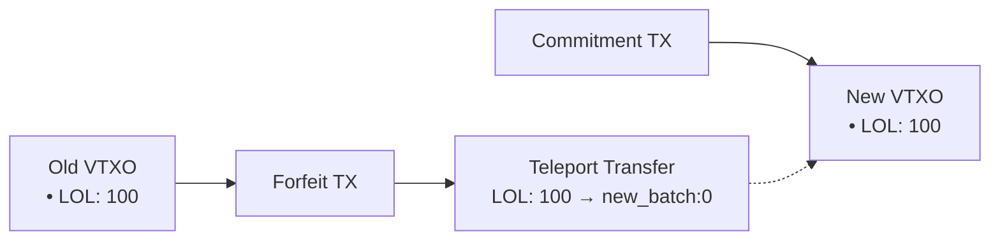

# Arkade Asset V1 Specification (Working Draft)

## 1. Overview

Arkade Asset V1 is a UTXO-native asset system for Bitcoin transactions inspired by Runes and Liquid Assets.

Within Arkade, it requires no offchain indexers to track asset state: simply parsing the transaction is enough to observe and validate asset transfers. This is possible because the Arkade Signer's cosigning guard validates before cosigning, along with its TEE assurances for verifiable honesty.

However, if used onchain, indexers/validators are required to analyse the chain (both utxos and vtxos) and disregard invalid asset transactions.

### Assets and Asset IDs

Arkade Assets are projected onto Bitcoin transactions by embedding a data packet, the **Arkade Asset V1 packet**.

Each Arkade Asset V1 packet, embedded in a Bitcoin output via OP_RETURN semantics, contains an ordered list of **Asset Groups** which define asset details along with indexes of transaction inputs and outputs that are carrying this asset and the amounts. The order is important for fresh asset mint operations.

Assets are identified by an Asset ID, which is always a pair: `AssetId: (genesis_txid, group_index)`

- `genesis_txid` = the transaction where the asset was first minted
- `group_index` = the idnex of the asset group inside that genesis transaction

There are two cases: 
- **Fresh mint**. If an Asset Group omits its Asset Id, it creates a new asset. It's Asset ID is `(this_txid, group_index)`, where `this_txid`is the current transaction hash. Since this is the genesis transaction for that asset, `this_txid = genesis_txid`.
- **Existing asset**. If the Asset Group specifies an Asset ID, it refers back to an already minted asset `(genesis_txid, group_index)`  

### Control Assets and Reissuance

When a fresh asset is being created, its asset group may specify a control asset. Issuance of a new asset is valid if that control asset is present in the same transaction. A fresh asset may be issued while its control asset is also being freshly minted in the same transaction.

Control assets allow additional, future reissuance of a token, and are themselves assets. If an asset group increases supply (Σout > Σin), the corresponding control asset MUST appear in the same transaction. This requirement applies to both fresh issuance and reissuance. 

If an asset did not specify a control asset at genesis, it cannot be reissued and its total supply is forever capped at the amount created in its genesis transaction.

Arkade Asset V1 supports projecting multiple assets unto a single UTXO, and BTC amounts are orthogonal and not included in asset accounting.

Asset amounts are atomic units, and supply management is managed through UTXO spending conditions.

---

## 2. OP\_RETURN structure

Exactly **one OP\_RETURN output** must contain the Arkade Asset protocol packet, prefixed with magic bytes. The packet itself is a top-level TLV (Type-Length-Value) stream, allowing multiple data types to coexist within a single transaction.

```
scriptPubKey = OP_RETURN <Magic_Bytes> <TLV_Stream>
```

- **Magic_Bytes**: `0x41524b` ("ARK")
- **TLV_Stream**: A concatenation of one or more TLV records.
- **TLV Record**: `Type (1-byte) || Length (CompactSize) || Value (bytes)`

### Arkade Asset V1 Packet (Type 0x00)

The Arkade Asset data is identified by `Type = 0x00`. The `Value` of this record is the asset payload itself.

```
<Type: 0x00> <Length: L> <Value: Asset_Payload>
```

- **Asset_Payload**: The TLV packet containing asset group data (see below).

**Note (Implicit Burn Policy):** If a transaction spends any UTXOs known to carry Arkade Asset balances but contains no `OP_RETURN` with an Arkade Asset packet (Type `0x00`), those balances are considered irrecoverably burned. Indexers MUST remove such balances from their state.

---

## 3. Packet format (canonical TLV)

### Packet

```
Packet := {
  GroupCount    : varuint
  Groups[GroupCount]     : Group
}
```

### Group

```
Group := {
  AssetId?      : AssetId          # absent => fresh asset (AssetId* = (this_txid, group_index))
  Issuance?     : Issuance         # Genesis only: Defines issuance policy and initial metadata.
  Metadata?     : map<string, string> # Update only: The new metadata for an existing asset.
  InputCount    : varuint
  Inputs[InputCount]  : AssetInput
  OutputCount   : varuint
  Outputs[OutputCount] : AssetOutput
}

Issuance := {
  ControlAsset? : AssetRef
  Metadata?     : map<string, string>
  Immutable?    : bool             # If true, metadata cannot be changed after genesis.
}
```

### 3.1. Issuance and Metadata Rules

- **Genesis (Fresh Assets)**: The `Issuance` property is **only allowed** when creating a fresh asset (i.e., when `AssetId` is absent). It defines the initial control policy and metadata.
  - If `Issuance.Immutable` is set to `true`, the asset's metadata can never be changed.
  - The `Metadata` property **must not** be present at genesis.
  - If `Issuance.ControlAsset` is omitted, no future token reissuance is possible. 

- **Metadata Updates (Existing Assets)**: To update the metadata of an existing, non-immutable asset, the transaction must:
  1. Include the asset's `ControlAsset` as an input to authorize the change.
  2. Include the new `Metadata` property in the asset group, containing the full new metadata map.

- **Mutual Exclusivity**: The `Issuance` and `Metadata` properties are mutually exclusive. An asset group **must not** contain both.

- **Covenant Enforcement**: The validity of a metadata transition (e.g., ensuring only certain keys are changed) is enforced by covenant scripts, which can inspect the input and output metadata hashes.

### 3.2. Encoding Details

While the specification uses a logical TLV (Type-Length-Value) model, the canonical binary encoding employs specific optimizations for compactness.

**Group Optional Fields: Presence Byte**

Instead of using a type marker for each optional field within a `Group` (`AssetId`, `Issuance`), the implementation uses a single **presence byte**. This byte is a bitfield that precedes the group's data, where each bit signals the presence of an optional field:

-   `bit 0 (0x01)`: `AssetId` is present.
-   `bit 1 (0x02)`: `Issuance` is present (genesis only).
-   `bit 2 (0x04)`: `Metadata` is present (update only).

The fields, if present, follow in that fixed order. This is more compact than a full TLV scheme for a small, fixed set of optional fields.

**Variant Types: Type Markers**

For data structures that represent one of several variants (a `oneof` structure), a **type marker byte** is used. This is consistent with the logical TLV model.

-   **`AssetRef`**: `0x01` for `BY_ID`, `0x02` for `BY_GROUP`.
-   **`AssetInput`**: `0x01` for `LOCAL`, `0x02` for `TELEPORT`.
-   **`AssetOutput`**: `0x01` for `LOCAL`, `0x02` for `TELEPORT`.

### Types

```
AssetId   := { txid: bytes32, gidx: u16 } # the genesis tx id that first issued this asset & the index of the asset group in that packet

AssetRef  := oneof {
               0x01 BY_ID    { assetid: AssetId } # if existing asset
             | 0x02 BY_GROUP { gidx: u16 } # if fresh asset (does not exist yet therefore no AssetId)
             }

AssetInput := oneof {
               0x01 LOCAL    { i: u16, amt: u64 }                    # input from same transaction's prevouts
             | 0x02 TELEPORT { commitment: bytes32, amt: u64 }       # input from external teleport via commitment 
             }

AssetOutput := oneof {
               0x01 LOCAL    { o: u16, amt: u64 }                    # output within same transaction
             | 0x02 TELEPORT { commitment: bytes32, amt: u64 }       # output to external transaction via commitment 
             }

TeleportCommitment := sha256(payment_script || nonce)
```
This hybrid approach balances compactness for the `Group` structure with the flexibility of type markers for variant data types.

---

## 4. Asset identity rules

- **Fresh asset:** if `AssetId` omitted, AssetId\* = `(this_txid, group_index)`.
- **Existing asset:** if `AssetId` present, AssetId\* = that literal `(txid,gidx)`.
- **Control reference:**
  - BY\_ID → literal `(txid,gidx)`
  - BY\_GROUP{g} → `(this_txid, g)`

---

## 5. Teleport System

### Commitment-Based Teleports

To solve the circular dependency problem, teleports use a **commitment hash** instead of direct txid references:

1. **Creating a Teleport Output**:
   - Creates `AssetOutput::TELEPORT { commitment, amt }` with 
     - Sender generates: `commitment = sha256(payment_script || nonce)` and
     - `payment_script` is the receiver's scriptPubKey that gets committed to (for future claiming)

2. **Claiming a Teleport Input**:
   - Receiver creates a transaction with an output containing the `payment_script`
   - References the teleport via `AssetInput::TELEPORT { commitment, amt }`
   - Must provide proof in witness: `{ payment_script, nonce }`
   - **The teleported assets MUST be assigned to a LOCAL output that has the committed `payment_script`**
   - Arkade Signer (offchain) / Indexer (onchain) validates: 
     - `sha256(payment_script || nonce) == commitment`
     - Transaction contains at least one output with the exact `payment_script`
     - Commitment matches an entry in pending teleports with the correct `source_txid`
     - **The assets flow matches an output carrying the committed `payment_script`**

3. **Validation Rules**:
   - Arkade Signer (offchain) / Indexer (onchain) tracks pending teleports via commitment hash.
   - **Lifecycle & Claiming Rules**:
     - **Arkade-Native Teleport**: If a teleport is created by an *arkade* transaction, it is instantly claimable by **any** other transaction (arkade or onchain). No confirmation delay is required.
     - **Onchain Teleport**: If a teleport is created by an *onchain* transaction, it can be claimed by **any** other transaction (arkade or onchain) after a minimum number of block confirmations (e.g., 6 blocks). This delay protects against reorg attacks.
   - When a teleport input is claimed, the Signer/Indexer also verifies:
     - The source transaction exists and has the corresponding teleport output.
     - The claiming transaction has an output with the matching `payment_script`.
     - **Assets from the teleport input MUST flow to a LOCAL output with the committed `payment_script`**.
   - Unclaimed teleports remain pending until claimed.
   - **Competing Claims**: In scenarios where multiple transactions attempt to claim the same teleport, the first valid claim to be processed wins. This implies:
     - An arkade transaction will always win against a competing onchain transaction, as it is processed faster.
     - If two onchain transactions compete, the one in the earlier mined block wins.
     - If two onchain transactions compete and are mined in the same block, the one with the lowest index in the block wins.
     


### Teleport State Tracking

The Signer/Indexer maintains:
```
PendingTeleport := {
  commitment: bytes32,
  source_txid: bytes32,
  source_height: u64,      // Block height where the teleport was created. Optional for arkade-native teleports.
  assetid: AssetId,
  amount: u64
}
```

When a teleport output is created, the indexer stores the source_txid, group index, and its output index. When claiming, the indexer uses the commitment to look up these values.

---

## 6. Examples

For detailed transaction examples, including diagrams, packet definitions, and code, please see [examples.md](./examples.md).

---

### Proof of Authenticity

Proving that an asset was genuinely issued by a specific entity (e.g., Tether issuing a stablecoin) can be accomplished by signing a message with the private key corresponding to a relevant UTXO. This is typically done using a standard like BIP322 (Signatures for P2TR). There are two primary methods:

**1. Proof of Genesis (Historical Proof)**

This method proves who the original creator of an asset was by linking them to the funding of the genesis transaction.

-   **What to Prove**: Ownership of a Bitcoin UTXO that was spent as an input in the asset's genesis transaction.
-   **How it Works**: The issuing entity (e.g., Tether) uses the private key for one of the genesis transaction's inputs to sign a message.
-   **Example Message**: `"We, Tether, certify that the Arkade Asset with genesis txid [genesis_txid] and group index [gidx] is the official USDT-Arkade."`

**2. Proof of Control (Dynamic Proof)**

This method proves who has administrative rights over an asset (e.g., the ability to reissue it). This is the most robust method for proving ongoing authenticity.

-   **What to Prove**: Ownership of the UTXO that holds the asset's control asset.
-   **How it Works**: The entity uses the private key for the UTXO holding the control asset to sign a message. An indexer is used to find which UTXO currently holds the control asset.
-   **Example Message**: `"As the current controller of USDT-Arkade, Tether authorizes this action at block height X."`

In summary, **Proof of Genesis** establishes historical origin, a one-time, static origin of an asset, **Proof of Control** provides an ongoing mechanism to demonstrate administrative authority - supporting actions such as reissuance or periodic attestations of authenticity - by linking the asset to a live, controlled UTXO on the Bitcoin blockchain. 

---

### Asset Metadata

Arkade Asset supports a flexible, onchain key-value model for metadata in the asset group. Well-known keys (e.g., `name`, `ticker`, `decimals`) can be defined in a separate standards document, but any key-value pair is valid.

Metadata is managed directly within the `Group` packet structure:

**1. Genesis Metadata**

When an asset is first created (i.e., the `AssetId` is omitted from the group), the optional `Metadata` map in the `Group` defines its initial, base metadata. This is useful for defining core, permanent properties.

**2. Metadata Updates**

To update the metadata for an existing asset, a `Group` for that asset must be included in a transaction. This group may or may not have inputs and outputs.

- **Rule**: If the `Metadata` field is present in a group for an *existing* asset, it is treated as an update. The transaction is only valid if one of its inputs spends the UTXO that currently holds the **Control Asset** for the asset being updated.
- **Behavior**: An indexer will replace the asset's existing metadata with the new key-value pairs. This allows any entity with spending rights of the control asset to change or add metadata fields over time.
- **Idempotency**: If the provided metadata is identical to the existing metadata, the transaction is still valid (assuming authorization), but no state change occurs. This allows clients to submit metadata without needing to check if it has changed.

> **Note:** To authorize a metadata update, the transaction must spend the UTXO containing the control asset. To avoid burning the control asset, the transaction packet must also include a group that transfers the control asset to a new output. If the control asset is not reissued, it is destroyed, and no further updates will be possible.

**3. Metadata Introspection**

To enable trustless, onchain validation of asset properties without incurring high overhead, an indexer MUST make a hash of an asset's current metadata available to the script execution environment.

- **Rule**: When building the transaction context for script execution, for each `Group` in the packet, the indexer must compute and expose a `metadataHash` for the corresponding asset. This hash is a read-only snapshot of the state *before* the current transaction is applied.
- **Behavior**: A smart contract can then verify a specific piece of metadata by requiring the user to provide the full metadata as a function argument. The contract hashes the provided data and compares it against the `metadataHash` from the introspection API.

- **Hashing Mechanism**: The `metadataHash` is the **Merkle root** of the asset's metadata. This provides a secure and efficient way to verify individual key-value pairs without processing the full metadata set onchain.
  - **Leaf Generation**: The leaves of the Merkle tree are the `sha256` hashes of the canonically encoded key-value pairs. The pairs MUST be sorted by key before hashing to ensure a deterministic root.
  - **Canonical Entry Format**: `leaf[i] = sha256(varuint(len(key[i])) || key[i] || varuint(len(value[i])) || value[i])`
  - **Verification**: This model allows a user to prove a specific metadata property by providing the key, value, and a Merkle path to the contract. The contract can then verify the proof against the onchain root hash.

---

## 7. Indexer State and Reorganization Handling

To ensure data integrity and consistency with the underlying Bitcoin blockchain, the Arkade Asset (onchain) indexer is designed to handle blockchain reorganizations (reorgs) and transaction replacements (RBF).

### State Versioning

The indexer's state (including all asset definitions, UTXO balances, and processed transactions) is not stored in a single monolithic file. Instead, it is versioned by block height. After processing all transactions in a block, the indexer saves a complete snapshot of the new state into a file named `state_<height>.json`.

- **Genesis State**: The state before any blocks are processed is at `blockHeight: -1`.
- **Block 100**: After processing, the state is saved to `state_n.json` and the internal `blockHeight` becomes `n`.
- **Block 101**: The indexer loads `state_(n+1).json`, applies transactions from block 101, and saves the result to `state_(n+1).json`.

### Block-Level Atomicity

Transactions are applied on a per-block basis. The indexer first loads the state from the previous block (`n-1`) and applies all transactions from the new block (`n`) to a temporary, in-memory copy of the state. Only if all transactions in the block are valid and applied successfully is the new state committed to disk as `state_N.json`. If any transaction fails, the entire block is rejected, and no changes are saved.

### Rollback on Reorganization

If a blockchain reorganization occurs, the external process monitoring the blockchain must instruct the indexer to roll back its state. For example, if block 101 is orphaned and replaced by a new block 101', the process is as follows:

1.  **Rollback**: The `rollbackLastBlock()` method is called. This deletes the state file for the most recent block (e.g., `state_101.json`).
2.  **Reload**: The indexer then loads the state from the previous block (`state_100.json`), making it the current active state.
3.  **Apply New Block**: The transactions from the new, valid block (101') can then be applied using the `applyBlock()` method, which will create a new `state_101.json`.

This mechanism ensures that the indexer's view of asset ownership remains synchronized with the canonical chain, providing a robust foundation for applications built on ArkAsset.

### Unconfirmed Transactions

The indexer implementation described here operates on **confirmed blocks only**. It does not watch the mempool for unconfirmed transactions. This design choice has several implications:

-   **Scope**: The indexer's primary role is to maintain a canonical state of asset ownership based on the blockchain's history. It does not provide real-time notifications for pending transactions.
-   **Replace-by-Fee (RBF)**: The indexer handles RBF implicitly. Since it only processes confirmed blocks, it will only ever see the version of a transaction that is ultimately mined. If an initial transaction is replaced by another via RBF, the indexer will process the replacement, and the original transaction will be correctly ignored as it was never part of the canonical chain history.
-   **Provisional State**: Applications requiring a "pending" or "unconfirmed" view of asset transfers would need a separate component to monitor the mempool. Such a component would need to manage the complexity of transaction replacements and reordering, while the main indexer provides the final, authoritative state once transactions are confirmed.

---

## 8. Teleport Transfers

Teleport transfers enable assets to be projected to outputs in external transactions, solving asset continuity challenges across batches.

### Mechanism

A teleport transfer is specified using the `TELEPORT` variant of `AssetOutput`:

```
AssetOutput := oneof {
  0x01 LOCAL    { o: u16, amt: u64 }                    # output within same transaction
  0x02 TELEPORT { txid: bytes32, vout: u32, amt: u64 } # output to external transaction via commitment
}
```

When processing a transaction with teleport outputs:

1. **Source Transaction**: Assets are deducted from inputs and "sent" to the external target
2. **Target Transaction**: Must exist and be confirmed for the teleport to be valid
3. **Asset Materialization**: Assets appear at the target outpoint once both transactions confirm

### Validation Rules

- **Balance Conservation**: `sum(LOCAL inputs) + sum(TELEPORT inputs) = sum(LOCAL outputs) + sum(TELEPORT outputs)`
- **Teleport Acknowledgment**: Target transaction MUST include `TELEPORT` input matching source's `TELEPORT` output
- **Exact Matching**: Teleport input/output pairs must have identical `txid`, `vout`, `amt`, and `AssetId`
- **Atomicity**: Both source and target transactions must be confirmed for teleport validity
- **No Double-Spend**: Assets cannot be both transferred locally and teleported in the same group

### Asset Identity Preservation

Teleported assets maintain their original `(genesis_txid, group_index)` identity. This ensures:
- Asset transfers remain traceable to their genesis
- Control asset relationships are preserved
- Metadata history is maintained across teleports

### Indexer Behavior

The indexer handles teleports through a two-phase validation process:

1. **Source Validation**: When source transaction confirms, verify `TELEPORT` outputs are well-formed
2. **Target Validation**: When target transaction confirms, verify it includes matching `TELEPORT` inputs
3. **Asset Transfer**: Only credit assets to target UTXO after both transactions confirm and match
4. **Burn Policy**: If target transaction confirms but doesn't include matching `TELEPORT` input, assets are permanently burned

---

## 9. Arkade Batch Swap Support

Teleport transfers provide native support for Arkade's batch swap mechanism, enabling seamless asset continuity across VTXO transitions from the virtual mempool to a new batch.

### The Batch Swap Challenge

In Arkade, users periodically perform batch swaps to:
- Transition preconfirmed VTXOs to confirmed state
- Reset VTXO expiry times
- Maintain unilateral exit guarantees

Without teleports, assets in old VTXOs would be lost during batch swaps, requiring complex workarounds or operator liquidity fronting.

### Teleport-Enabled Batch Swaps

With teleport transfers, the batch swap process becomes:

1. **User's Forfeit Transaction**:
   - Spends old VTXO containing assets
   - Uses `TELEPORT` outputs to send assets to new batch commitment transaction
   - No assets are burned or lost

2. **Operator's Commitment Transaction**:
   - Creates new VTXOs for users
   - Receives teleported assets at specified outputs
   - Assets materialize in the new batch structure

### Example Flow



### Benefits

- **Asset Continuity**: Assets maintain their identity across batch swaps
- **No Liquidity Requirements**: Operator doesn't need to front assets
- **Atomic Operations**: Both forfeit and commitment transactions must confirm
- **TEE Validation**: Arkade's TEE cosigner validates teleport destinations before signing

### Implementation Notes

In the Arkade context:
- The TEE cosigner validates that teleport targets point to valid new VTXOs
- Batch swap intents include teleport specifications
- Asset balances are preserved across the VTXO transition
- No additional operator infrastructure is required

This mechanism ensures that Arkade Assets work seamlessly within Arkade's batch swap architecture while maintaining the protocol's trust-minimized properties.

---

