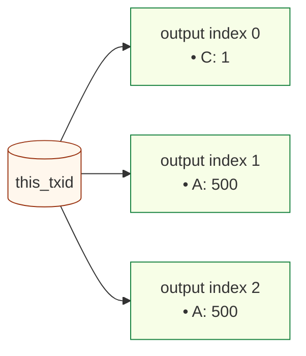
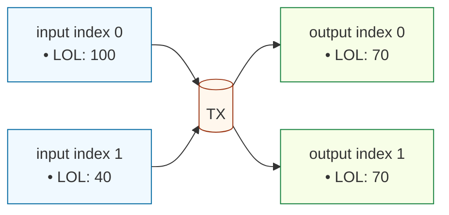
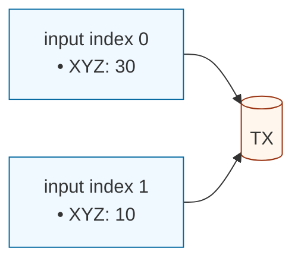
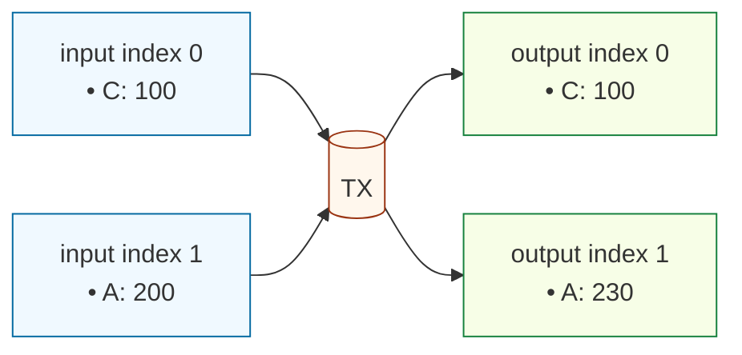
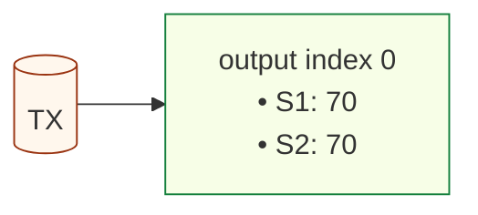
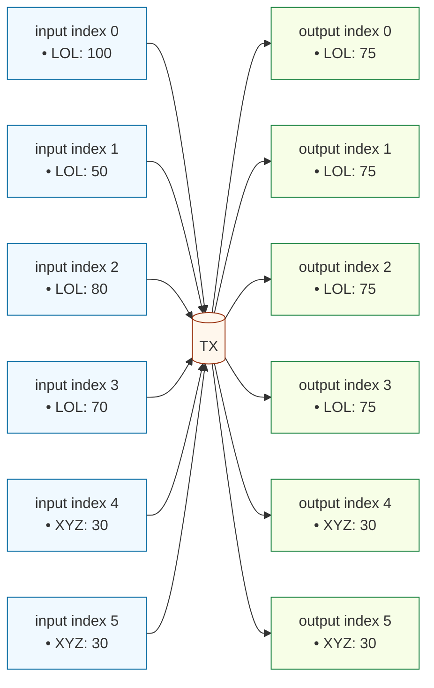
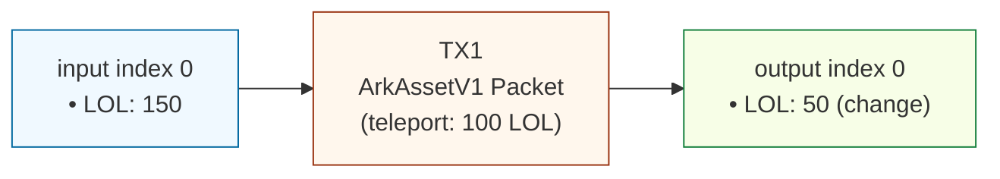
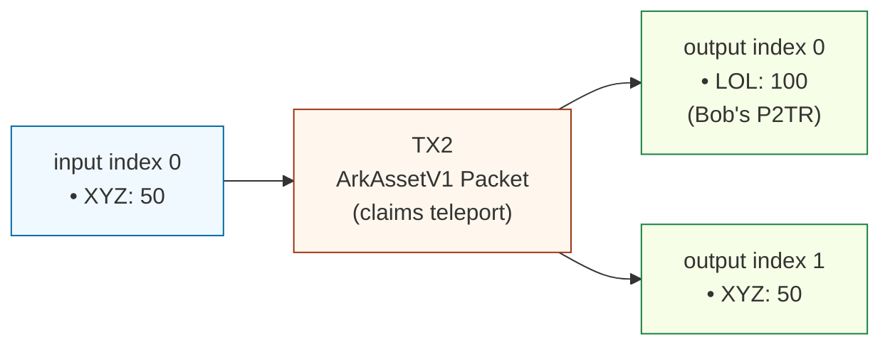
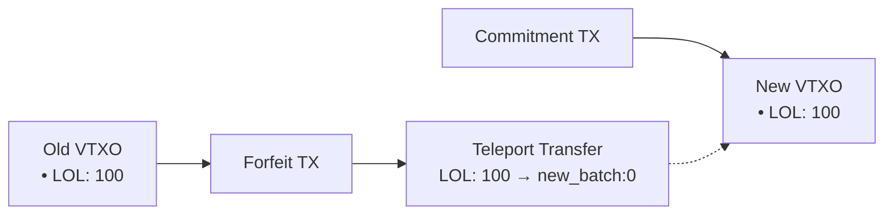

# ArkAssetV1 Specification (Working Draft)

## 1. Overview

ArkAssetV1 is UTXO-native asset system for Bitcoin transactions inspired by Runes and Liquid Assets.

Within Arkade, it requires no indexers: simply parsing the transaction is enough to observe and validate asset interactions. This is due to Arkade Signer's cosigning guard which validates before cosigning, along with its TEE assurances for verifibale honesty.

However, if used onchain, indexers/validators are required to follow the chain (both utxos and vtxos) and disregard invalid asset interaction transactions.

Assets are identified by 2 pieces of data, its genesis transaction hash, and group index. `(genesis_txid, group_index)`

Assets are projected onto Bitcoin transactions by embedding a well-defined data packet, the ArkAssetV1 packet, in a Bitcoin output via OP_RETURN semantics.

This data packet contains a set of (ordered) Asset Groups, which define asset details along with indexes of transaction inputs and outputs that are caarying this asset and the amounts. The order is important for fresh asset mint operations.

If an Asset group omits its Asset Id, it mints a **fresh asset** whose Asset Id in subsequent transactions .

If Asset Id is provided, the group operates on that existing asset.

When a fresh asset is being created, it may refer to another asset (fresh or existing) as its control asset. 

Control assets allow additional, future reissuance of a token, and are themselves assets. When a positive delta is detected in an asset group (the sum of the asset group's outputs is larger than the sum of the asset group's inputs), the control asset is required to be part of the transaction. If the asset did not have a control asset specified, it cannot reissue. Fresh assets that specifies an existing asset as its control asset do not require that control asset to be present for the initial issuance.

ArkAssetV1 supports projecting multiple assets unto a UTXO.\
BTC amounts are orthogonal and not included in asset accounting.

Asset amounts are atomic units, and supply management is managed through UTXO spending conditions.


---

## 2. OP\_RETURN structure

Exactly **one OP\_RETURN output** must contain the ArkAssetV1 packet:

```
scriptPubKey = OP_RETURN <0x41 0x52 0x4b 0x41 0x53 0x53 || Payload>
                          "A"   "R"  "K"  "A"  "S"  "S"

```

- Magic prefix: `0x41 0x52 0x4b 0x41 0x53 0x53` (“ARKASS”)
- Payload: TLV\_PACKET (see below)

Note (implicit burn policy): If a Bitcoin transaction spends any UTXOs that are known (to an indexer or Arkade) to carry ArkAsset balances and contains no ArkAssetV1 OP_RETURN at all, those balances are considered irrecoverably burned. Indexers MUST remove such balances from their state and MUST NOT assign them to any outputs.

---

## 3. Packet format (canonical TLV)

### Packet

```
Packet := {
  GroupCount    : varuint
  Groups[GroupCount]     : Group
  UpdateCount   : varuint
  Updates[UpdateCount] : MetadataUpdate
}

MetadataUpdate := {
  AssetRef     : AssetRef,
  Metadata     : map<string, string>
}
```

### Group

```
Group := {
  AssetId?      : AssetId          # absent => fresh asset (AssetId* = (this_txid, group_index))
  ControlAsset? : AssetRef         # absent if no control required
  Metadata?     : map<string, string> # optional, only for genesis. key-value store.
  InputCount    : varuint
  Inputs[InputCount]  : AssetInput
  OutputCount   : varuint
  Out[OutputCount] : AssetOutput
}
```

### Types

```
AssetId   := { txid: bytes32, gidx: u16 } # the genesis tx id that first issued this asset & the index of the asset group in that packet

AssetRef  := oneof {
               0x01 BY_ID    { assetid: AssetId } # if existing asset
             | 0x02 BY_GROUP { gidx: u16 } # if fresh asset (does not exist yet therefore no Assetid)
             }

AssetInput := oneof {
               0x01 LOCAL    { i: u16, amt: u64 }                    # input from same transaction's prevouts
             | 0x02 TELEPORT { commitment: bytes32, amt: u64 }       # input from external teleport via commitment
             }

AssetOutput := oneof {
               0x01 LOCAL    { o: u16, amt: u64 }                    # output within same transaction
             | 0x02 TELEPORT { commitment: bytes32, amt: u64 }       # output to external transaction via commitment
             }

TeleportCommitment := sha256(payment_script || nonce)
```

---

## 4. Asset identity rules

- **Fresh asset:** if `AssetId` omitted, AssetId\* = `(this_txid, group_index)`.
- **Existing asset:** if `AssetId` present, AssetId\* = that literal `(txid,gidx)`.
- **Control reference:**
  - BY\_ID → literal `(txid,gidx)`
  - BY\_GROUP{g} → `(this_txid, g)`

---

## 5. Teleport System

### Commitment-Based Teleports

To solve the circular dependency problem, teleports use a **commitment hash** instead of direct txid references:

1. **Creating a Teleport Output**:
   - Sender generates: `commitment = sha256(payment_script || nonce)`
   - Creates `AssetOutput::TELEPORT { commitment, amt }`
   - The `payment_script` is the receiver's scriptPubKey that gets committed to (for later claiming)

2. **Claiming a Teleport Input**:
   - Receiver creates a transaction with an output containing the `payment_script`
   - References the teleport via `AssetInput::TELEPORT { commitment, amt }`
   - Must provide proof in witness: `{ payment_script, nonce }`
   - **The teleported assets MUST be assigned to a LOCAL output that has the committed `payment_script`**
   - Indexer validates: 
     - `sha256(payment_script || nonce) == commitment`
     - Transaction contains at least one output with the exact `payment_script`
     - Looks up the commitment in pending teleports to find source_txid
     - **Verifies the assets flow to an output with the committed `payment_script`**

3. **Validation Rules**:
   - Indexer tracks pending teleports by commitment hash
   - When a teleport input is claimed, indexer verifies:
     - Source transaction exists and has the teleport output
     - Claiming transaction has an output with matching `payment_script`
     - **Assets from teleport input MUST flow to a LOCAL output with the committed `payment_script`**
   - Unclaimed teleports remain pending until claimed

### Teleport State Tracking

The indexer maintains:
```
PendingTeleport := {
  commitment: bytes32,
  source_txid: bytes32,
  assetid: AssetId,
  amount: u64
}
```

When a teleport output is created, the indexer stores the source_txid, group index, and its output index. When claiming, the indexer uses the commitment to look up these values.

---

## 6. Introspection opcodes

All Asset Ids are handled as **two stack items**: `(txid32, gidx_u16)`.

### Basics

- `OP_TXHASH` → *[out]* `txid32`\
  *Pushes the txid of the current transaction.*

### Groups

- `OP_INSPECTNUMASSETGROUPS` → *[out]* `K`\
  *Number of groups in the ArkAssetV1 packet.*
- `OP_INSPECTASSETGROUPASSETID k` → *[out]* `assetid_txid32  assetid_gidx_u16`\
  *Resolved AssetId of group **``**. Fresh groups use **``**.*
- `OP_INSPECTASSETGROUPCTRL k` → *[out]* `ctrl_txid32  ctrl_gidx_u16 | OP_0`\
  *Control AssetId if present, else OP\_0.*
- `OP_FINDASSETGROUPBYASSETID assetid_txid32 assetid_gidx_u16` → *[out]* `k | OP_0`\
  *Find group index for a given AssetId, or OP\_0 if absent.*

### Per-group I/O

- `OP_INSPECTASSETGROUPNUMIN  k` → *[out]* `I_k`\
  *Number of declared inputs for group k.*
- `OP_INSPECTASSETGROUPIN     k j` → *[out]* `type_u8  data...  amount_u64`\
  *Retrieve j-th input of group k. For LOCAL: `0x01 in_index_u16 amount_u64`. For TELEPORT: `0x02 commitment_32 amount_u64`.*
- `OP_INSPECTASSETGROUPNUMOUT k` → *[out]* `O_k`\
  *Number of declared outputs for group k.*
- `OP_INSPECTASSETGROUPOUT    k j` → *[out]* `type_u8  data...  amount_u64`\
  *Retrieve j-th output of group k. For LOCAL: `0x01 out_index_u16 amount_u64`. For TELEPORT: `0x02 commitment_32 amount_u64`.*
- `OP_INSPECTASSETGROUPSUMIN  k` → *[out]* `Σ_in_u64`\
  *Sum of all input amounts for group k.*
- `OP_INSPECTASSETGROUPSUMOUT k` → *[out]* `Σ_out_u64`\
  *Sum of all output amounts for group k.*
- `OP_INSPECTASSETGROUPDELTA  k` → *[out]* `delta_i64` (Σout − Σin)\
  *Net change for group k. >0 issuance, 0 transfer, <0 burn.*

### Cross-output (multi-asset per UTXO)

- `OP_INSPECTOUTASSETCOUNT o` → *[out]* `n`\
  *Number of asset entries assigned to output o.*
- `OP_INSPECTOUTASSETAT o t` → *[out]* `assetid_txid32  assetid_gidx_u16  amount_u64`\
  *t-th asset and amount assigned to output o.*
- `OP_INSPECTOUTASSETLOOKUP o assetid_txid32 assetid_gidx_u16` → *[out]* `amount_u64 | OP_0`\
  *Declared amount for given asset at output o, or OP\_0 if none.*

### Cross-input (packet-declared)

- `OP_INSPECTINASSETCOUNT i` → *[out]* `n`\
  *Number of assets declared for input i.*
- `OP_INSPECTINASSETAT i t` → *[out]* `assetid_txid32  assetid_gidx_u16  amount_u64`\
  *t-th asset and amount declared for input i.*
- `OP_INSPECTINASSETLOOKUP i assetid_txid32 assetid_gidx_u16` → *[out]* `amount_u64 | OP_0`\
  *Declared amount for given asset at input i, or OP\_0 if none.*

### Teleport-specific

- `OP_INSPECTGROUPTELEPORTOUTCOUNT k` → *[out]* `n`\
  *Number of TELEPORT outputs in group k.*
- `OP_INSPECTGROUPTELEPORTOUT k j` → *[out]* `txid_32  vout_u32  amount_u64`\
  *j-th TELEPORT output in group k (target txid, vout, amount).*
- `OP_INSPECTGROUPTELEPORTINCOUNT k` → *[out]* `n`\
  *Number of TELEPORT inputs in group k.*
- `OP_INSPECTGROUPTELEPORTIN k j` → *[out]* `txid_32  vout_u32  amount_u64`\
  *j-th TELEPORT input in group k (source txid, vout, amount).*

---

## 6. Examples of transactions

### A) Genesis issuance: mint control C and asset A

```
Group[0] (C): AssetId absent → (txid,0)
              CTRL absent
              O: (o0,1)

Group[1] (A): AssetId absent → (txid,1)
              CTRL=BY_GROUP{0} → (txid,0)
              O: (o1,500), (o2,500)
```

Diagram:



**Checks:**

- Group 1: Δ>0 and fresh.
- Group 1: CTRL points to sibling 0; sibling minted Σout>0.

---

### B) Transfer

```
  Group (LOL): AssetId=(txidL,gidxL)
              I: (i0,100),(i1,40)
              O: (o0,70),(o1,70)
```

Diagram:



Δ=0 → valid transfer.

---

### C) Burn

```
  Group (XYZ): AssetId=(txidX,gidxX)
               I: (i0,30),(i1,10)
               O: []
```

Diagram:



Δ<0 → burn.

---

### D) Reissuance with retained control

```
  Group (A): Δ>0, CTRL=(txidC,gidxC)
  Group (C): Δ=0, in/out match → control retained
```

Diagram:



Policy: issuance valid since control is present and not consumed.

---

### E) Multi-asset per UTXO

```
  Group S1: AssetId=(txidS1,gidxS1), O:(o0,70)
  Group S2: AssetId=(txidS2,gidxS2), O:(o0,70)
```

Diagram:



Output 0 now carries two assets.

---

### F) Multi-party CoinJoin

**Goal:** Multiple parties atomically swap/reshuffle assets while preserving per‑asset conservation (`Δ=0` for every group) and hiding linkage between inputs and outputs.

**Participants (example):**

- Alice inputs 150 LOL
- Bob inputs 150 LOL
- Carol inputs 60 XYZ
- Dave inputs 60 XYZ

**Packet (two groups, equalized outputs):**

```
Group[0]  # LOL (assetid = (txidLOL, gidxLOL))
  AssetId : {txidLOL, gidxLOL}
  I=4 : (i0, 100), (i1, 50), (i2, 80), (i3, 70)      # from Alice+Bob
  O=4 : (o0, 75),  (o1, 75),  (o2, 75),  (o3, 75)    # four equal-sized LOL outputs
  # Σin=300, Σout=300 → Δ=0

Group[1]  # XYZ (assetid = (txidXYZ, gidxXYZ))
  AssetId : {txidXYZ, gidxXYZ}
  I=2 : (i4, 30), (i5, 30)                           # from Carol+Dave
  O=2 : (o4, 30), (o5, 30)                           # equal-sized XYZ outputs
  # Σin=60, Σout=60 → Δ=0
```

Diagram:



**Properties:**

- Every group preserves supply (`Δ=0`), so no control tokens are required.
- Using **equalized output amounts** per asset thwarts simple amount-based linkage.
- Outputs can be any scriptPubKey (P2TR to new keys recommended). If covenant recursion is desired, require outputs use the covenant P2TR template.
- Multi‑asset per UTXO is allowed: parties MAY consolidate multiple assets into a single `outIndex` to reduce UTXO count.


### G) Hierarchical control

Control assets can be chained. Example hierarchy:

- S: top-level control asset
- C: control asset controlled by S
- A: asset controlled by C

Graph: S → C → A

Rules:

- To reissue A (Δ>0 in group A), C must be present in the same transaction and retained (Δ=0).
- To reissue C (Δ>0 in group C), S must be present in the same transaction and retained (Δ=0).
- “Present and retained” means the control asset appears as a group with matching inputs and outputs (no net spend), as shown in section D.

Example packet layout:

```
Group[0] (S): AssetId=(txidS,gidxS)                          # top-level control
              I/O balance: Δ=0                               # present and retained

Group[1] (C): AssetId=(txidC,gidxC), CTRL=BY_ID{ assetid:{txidS,gidxS} }
              I/O balance: Δ=0 or Δ>0                        # Δ>0 only if reissuing C; then S must be retained (Δ=0)

Group[2] (A): AssetId=(txidA,gidxA), CTRL=BY_ID{ assetid:{txidC,gidxC} }
              I/O balance: Δ>0                               # reissuing A; requires C retained (Δ=0)
```

If only A is reissued, C must be retained (Δ=0) but S is not required unless C itself is being reissued.

---

### H) Teleport Transfer Examples

#### Basic Teleport Transfer

**Step 1: Source Transaction (Alice teleports 100 LOL to Bob)**



**ArkAssetV1 Packet:**
```
Group[0]: AssetId=(LOL_txid, 0)
  Inputs:  [LOCAL{i:0, amt:150}]
  Outputs: [LOCAL{o:0, amt:50}, TELEPORT{commitment:0xABC123..., amt:100}]
```

**Commitment Generation:**
```
commitment = sha256(
  payment_script: Bob's_P2TR_scriptPubKey,
  nonce: random_32_bytes
)
```

**Step 2: Target Transaction (Bob claims 100 LOL)**



**ArkAssetV1 Packet:**
```
Group[0]: AssetId=(LOL_txid, 0)
  Inputs:  [TELEPORT{commitment:0xABC123..., amt:100}]
  Outputs: [LOCAL{o:0, amt:100}]  # Must go to output 0 which has Bob's P2TR

Group[1]: AssetId=(XYZ_txid, 0)
  Inputs:  [LOCAL{i:0, amt:50}]
  Outputs: [LOCAL{o:1, amt:50}]
```

**Witness Data for Teleport Claim:**
```
TeleportProof {
  payment_script: Bob's_P2TR_scriptPubKey,
  nonce: same_nonce_from_step1
}
```

**Key Points:**
- Output 0 MUST have Bob's P2TR scriptPubKey that was committed to
- The LOL assets from the teleport MUST be assigned to output 0
- The indexer verifies both: `sha256(scriptPubKey || nonce) == commitment` AND assets flow to the correct output
- Bob can use any script type (P2TR, P2WSH, etc.) as long as it matches

#### Arkade Batch Swap with Teleports

**Scenario:** Alice and Bob perform atomic swap via Arkade operator using teleports.

```mermaid
{{ ... }}
graph LR
  subgraph "Alice's TX"
    ai0["input<br/>• LOL: 100"] --> ATX["Alice TX"]
    ATX --> ao0["teleport out<br/>commitment_A"]
  end
  
  subgraph "Arkade Batch TX"
    bi0["teleport in<br/>commitment_A"] --> BTX["Batch TX"]
    bi1["teleport in<br/>commitment_B"] --> BTX
    BTX --> bo0["teleport out<br/>commitment_C"]
    BTX --> bo1["teleport out<br/>commitment_D"]
  end
  
  subgraph "Bob's TX"
    ci0["input<br/>• XYZ: 50"] --> CTX["Bob TX"]
    CTX --> co0["teleport out<br/>commitment_B"]
  end

  classDef in fill:#f0f9ff,stroke:#0369a1,stroke-width:1px;
  classDef out fill:#f7fee7,stroke:#15803d,stroke-width:1px;
  classDef tx fill:#fff7ed,stroke:#9a3412,stroke-width:1px;
```

**Commitment Relationships:**
- `commitment_A`: Alice → Arkade (100 LOL)
- `commitment_B`: Bob → Arkade (50 XYZ)
- `commitment_C`: Arkade → Alice (50 XYZ)
- `commitment_D`: Arkade → Bob (100 LOL)

---

### I) Proof of Authenticity

Proving that an asset was genuinely issued by a specific entity (e.g., Tether issuing a stablecoin) can be accomplished by signing a message with the private key corresponding to a relevant UTXO. This is typically done using a standard like BIP322 (Signatures for P2TR). There are two primary methods:

**1. Proof of Genesis (Historical Proof)**

This method proves who the original creator of an asset was by linking them to the funding of the genesis transaction.

-   **What to Prove**: Ownership of a Bitcoin UTXO that was spent as an input in the asset's genesis transaction.
-   **How it Works**: The issuing entity (e.g., Tether) uses the private key for one of the genesis transaction's inputs to sign a message.
-   **Example Message**: `"We, Tether, certify that the ArkAsset with genesis txid [genesis_txid] and group index [gidx] is the official USDT-Ark."`
-   **Use Case**: A one-time, static proof to establish the authentic origin of an asset.

**2. Proof of Control (Dynamic Proof)**

This method proves who currently has administrative rights over an asset (e.g., the ability to reissue it). This is the most robust method for proving ongoing authenticity.

-   **What to Prove**: Ownership of the UTXO that currently holds the asset's **control asset**.
-   **How it Works**: The entity uses the private key for the UTXO holding the control asset to sign a message. An indexer is used to find which UTXO currently holds the control asset.
-   **Example Message**: `"As the current controller of USDT-Ark, Tether authorizes this action at block height X."`
-   **Use Case**: Proving ongoing administrative control for actions like reissuance or for periodic attestations of authenticity.

In summary, while Proof of Genesis establishes historical origin, **Proof of Control** provides a dynamic and continuous way to verify an asset's authenticity by linking it to a live, controlled UTXO on the Bitcoin blockchain.

---

### I) Asset Metadata (On-Chain)

ArkAsset supports a flexible, on-chain key-value model for metadata. Well-known keys (e.g., `name`, `ticker`, `decimals`) can be defined in a separate standards document, but any key-value pair is valid.

There are two ways metadata is managed on-chain:

**1. Immutable Genesis Metadata**

When an asset is first created, the `Group` packet may contain an optional `Metadata` map. 

- **Rule**: If this map is present in the genesis transaction, its key-value pairs are considered the base, immutable metadata for the asset. This is useful for defining core, permanent properties.

**2. Mutable Metadata Updates**

Metadata can be updated after creation by including a `MetadataUpdate` entry in the main packet.

- **Rule**: For each `MetadataUpdate` entry, its `AssetRef` is first resolved to a concrete `AssetId`. The transaction is only valid if one of its inputs spends the UTXO that currently holds the `ControlAsset` for that resolved `AssetId`.
- **Behavior**: An indexer will find the latest valid metadata update transaction (by block height and transaction index) and replace its key-value pairs on top of the genesis metadata. This allows any entity with spending rights of the control asset to change or add metadata fields over time.

> **Note:** To authorize a metadata update, the transaction must spend the UTXO containing the control asset. To avoid burning the control asset, the transaction packet must also include an asset group that transfers the control asset to a new output. If the control asset is not reissued, it is destroyed, and no further updates will be possible.

---

## 7. Indexer State and Reorganization Handling

To ensure data integrity and consistency with the underlying Bitcoin blockchain, the ArkAsset (onchain) indexer is designed to handle blockchain reorganizations (reorgs) and transaction replacements (RBF).

### State Versioning

The indexer's state (including all asset definitions, UTXO balances, and processed transactions) is not stored in a single monolithic file. Instead, it is versioned by block height. After processing all transactions in a block, the indexer saves a complete snapshot of the new state into a file named `state_<height>.json`.

- **Genesis State**: The state before any blocks are processed is at `blockHeight: -1`.
- **Block 100**: After processing, the state is saved to `state_100.json` and the internal `blockHeight` becomes `100`.
- **Block 101**: The indexer loads `state_100.json`, applies transactions from block 101, and saves the result to `state_101.json`.

### Block-Level Atomicity

Transactions are applied on a per-block basis. The indexer first loads the state from the previous block (`N-1`) and applies all transactions from the new block (`N`) to a temporary, in-memory copy of the state. Only if all transactions in the block are valid and applied successfully is the new state committed to disk as `state_N.json`. If any transaction fails, the entire block is rejected, and no changes are saved.

### Rollback on Reorganization

If a blockchain reorganization occurs, the external process monitoring the blockchain must instruct the indexer to roll back its state. For example, if block 101 is orphaned and replaced by a new block 101', the process is as follows:

1.  **Rollback**: The `rollbackLastBlock()` method is called. This deletes the state file for the most recent block (e.g., `state_101.json`).
2.  **Reload**: The indexer then loads the state from the previous block (`state_100.json`), making it the current active state.
3.  **Apply New Block**: The transactions from the new, valid block (101') can then be applied using the `applyBlock()` method, which will create a new `state_101.json`.

This mechanism ensures that the indexer's view of asset ownership remains synchronized with the canonical chain, providing a robust foundation for applications built on ArkAsset.

### Unconfirmed Transactions

The indexer implementation described here operates on **confirmed blocks only**. It does not watch the mempool for unconfirmed transactions. This design choice has several implications:

-   **Scope**: The indexer's primary role is to maintain a canonical state of asset ownership based on the blockchain's history. It does not provide real-time notifications for pending transactions.
-   **Replace-by-Fee (RBF)**: The indexer handles RBF implicitly. Since it only processes confirmed blocks, it will only ever see the version of a transaction that is ultimately mined. If an initial transaction is replaced by another via RBF, the indexer will process the replacement, and the original transaction will be correctly ignored as it was never part of the canonical chain history.
-   **Provisional State**: Applications requiring a "pending" or "unconfirmed" view of asset transfers would need a separate component to monitor the mempool. Such a component would need to manage the complexity of transaction replacements and reordering, while the main indexer provides the final, authoritative state once transactions are confirmed.

---

## 8. Teleport Transfers

Teleport transfers enable assets to be projected to outputs in external transactions, solving asset continuity challenges in cross-transaction scenarios like batch swaps.

### Mechanism

A teleport transfer is specified using the `TELEPORT` variant of `AssetOutput`:

```
AssetOutput := oneof {
  0x01 LOCAL    { o: u16, amt: u64 }                    # output within same transaction
  0x02 TELEPORT { txid: bytes32, vout: u32, amt: u64 } # output to external transaction via commitment
}
```

When processing a transaction with teleport outputs:

1. **Source Transaction**: Assets are deducted from inputs and "sent" to the external target
2. **Target Transaction**: Must exist and be confirmed for the teleport to be valid
3. **Asset Materialization**: Assets appear at the target outpoint once both transactions confirm

### Validation Rules

- **Balance Conservation**: `sum(LOCAL inputs) + sum(TELEPORT inputs) = sum(LOCAL outputs) + sum(TELEPORT outputs)`
- **Teleport Acknowledgment**: Target transaction MUST include `TELEPORT` input matching source's `TELEPORT` output
- **Exact Matching**: Teleport input/output pairs must have identical `txid`, `vout`, `amt`, and `AssetId`
- **Atomicity**: Both source and target transactions must be confirmed for teleport validity
- **No Double-Spend**: Assets cannot be both transferred locally and teleported in the same group

### Asset Identity Preservation

Teleported assets maintain their original `(genesis_txid, group_index)` identity. This ensures:
- Asset definitions remain traceable to their genesis
- Control asset relationships are preserved
- Metadata history is maintained across teleports

### Indexer Behavior

The indexer handles teleports through a two-phase validation process:

1. **Source Validation**: When source transaction confirms, verify `TELEPORT` outputs are well-formed
2. **Target Validation**: When target transaction confirms, verify it includes matching `TELEPORT` inputs
3. **Asset Transfer**: Only credit assets to target UTXO after both transactions confirm and match
4. **Burn Policy**: If target transaction confirms but doesn't include matching `TELEPORT` input, assets are permanently burned

---

## 9. Arkade Batch Swap Support

Teleport transfers provide native support for Arkade's batch swap mechanism, enabling seamless asset continuity across VTXO transitions.

### The Batch Swap Challenge

In Arkade, users periodically perform batch swaps to:
- Transition preconfirmed VTXOs to confirmed state
- Extend VTXO expiry times
- Maintain settlement guarantees

Without teleports, assets in old VTXOs would be lost during batch swaps, requiring complex workarounds or operator liquidity fronting.

### Teleport-Enabled Batch Swaps

With teleport transfers, the batch swap process becomes:

1. **User's Forfeit Transaction**:
   - Spends old VTXO containing assets
   - Uses `TELEPORT` outputs to send assets to new batch commitment transaction
   - No assets are burned or lost

2. **Operator's Commitment Transaction**:
   - Creates new VTXOs for users
   - Receives teleported assets at specified outputs
   - Assets materialize in the new batch structure

### Example Flow



### Benefits

- **Asset Continuity**: Assets maintain their identity across batch swaps
- **No Liquidity Requirements**: Operator doesn't need to front assets
- **Atomic Operations**: Both forfeit and commitment transactions must confirm
- **TEE Validation**: Arkade's TEE cosigner validates teleport destinations before signing

### Implementation Notes

In the Arkade context:
- The TEE cosigner validates that teleport targets point to valid new VTXOs
- Batch swap intents include teleport specifications
- Asset balances are preserved across the VTXO transition
- No additional operator infrastructure is required

This mechanism ensures that ArkAssets work seamlessly within Arkade's batch swap architecture while maintaining the protocol's trust-minimized properties.

---

```
