# Arkade Asset Transaction Examples

> **Note:** Amount fields use varint encoding. Small values (0-252) use 1 byte, large values use more. The TypeScript codec handles this automatically.

---

## A) Fresh Issuance with Pre-existing Control

This example demonstrates a fresh issuance of a new asset `A`, which is controlled by a pre-existing control asset `C`. The control asset `C` must be present in the same transaction for the issuance of `A` to be valid. The control asset must be present, but its input and output amounts do not need to match.

### Transaction Diagram

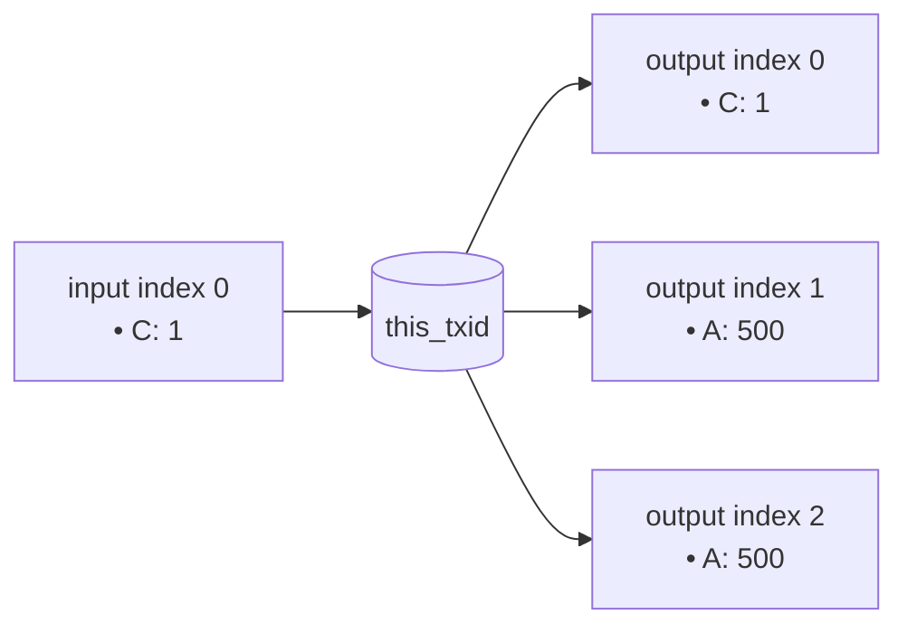

### Asset Packet Definition

- **Group[0] (Control Asset C):**
  - `AssetId`: `(txidC, gidxC)` (points to an existing asset)
  - `Inputs`: `(i:0, amt:1)`
  - `Outputs`: `(o:0, amt:1)`
  - *Result: Control asset is present.* 

- **Group[1] (New Asset A):**
  - `AssetId`: Omitted (fresh issuance, new ID is `(this_txid, 1)`)
  - `ControlAsset`: `BY_ID { assetid: {txidC, gidxC} }` (points to asset C)
  - `Outputs`: `(o:1, amt:500), (o:2, amt:500)`
  - *Result: Σout > Σin, fresh issuance is valid because control asset C is present in Group[0].*

### Code Example (TypeScript)

This is how you would construct the transaction packet using the `arkade-assets-codec` library.

```typescript
import { Packet } from './arkade-assets-codec';

// Example A: fresh issuance with a pre-existing control asset.
const controlTxidHex = '11'.repeat(32);
const controlGidx = 0;

const payload: Packet = {
  groups: [
    // Group[0] Control: A pre-existing control asset, spent and re-created.
    {
      assetId: { txidHex: controlTxidHex, gidx: controlGidx },
      inputs: [{ type: 'LOCAL', i: 0, amt: 1n }],
      outputs: [{ type: 'LOCAL', o: 0, amt: 1n }]
    },
    // Group[1] Token: A fresh issuance, controlled by group 0.
    // AssetId is omitted, which indicates this is a genesis (fresh asset).
    {
      controlAsset: { gidx: 0 }, // References Group[0]
      metadata: { name: 'Token A' },  // Immutable metadata set at genesis
      inputs: [],
      outputs: [
        { type: 'LOCAL', o: 1, amt: 500n },
        { type: 'LOCAL', o: 2, amt: 500n }
      ]
    },
  ]
};

// This payload would then be encoded and put into an OP_RETURN.
```

---

## B) Simple Transfer

This example shows a standard transfer of a single asset (`LOL`) from multiple inputs to multiple outputs. The key requirement for a valid transfer is that the total amount of the asset in the inputs equals the total amount in the outputs (i.e., Σinputs = Σoutputs).

### Transaction Diagram

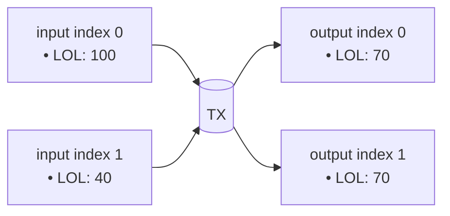

### Asset Packet Definition

- **Group[0] (Asset LOL):**
  - `AssetId`: `(txidL, gidxL)`
  - `Inputs`: `(i:0, amt:100), (i:1, amt:40)`
  - `Outputs`: `(o:0, amt:70), (o:1, amt:70)`
  - *Result: Σin (140) = Σout (140). This is a valid transfer.*

### Code Example (TypeScript)

```typescript
import { Packet } from './arkade-assets-codec';

const lolAssetId = { txidHex: '70'.repeat(32), gidx: 0 };

const payload: Packet = {
  groups: [
    {
      assetId: lolAssetId,
      inputs: [
        { type: 'LOCAL', i: 0, amt: 100n },
        { type: 'LOCAL', i: 1, amt: 40n },
      ],
      outputs: [
        { type: 'LOCAL', o: 0, amt: 70n },
        { type: 'LOCAL', o: 1, amt: 70n },
      ],
    },
  ]
};
```

---

## C) Asset Burn

This example demonstrates how to burn assets. A burn occurs when the sum of an asset's inputs is greater than the sum of its outputs (Σinputs > Σoutputs). In this case, two inputs containing the `XYZ` asset are spent, but no outputs are created for that asset group, resulting in the total amount being burned.

### Transaction Diagram

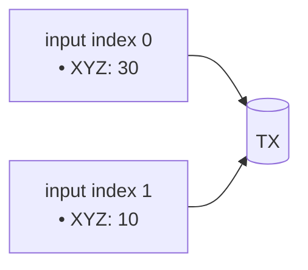

### Asset Packet Definition

- **Group[0] (Asset XYZ):**
  - `AssetId`: `(txidX, gidxX)`
  - `Inputs`: `(i:0, amt:30), (i:1, amt:10)`
  - `Outputs`: `[]`
  - *Result: Σin (40) > Σout (0). This is a valid burn.*

### Code Example (TypeScript)

```typescript
import { Packet } from './arkade-assets-codec';

const xyzAssetId = { txidHex: '88'.repeat(32), gidx: 0 }; // Placeholder

const payload: Packet = {
  groups: [
    {
      assetId: xyzAssetId,
      inputs: [
        { type: 'LOCAL', i: 0, amt: 30n },
        { type: 'LOCAL', i: 1, amt: 10n },
      ],
      outputs: [], // No outputs for this group, so all inputs are burned
    },
  ]
};
```

---

## D) Reissuance with Control

This example shows how to reissue more units of an existing asset (`A`). Reissuance is a transaction where the output amount of an asset is greater than its input amount (Σoutputs > Σinputs). This is only allowed if the asset was created with a control asset, and that control asset (`C`) is present in the reissuance transaction.

### Transaction Diagram

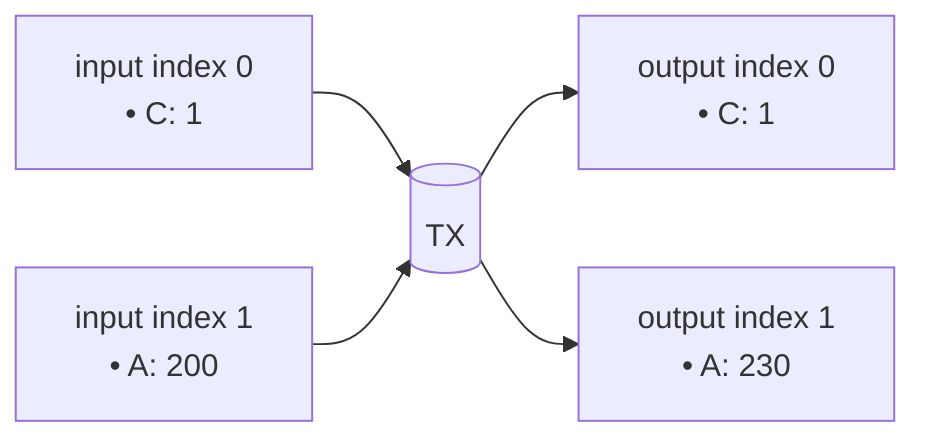

### Asset Packet Definition

- **Group[0] (Control Asset C):**
  - `AssetId`: `(txidC, gidxC)`
  - `Inputs`: `(i:0, amt:1)`
  - `Outputs`: `(o:0, amt:1)`
  - *Result: Control asset is present.*

- **Group[1] (Reissued Asset A):**
  - `AssetId`: `(txidA, gidxA)`
  - `Inputs`: `(i:1, amt:200)`
  - `Outputs`: `(o:1, amt:230)`
  - *Result: Σout (230) > Σin (200). This reissuance is valid because its control asset `C` is present in Group[0].*

### Code Example (TypeScript)

```typescript
import { Packet } from './arkade-assets-codec';

const controlAssetId = { txidHex: 'cc'.repeat(32), gidx: 0 };
const reissuedAssetId = { txidHex: 'aa'.repeat(32), gidx: 1 };

const payload: Packet = {
  groups: [
    {
      assetId: controlAssetId,
      inputs: [{ type: 'LOCAL', i: 0, amt: 1n }],
      outputs: [{ type: 'LOCAL', o: 0, amt: 1n }],
    },
    {
      assetId: reissuedAssetId,
      inputs: [{ type: 'LOCAL', i: 1, amt: 200n }],
      outputs: [{ type: 'LOCAL', o: 1, amt: 230n }],
    },
  ]
};
```

---

## E) Multi-Asset-Per-UTXO Transfer

An input UTXO is not limited to holding only one type of asset. This example demonstrates a transaction where a single input (`input index 0`) contains quantities of two different assets, `X` and `Y`. Both asset groups reference the same input index to spend their respective amounts.

### Transaction Diagram

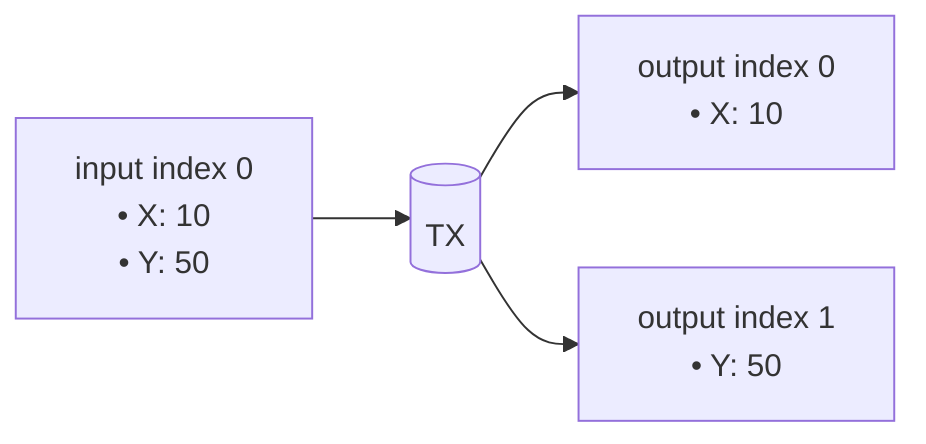

### Asset Packet Definition

- **Group[0] (Asset X):**
  - `AssetId`: `(txidX, gidxX)`
  - `Inputs`: `(i:0, amt:10)`
  - `Outputs`: `(o:0, amt:10)`
  - *Result: Valid transfer (delta=0).*

- **Group[1] (Asset Y):**
  - `AssetId`: `(txidY, gidxY)`
  - `Inputs`: `(i:0, amt:50)`
  - `Outputs`: `(o:1, amt:50)`
  - *Result: Valid transfer (delta=0).*

### Code Example (TypeScript)

```typescript
import { Packet } from './arkade-assets-codec';

const assetX = { txidHex: '55'.repeat(32), gidx: 0 };
const assetY = { txidHex: '66'.repeat(32), gidx: 1 };

const payload: Packet = {
  groups: [
    {
      assetId: assetX,
      inputs: [{ type: 'LOCAL', i: 0, amt: 10n }],
      outputs: [{ type: 'LOCAL', o: 0, amt: 10n }],
    },
    {
      assetId: assetY,
      inputs: [{ type: 'LOCAL', i: 0, amt: 50n }],
      outputs: [{ type: 'LOCAL', o: 1, amt: 50n }],
    },
  ]
};
```

---

## F) Multi-Asset-Per-Transaction Transfer

A single transaction can contain operations for multiple, independent assets. This example shows two separate asset transfers (`P` and `Q`) happening within the same transaction. Each asset has its own group in the packet.

### Transaction Diagram

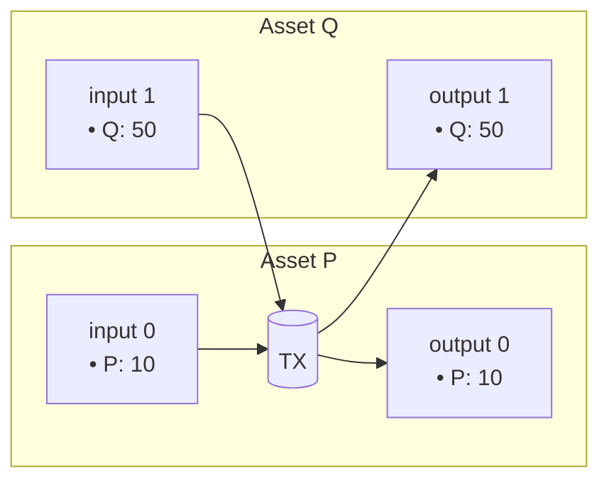

### Asset Packet Definition

- **Group[0] (Asset P):**
  - `AssetId`: `(txidP, gidxP)`
  - `Inputs`: `(i:0, amt:10)`
  - `Outputs`: `(o:0, amt:10)`
  - *Result: Valid transfer (delta=0).*

- **Group[1] (Asset Q):**
  - `AssetId`: `(txidQ, gidxQ)`
  - `Inputs`: `(i:1, amt:50)`
  - `Outputs`: `(o:1, amt:50)`
  - *Result: Valid transfer (delta=0).*

### Code Example (TypeScript)

```typescript
import { Packet } from './arkade-assets-codec';

const assetP = { txidHex: 'ab'.repeat(32), gidx: 0 };
const assetQ = { txidHex: 'cd'.repeat(32), gidx: 0 };

const payload: Packet = {
  groups: [
    {
      assetId: assetP,
      inputs: [{ type: 'LOCAL', i: 0, amt: 10n }],
      outputs: [{ type: 'LOCAL', o: 0, amt: 10n }],
    },
    {
      assetId: assetQ,
      inputs: [{ type: 'LOCAL', i: 1, amt: 50n }],
      outputs: [{ type: 'LOCAL', o: 1, amt: 50n }],
    },
  ]
};
```

---

## G) Intent (Lock & Claim)

The intent system allows assets to be moved across Arkade batches. It's a two-stage process: lock and claim.

1.  **Intent Transaction:** User locks assets in `INTENT` outputs, signaling participation in a batch swap.
2.  **Commitment Transaction:** Operator claims locked assets via `INTENT` inputs and places them at new VTXOs via `LOCAL` outputs.

### Transaction Diagrams

**Intent Transaction**
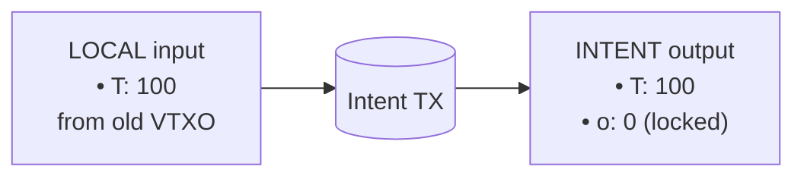

**Commitment Transaction**
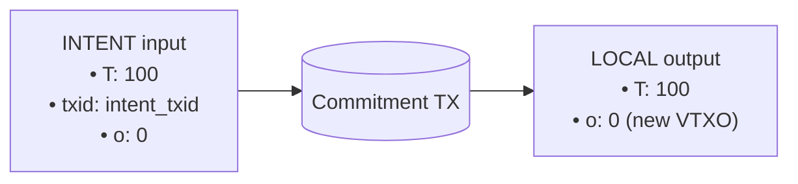

### Asset Packet Definitions

**Intent Packet**
- `AssetId`: `(txidT, gidxT)`
- `Inputs`: `(type:LOCAL, i:0, amt:100)`
- `Outputs`: `(type:INTENT, o:0, amt:100)`

**Commitment Packet**
- `AssetId`: `(txidT, gidxT)`
- `Inputs`: `(type:INTENT, txid:intent_txid, o:0, amt:100)`
- `Outputs`: `(type:LOCAL, o:0, amt:100)`

### Code Example (TypeScript)

```typescript
import { Packet } from './arkade-assets-codec';

const assetId = { txidHex: 'dd'.repeat(32), gidx: 0 };
const intentTxid = Buffer.alloc(32); // Will be the hash of the intent transaction

// Intent Transaction Payload (user submits to join batch)
const intentPayload: Packet = {
  groups: [
    {
      assetId: assetId,
      inputs: [{ type: 'LOCAL', i: 0, amt: 100n }],
      outputs: [{ type: 'INTENT', o: 0, amt: 100n }],
    },
  ]
};

// Commitment Transaction Payload (operator builds batch)
const commitmentPayload: Packet = {
  groups: [
    {
      assetId: assetId,
      inputs: [{
        type: 'INTENT',
        txid: intentTxid,  // Hash of the intent transaction
        o: 0,              // Output index in intent tx
        amt: 100n
      }],
      outputs: [{ type: 'LOCAL', o: 0, amt: 100n }],
    },
  ]
};
```

### Composable Intents (Batch Swap + Collaborative Exit)

A single intent can mix VTXOs and collaborative exits:

```typescript
// Intent with mixed destinations (specified via BIP322 config message)
const mixedIntentPayload: Packet = {
  groups: [
    {
      assetId: assetId,
      inputs: [{ type: 'LOCAL', i: 0, amt: 100n }],
      outputs: [
        { type: 'INTENT', o: 0, amt: 30n },  // → new VTXO
        { type: 'INTENT', o: 1, amt: 70n },  // → collaborative exit (on-chain)
      ],
    },
  ]
};
```

---

# Arkade Script Contract Examples

## 1) Gated Asset Swap

This example demonstrates an Arkade Script contract that facilitates a trustless 1-for-1 swap of Asset `A` for Asset `B`. The contract is placed on the output holding Asset `A`. To spend this output, the transaction must also provide 1 unit of Asset `B` and send it to the contract's address, ensuring a fair exchange.

### Contract Logic

The script performs the following checks:
1.  **Verify Incoming Asset B:** It checks that the transaction contains an input of Asset `B` with an amount of 1.
2.  **Verify Outgoing Asset A:** It ensures that the output containing Asset `A` is being spent.
3.  **Verify Destination of Asset B:** It confirms that Asset `B` is being sent to the same address that held Asset `A`.

### Arkade Script Opcodes

```
// Define Asset IDs
OP_PUSHBYTES_32 <asset_B_txid>
OP_PUSHBYTES_1 <asset_B_gidx>
OP_ASSETID

// Check that 1 unit of Asset B is an input
OP_PUSHINT_1
OP_GETASSET_IN
OP_EQUAL
OP_VERIFY

// Check that Asset B is sent to the current contract's output script
OP_PUSHINT_1
OP_GETASSET_OUT
OP_EQUAL
OP_VERIFY
```

### Transaction Diagram

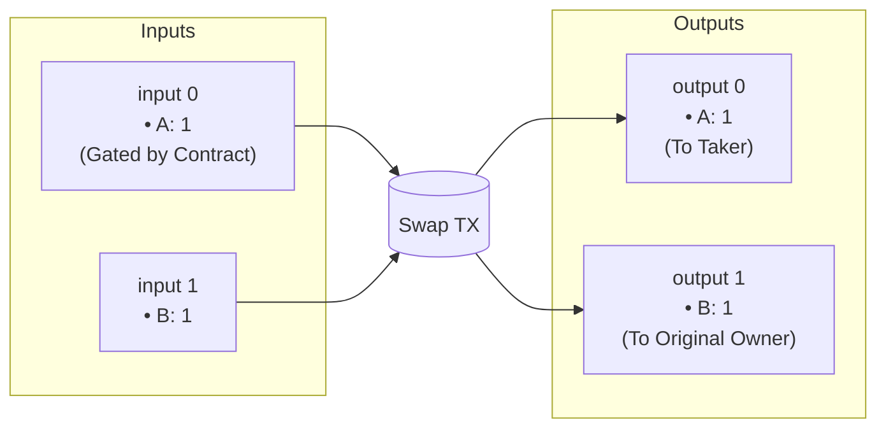

---

## 2) Multi-Sig Asset Vault

This contract demonstrates a 2-of-2 multi-signature vault for an asset. To spend the asset held by this contract, two valid signatures must be provided corresponding to the two public keys defined in the script.

### Contract Logic

1.  **Define Public Keys:** The script starts by pushing two public keys onto the stack.
2.  **Check Signatures:** It then uses `OP_CHECKSIG` twice to validate the provided signatures against the public keys. `OP_SWAP` is used to reorder the stack for the second signature check.
3.  **Verify:** Both checks must pass for the transaction to be valid.

### Arkade Script Opcodes

```
// PubKey1 Sig1
OP_PUSHBYTES_33 <pubkey1>
OP_CHECKSIG
OP_VERIFY

// PubKey2 Sig2
OP_PUSHBYTES_33 <pubkey2>
OP_CHECKSIG
OP_VERIFY
```

### Transaction Diagram

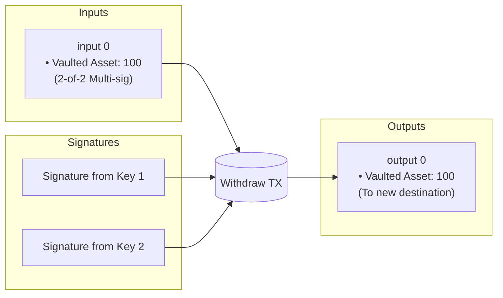

---

## 3) Synthetic Asset Covenant

This advanced contract creates a synthetic asset (`SynthUSD`) that is pegged to another asset (`BaseAsset`). The contract ensures that new `SynthUSD` can only be issued if a corresponding amount of `BaseAsset` is locked in the same transaction. Conversely, `SynthUSD` can be burned to unlock the `BaseAsset`.

### Contract Logic

The script uses introspection opcodes to check the asset balances for both the synthetic and base assets across inputs and outputs.

1.  **Get Input and Output Sums:** It calculates the sum of inputs and outputs for both `SynthUSD` and `BaseAsset`.
2.  **Enforce Peg:** It verifies that `(Σout_Synth - Σin_Synth) + (Σout_Base - Σin_Base) == 0`. This means that for every unit of `SynthUSD` created, one unit of `BaseAsset` must be deposited, and for every unit of `SynthUSD` burned, one unit of `BaseAsset` is returned.

### Arkade Script Opcodes

```
// Assume synth_gidx and base_gidx are on the stack

// Calculate delta for SynthUSD: (sumOutputs - sumInputs)
<synth_gidx> <1> OP_INSPECTASSETGROUPSUM
<synth_gidx> <0> OP_INSPECTASSETGROUPSUM
OP_SUB

// Calculate delta for BaseAsset: (sumOutputs - sumInputs)
<base_gidx> <1> OP_INSPECTASSETGROUPSUM
<base_gidx> <0> OP_INSPECTASSETGROUPSUM
OP_SUB

// Verify peg: delta(SynthUSD) + delta(BaseAsset) == 0
OP_ADD
OP_0
OP_EQUALVERIFY
```

### Transaction Diagram (Issuance)

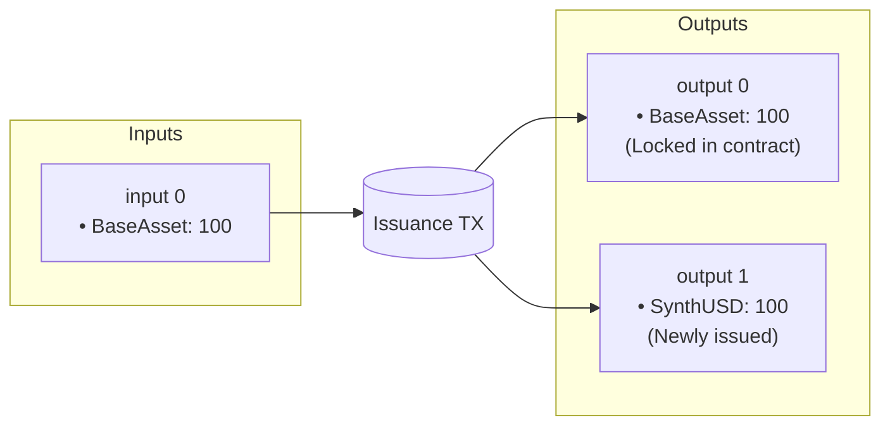
